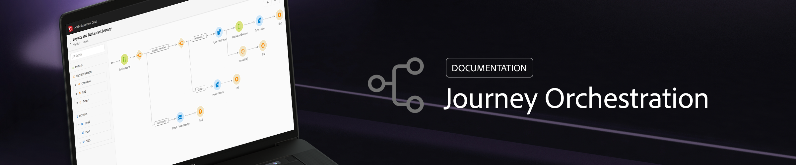

# Hilfe {#journeys-documentation}

## Erste Schritte

* **[Was ist Journey Orchestration?](using/about/about-journey-orchestration.md)** Weitere Informationen zu Journey Orchestration.

* **[Erstellen Ihrer ersten Journey](using/about/get-started.md)** Entdecken Sie die wichtigsten Schritte zur Einrichtung von Journey Orchestration und zur Erstellung Ihrer ersten Journey.

* **[Konfigurieren eines Ereignisses](using/event/about-events.md#section_tbk_5qt_pgb)** Erfahren Sie, wie Sie die Ereignisse konfigurieren, auf die Ihre Journeys reagieren.

* **[Entdecken Sie die neuen Funktionen](using/release-notes/release-notes.md)** Erfahren Sie mehr über die neuesten Versionen.

* **[Alpha-Funktionen](using/alpha/alpha-overview.md)** Entdecken Sie die Funktionen, die derzeit über das Alpha-Programm verfügbar sind.

## Wichtigste Seiten

<table>
<tr>
    <td valign="top">
        
    

    <a href="using/about/troubleshooting.md"><strong>Problembehebung</strong></a>
    

    <em></em>Informieren Sie sich über die verschiedenen Tools, mit denen Sie Probleme bei Ihren Journeys beheben können.
     
  </td>
  <td valign="top">
    
    

    <a href="using/usecase/building-the-journey.md"><strong>Anwendungsfall</strong></a>
    

    <em></em>Lernen Sie Schritt für Schritt, wie Sie eine erweiterte Journey erstellen können.
     
  </td>
  <td valign="top">
    
    

    <a href="using/expression/expressionadvanced.md"><strong>Erstellen erweiterter Ausdrücke</strong></a>
    

    <em>Erfahren Sie, wie Sie mithilfe von Daten aus Ereignissen und Datenquellen komplexe Ausdrücke erstellen. </em>
     
  </td>
</tr>
</table>

## Zusätzliche Ressourcen

* [Dokumentation zu Experience Platform](https://www.adobe.com/de/experience-platform/documentation-and-developer-resources.html)
* [Dokumentation zum Echtzeit-Kundenprofil](https://docs.adobe.com/content/help/de-DE/experience-platform/profile/home.html)
* [Experience Cloud-XDM-Felddefinition](https://docs.adobe.com/content/help/de-DE/experience-platform/xdm/home.html)
* [Dokumentation zum Identity-Namespace](https://docs.adobe.com/content/help/de-DE/experience-platform/identity/home.html)
* [Streaming-Aufnahme-APIs](https://docs.adobe.com/content/help/de-DE/experience-platform/ingestion/streaming/overview.html)
* [Dokumentation zu Transaktionsnachrichten von Campaign Standard](https://docs.adobe.com/content/help/de-DE/campaign-standard/using/communication-channels/transactional-messaging/about-transactional-messaging.html)
