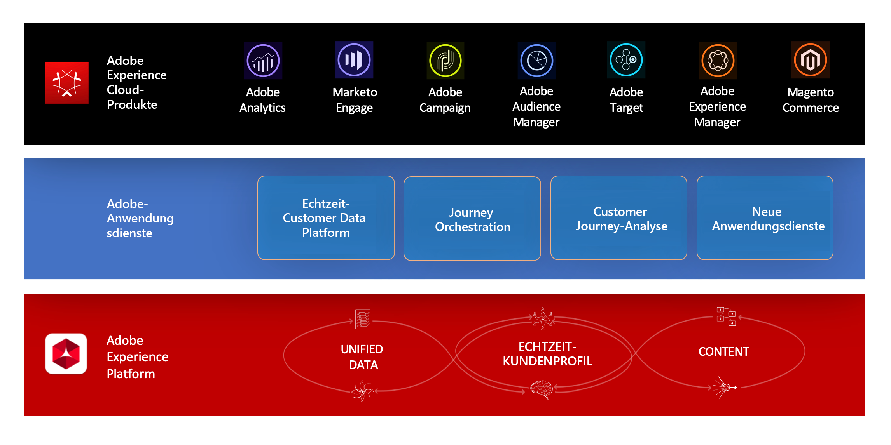

# Informationen zu Journey Orchestration{#concept_nd3_mqt_52b}

Journey Orchestration ermöglicht die Erstellung von Anwendungsfällen für die Echtzeit-Orchestrierung mithilfe von Kontextdaten aus Ereignissen oder Datenquellen.

Dies ist ein in Experience Platform integrierter Anwendungs-Service.

Journey Orchestration bietet die Möglichkeit, Kontextdaten in Echtzeit zu orchestrieren, die aus Ereignissen, Informationen von Adobe Experience Platform oder aus API-Diensten von Drittanbietern stammen. Wenn Sie für den Nachrichtenversand ein Drittanbietersystem verwenden, können Sie eine benutzerdefinierte Aktion einrichten. Falls Sie Adobe Campaign Standard verwenden, können Sie E-Mails, Push-Benachrichtigungen und SMS mit den nativen [Funktionen für Transaktionsnachrichten](https://docs.adobe.com/content/help/de-DE/campaign-standard/using/communication-channels/transactional-messaging/about-transactional-messaging.html) versenden.

Zu diesem Zweck muss ein **technischer Anwender** im Tab „Ereigniskonfiguration“ Ereignisse für die Journeys konfigurieren. Die eingehenden Ereignisdaten werden mit dem Experience-Datenmodell (XDM) von Adobe normalisiert. Die Ereignisse stammen von Streaming-Aufnahme-APIs für authentifizierte und nicht authentifizierte Ereignisse (z. B. Adobe Mobile SDK-Ereignisse).

Der **technische Anwender** konfiguriert im Tab „Datenquellenkonfiguration“ Folgendes:

* Die diversen Felder, die von Adobe Experience Platform im Journey-Designer angezeigt werden, um Bedingungen und Personalisierungen zu erstellen
* Die zusätzlichen im Journey-Designer verwendeten benutzerdefinierten Datenquellen. Benutzerdefinierte Datenquellen sind die Verbindungsglieder zwischen Journey Orchestration und Drittanbietersystemen oder -diensten in Form von APIs. So können Sie z. B. ein Drittanbietersystem wie ein Treueprogramm anbinden. Eine Wetter-API wäre ein Beispiel für einen Drittanbieterdienst.

Ein **Business-Anwender** kann mithilfe des Journey-Designers einfach per Drag-and-Drop ein Eintrittsereignis einfügen, Bedingungen hinzufügen und die auszuführende Aktion definieren.

Danach können Bedingungen auf folgender Basis erstellt werden:

* Zeit
* Daten aus der Ereignis-Payload
* Informationen aus Datenquellen: dem Echtzeit-Kundenprofil oder aus benutzerdefinierten Datenquellen

Mit einer Aufspaltungsbedingung können Sie den Pfad einer Journey in unterschiedliche Richtungen laufen lassen.

Danach können Sie bei der Verwendung eines Drittanbietersystems Nachrichten mithilfe von Aktionsaktivitäten versenden. Wenn Sie Adobe Campaign Standard verwenden, können Sie in Echtzeit personalisierte SMS, Push-Benachrichtigungen oder E-Mails senden.

Da Journey Orchestration mehrere Schritte umfasst, lassen sich erweiterte Szenarien erstellen. Beispielsweise können Sie nach einem ersten Ereignis und einer ersten Aktion weitere Ereignisse anfügen. Anschließend kann eine zweite Aktion, eine Warteaktivität und eine Aufspaltungsbedingung hinzugefügt werden, um Personen auf zwei verschiedene Pfade zu senden und ihnen unterschiedliche Nachrichten zu senden.

>[!NOTE]
>
>Die vorliegende Dokumentation wird entsprechend den Produktänderungen regelmäßig aktualisiert. Manche Screenshots können jedoch geringfügig von der Benutzeroberfläche des Produkts abweichen.

