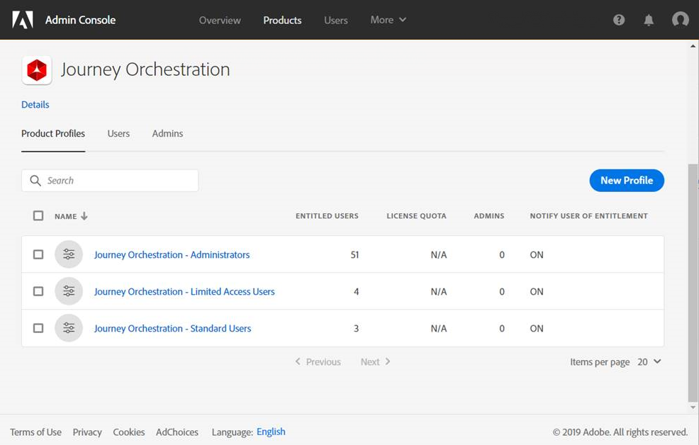

# Zugriffsverwaltung{#concept_rfj_wpt_52b}

## Informationen zur Zugriffsverwaltung {#about-access-management}

Produktprofile werden einer Reihe von Benutzern zugewiesen, die innerhalb Ihres Unternehmens dieselben Rechte haben.

In der Admin Console können Sie Ihren Benutzern eines der folgenden vordefinierten Produktprofile zuweisen:

* **[!UICONTROL Benutzer mit eingeschränktem Zugriff]**: Benutzer mit schreibgeschütztem Zugriff auf Journeys und Berichte. Dieses Produktprofil umfasst folgende Berechtigungen:
   * Journeys lesen
   * Berichte lesen

* **[!UICONTROL Administratoren]**: Benutzer mit Zugriff auf die Verwaltungsmenüs und mit der Fähigkeit, Journeys, Ereignisse und Berichte zu verwalten. Dieses Produktprofil umfasst folgende Berechtigungen:
   * Journeys verwalten und ausführen
   * Ereignisse, Datenquellen und Aktionen verwalten
   * Berichte verwalten
   >[!NOTE]
   >
   >**[!UICONTROL Administratoren]** ist das einzige Produktprofil, das in Adobe Campaign Standard eine Erstellung, Bearbeitung und Veröffentlichung von Transaktionsnachrichten (oder Nachrichtenvorlagen) ermöglicht. Dieses Produktprofil ist erforderlich, wenn Sie mit Adobe Campaign Standard in Journeys Nachrichten senden möchten.

* **[!UICONTROL Standardbenutzer]**: Benutzer mit Basiszugriff, wie z. B. Verwaltung von Journeys. Dieses Produktprofil umfasst folgende Berechtigungen:
   * Journeys verwalten und ausführen
   * Berichte verwalten

Sie können [hier](../assets/do-not-localize/acs_rights_journeys.pdf) die Kompatibilität zwischen Berechtigungen und den verschiedenen Funktionen bei der Orchestrierung der Customer Journey ermitteln.

## Zuweisen eines Produktprofils {#assigning-product-profile}

Produktprofile werden in der Admin Console verwaltet. Weiterführende Informationen dazu finden Sie in der [Dokumentation zur Admin Console](https://helpx.adobe.com/de/enterprise/managing/user-guide.html).

So weisen Sie einem Benutzer ein Produktprofil für den Zugriff auf die Orchestrierung der Customer Journey zu:

1. Wählen Sie in der Admin Console die Option **[!UICONTROL Orchestrierung der Customer Journey]**.

   

1. Wählen Sie das Produktprofil aus, mit dem der neue Benutzer verknüpft werden soll.

   

1. Wählen Sie **[!UICONTROL Benutzer hinzufügen]** aus.

   Sie können Ihren neuen Benutzer auch einer Benutzergruppe hinzufügen, um den freigegebenen Berechtigungssatz genauer anzupassen. Weiterführende Informationen hierzu finden Sie auf dieser [Seite](https://helpx.adobe.com/de/enterprise/using/user-groups.html).

   

1. Geben Sie die E-Mail-Adresse Ihres neuen Benutzers ein und klicken Sie auf **[!UICONTROL Speichern]**.

   

Ihr Benutzer sollte dann eine E-Mail mit Umleitung zur Instanz der Orchestrierung der Customer Journey erhalten.