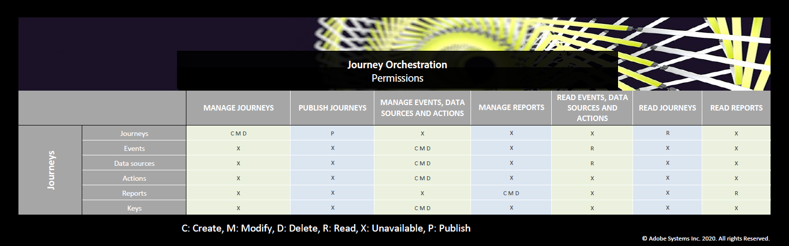

# Zugriffsverwaltung{#concept_rfj_wpt_52b}

## Informationen zur Zugriffsverwaltung {#about-access-management}

[!DNL Journey Orchestration] ermöglicht es Ihnen, Ihren Benutzern eine Reihe von Berechtigungen zuzuweisen, um zu definieren, auf welchen Teil der Oberfläche sie zugreifen können.

Rollen können von Administratoren verwaltet werden, die Zugriff auf die Admin Console haben. Weitere Informationen zur Admin Console finden Sie in [dieser Dokumentation](https://helpx.adobe.com/de/enterprise/managing/user-guide.html).

Um Zugriff [!DNL Journey Orchestration]zu haben, muss ein Benutzer:

* Teil eines [!DNL Journey Orchestration] Profils **[!UICONTROL , das mit]** [!DNL Journey Orchestration] Berechtigungen verknüpft ist.
* Teil eines [!DNL Adobe Experience Platform] Profils ****. Es ist keine zwingende Erlaubnis erforderlich. Der Benutzer sollte über die Berechtigung zum **[!UICONTROL Profil-Management]** verfügen, um Plattformsegmente über die [!DNL Journey Orchestration] Oberfläche erstellen und bearbeiten zu können. Weiterführende Informationen hierzu finden Sie auf dieser [Seite](https://docs.adobe.com/content/help/en/experience-platform/access-control/home.html#adobe-admin-console).

In der Admin Console können Sie Ihren Benutzern eines der folgenden vordefinierten Produktprofile zuweisen:

* **[!UICONTROL Benutzer mit eingeschränktem Zugriff]**: Benutzer mit schreibgeschütztem Zugriff auf Journeys und Berichte. Dieses Profil umfasst die folgenden Berechtigungen:
   * Journeys lesen
   * Berichte lesen

* **[!UICONTROL Administratoren]**: Benutzer mit Zugriff auf die Verwaltungsmenüs und mit der Fähigkeit, Journeys, Ereignisse und Berichte zu verwalten. Dieses Profil umfasst die folgenden Berechtigungen:
   * Journeys verwalten
   * Journeys veröffentlichen
   * Ereignisse, Datenquellen und Aktionen verwalten
   * Berichte verwalten

   >[!NOTE]
   >
   >**[!UICONTROL Administratoren]** ist das einzige Produktprofil, das in Adobe Campaign Standard eine Erstellung, Bearbeitung und Veröffentlichung von Transaktionsnachrichten (oder Nachrichtenvorlagen) ermöglicht. Dieses Produktprofil ist erforderlich, wenn Sie mit Adobe Campaign Standard in Journeys Nachrichten senden möchten.

* **[!UICONTROL Standardbenutzer]**: Benutzer mit Basiszugriff, wie z. B. Verwaltung von Journeys. Dieses Profil umfasst die folgenden Berechtigungen:
   * Journeys verwalten
   * Journeys veröffentlichen
   * Berichte verwalten

Wenn die nativen Profile für Ihre Anforderungen nicht ausreichend sind, können Sie auch eigene Produktprofile erstellen.
Benutzer müssen immer mit einem Produkt-Profil verknüpft sein, damit Sie ihnen spezifische Buildberechtigungen zuweisen können, z. B.:

* **[!UICONTROL Journeys lesen]**
* **[!UICONTROL Berichte lesen]**
* **[!UICONTROL Ereignisse, Datenquellen und Aktionen verwalten]**
* **[!UICONTROL Ereignisse, Datenquellen und Aktionen lesen]**
* **[!UICONTROL Journeys verwalten]**
* **[!UICONTROL Journeys veröffentlichen]**
* **[!UICONTROL Berichte verwalten]**

You can find below the compatibility between permissions and [!DNL Journey Orchestration]&#39;s different functionalities.

## Erstellen eines Produktprofils {#create-product-profile}

[!DNL Journey Orchestration] ermöglicht es Ihnen, Ihre eigenen Profil zu erstellen und Ihren Benutzern eine Reihe von Berechtigungen und Sandboxen zuzuweisen. Mit Produktprofilen können Sie Zugriff auf bestimmte Funktionen oder Objekte in der Benutzeroberfläche zulassen oder verweigern.

Weitere Informationen zum Erstellen und Verwalten von Sandboxes finden Sie in der [Dokumentation zu Adobe Experience Platform](https://docs.adobe.com/content/help/de-DE/experience-platform/sandbox/ui/user-guide.html).

So erstellen Sie ein Produkt-Profil und weisen einen Satz von Berechtigungen und Sandboxen zu:

1. Wählen Sie in der Admin Console die Option **[!UICONTROL Journey Orchestration]** aus. Klicken Sie auf dem Tab **[!UICONTROL Produktprofile]** auf **[!UICONTROL Neues Profil]**.

   

1. Fügen Sie einen **[!UICONTROL Profilnamen]** und eine **[!UICONTROL Beschreibung]** für Ihr neues Profil hinzu. Wenn Sie möchten, dass der **[!UICONTROL Anzeigename]** Ihres Profils anders lautet, deaktivieren Sie **[!UICONTROL Wie Profilname]** und geben Sie Ihren **[!UICONTROL Anzeigenamen]** ein.

1. Wählen Sie in der Kategorie **[!UICONTROL Benutzerbenachrichtigungen]** aus, ob Benutzer per E-Mail benachrichtigt werden sollen, wenn sie diesem Produktprofil hinzugefügt oder daraus entfernt werden.

1. Klicken Sie abschließend auf **[!UICONTROL Fertig]**. Ihr neues Produktprofil wurde erstellt.

   

1. Wählen Sie Ihr neues Produktprofil aus, um Berechtigungen zu verwalten. Fügen Sie Ihrem Produktprofil auf dem Tab **[!UICONTROL Benutzer]** Benutzer hinzu. Weiterführende Informationen hierzu finden Sie auf dieser [Seite](../about/access-management.md#assigning-product-profile).

1. Führen Sie dieselben Schritte wie oben beschrieben aus, um Ihrem Produktprofil **[!UICONTROL Admin]** hinzuzufügen.

1. Wählen Sie auf dem Tab **[!UICONTROL Berechtigungen]** eine der beiden Kategorien (**[!UICONTROL Sandbox]** oder **[!UICONTROL Authoring]**) aus, um die Seite **[!UICONTROL Berechtigungen bearbeiten]** zu öffnen und Berechtigungen zu Ihrem Produktprofil hinzuzufügen oder daraus zu entfernen.

   

1. Wählen Sie in der Berechtigungskategorie **[!UICONTROL Sandboxes]** die Sandbox(es) aus, die Sie Ihrem Produktprofil zuweisen möchten. Klicken Sie unter **[!UICONTROL Verfügbare Berechtigungselemente]** auf das Pluszeichen (+), um Ihrem Profil Sandboxes zuzuweisen. Weiterführende Informationen zu Sandboxes finden Sie in diesem [Abschnitt](../about/access-management.md#sandboxes).

   

1. Klicken Sie bei Bedarf unter **[!UICONTROL Einbezogene Berechtigungselemente]** auf das X-Symbol, um Berechtigungen für das Produktprofil zu entfernen.

   

1. From the **[!UICONTROL Authoring]** permission category, carry out the same steps as above to add permissions to your product profile.
    Weitere Informationen zu Berechtigungen und Kompatibilität zwischen Berechtigungen und [!DNL Journey Orchestration]den verschiedenen Funktionen finden Sie in diesem [Abschnitt](../about/access-management.md#about-access-management).

   

1. Klicken Sie abschließend auf **[!UICONTROL Speichern]**.

Ihr Profil wurde erstellt und konfiguriert. Anwender, die mit diesem Profil verknüpft sind, können jetzt eine Verbindung mit [!DNL Journey Orchestration] herstellen.

## Zuweisen eines Produktprofils {#assigning-product-profile}

Produktberechtigungen werden einer Reihe von Profilen zugewiesen, die innerhalb Ihres Unternehmens dieselben Berechtigungen besitzen.
Die Liste aller vordefinierten Profil mit zugewiesenen Berechtigungen finden Sie in diesem Abschnitt.

So weisen Sie einem Benutzer ein Produktprofil für den Zugriff auf [!DNL Journey Orchestration] zu:

1. Wählen Sie in der Admin Console die Option **[!UICONTROL Journey Orchestration]**.

   

1. Wählen Sie das Produktprofil aus, mit dem der neue Benutzer verknüpft werden soll.

   

1. Wählen Sie **[!UICONTROL Benutzer hinzufügen]** aus.

   Sie können Ihren neuen Benutzer auch einer Benutzergruppe hinzufügen, um den freigegebenen Berechtigungssatz genauer anzupassen. Weiterführende Informationen hierzu finden Sie auf dieser [Seite](https://helpx.adobe.com/de/enterprise/using/user-groups.html).

   

1. Geben Sie die E-Mail-Adresse Ihres neuen Benutzers ein und klicken Sie auf **[!UICONTROL Speichern]**.

   

Ihr Benutzer sollte dann eine E-Mail mit einer Umleitung zur [!DNL Journey Orchestration]-Instanz erhalten.

## Verwenden von Sandboxes {#sandboxes}

[!DNL Journey Orchestration] ermöglicht es Ihnen, Ihre Instanz in separate virtuelle Umgebungen, so genannte Sandboxes, zu unterteilen.
Sandboxes werden über Produktprofile in der Admin Console zugewiesen. Weiterführende Informationen zur Zuweisung von Sandboxes finden Sie in [diesem Abschnitt](../about/access-management.md#create-product-profile).

[!DNL Journey Orchestration] spiegelt die für eine bestimmte Organisation erstellten Adobe Experience Platform-Sandboxen wider.
Adobe Experience Platform-Sandboxen können von Ihrer Adobe Experience Platform-Instanz erstellt oder zurückgesetzt werden. Detaillierte Anweisungen dazu finden Sie im [Sandbox-Benutzerhandbuch](https://docs.adobe.com/content/help/de-DE/experience-platform/sandbox/ui/user-guide.html).

Das Steuerelement für den Sandbox-Umschalter finden Sie oben links auf Ihrem Bildschirm. Um von einer Sandbox zu einer anderen zu wechseln, klicken Sie im Umschalter auf die derzeit aktive Sandbox und wählen dann in der Dropdown-Liste eine andere Sandbox aus.
