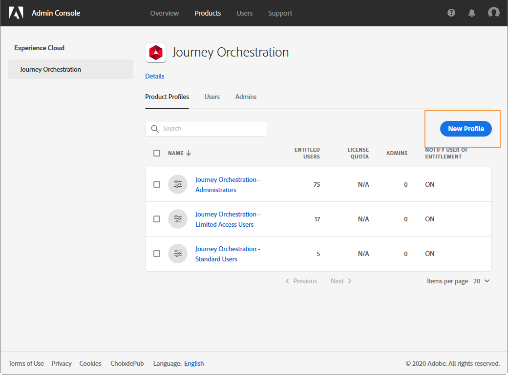

# Zugriffsverwaltung {#concept_rfj_wpt_52b}

>[!CAUTION]
>
>**Sie möchten mehr über Adobe Journey Optimizer erfahren**? Klicken Sie [hier](https://experienceleague.adobe.com/de/docs/journey-optimizer/using/ajo-home){target="_blank"}, um auf die Journey Optimizer-Dokumentation zuzugreifen.
>
>
>_Diese Dokumentation bezieht sich auf veraltete Journey Orchestration-Materialien, die durch Journey Optimizer ersetzt wurden. Wenden Sie sich an Ihr Accountteam, wenn Sie Fragen zu Ihrem Zugriff auf Journey Orchestration oder Journey Optimizer haben._

## Über die Zugriffsverwaltung {#about-access-management}

In [!DNL Journey Orchestration] können Sie Ihren Benutzenden verschiedene Rechte zuweisen und dadurch festlegen, welchen Teil der Benutzeroberfläche sie verwenden können.

Rollen können von Admins verwaltet werden, die Zugriff auf die Admin Console haben. Weitere Informationen zur Admin Console finden Sie im [Administratorhandbuch für Unternehmen und Teams](https://helpx.adobe.com/de/enterprise/managing/user-guide.html).

Um Zugriff auf [!DNL Journey Orchestration] zu erhalten, muss ein Benutzer:

* Teil eines [!DNL Journey Orchestration]-**[!UICONTROL Produktprofils]** sein, das mit [!DNL Journey Orchestration]-Berechtigungen verknüpft ist.
* Teil eines [!DNL Adobe Experience Platform]-**[!UICONTROL Produktprofils]** sein. Es ist keine zwingende Berechtigung erforderlich. Der Benutzer sollte über die Berechtigung **[!UICONTROL Profil-Management]** verfügen, um Plattformsegmente über die [!DNL Journey Orchestration]-Oberfläche erstellen und bearbeiten zu können. Weiterführende Informationen hierzu finden Sie auf [dieser Seite](https://experienceleague.adobe.com/docs/experience-platform/access-control/home.html?lang=de#adobe-admin-console).

In der Admin Console können Sie Ihren Benutzenden eines der folgenden vorkonfigurierten Produktprofile zuweisen:

* **[!UICONTROL Benutzer mit eingeschränktem Zugriff]**: Benutzende mit schreibgeschütztem Zugriff auf Journeys und Berichte. Dieses Produktprofil umfasst folgende Berechtigungen:
   * Journeys lesen
   * Berichte lesen

* **[!UICONTROL Administrator]**: Benutzer mit Zugriff auf die Verwaltungsmenüs und mit der Fähigkeit, Journeys, Ereignisse und Berichte zu verwalten. Dieses Produktprofil umfasst folgende Berechtigungen:
   * Journeys verwalten
   * Journeys veröffentlichen
   * Ereignisse, Datenquellen und Aktionen verwalten
   * Verwalten von Berichten

  >[!NOTE]
  >
  >**[!UICONTROL Administratoren]** ist das einzige Produktprofil, das in Adobe Campaign Standard eine Erstellung, Bearbeitung und Veröffentlichung von Transaktionsnachrichten (oder Nachrichtenvorlagen) ermöglicht. Dieses Produktprofil ist erforderlich, wenn Sie mit Adobe Campaign Standard in Journeys Nachrichten senden möchten. Sein Name sollte in der Admin Console nicht geändert werden.

* **[!UICONTROL Standardbenutzer]**: Benutzer mit Basiszugriff, wie z. B. zur Verwaltung von Journeys. Dieses Produktprofil umfasst folgende Berechtigungen:
   * Journeys verwalten
   * Journeys veröffentlichen
   * Verwalten von Berichten
   * Lesen von Ereignissen, Datenquellen und Aktionen

Wenn die nativen Profile für Ihre Anforderungen nicht ausreichend sind, können Sie auch eigene Produktprofile erstellen.
Benutzer müssen stets mit einem Produktprofil verknüpft sein, damit Sie ihnen bestimmte native Berechtigungen zuweisen können, z. B.:

* **[!UICONTROL Journeys lesen]**
* **[!UICONTROL Berichte lesen]**
* **[!UICONTROL Ereignisse, Datenquellen und Aktionen verwalten]**
* **[!UICONTROL Ereignisse, Datenquellen und Aktionen lesen]**
* **[!UICONTROL Journeys verwalten]**
* **[!UICONTROL Journeys veröffentlichen]**
* **[!UICONTROL Berichte verwalten]**

Sie können hier die Kompatibilität zwischen Berechtigungen und den verschiedenen Funktionen bei [!DNL Journey Orchestration] ermitteln.

## Erstellen eines Produktprofils {#create-product-profile}

[!DNL Journey Orchestration] ermöglicht Ihnen, eigene Produktprofile zu erstellen und Ihren Benutzern eine Reihe von Berechtigungen und Sandboxes zuzuweisen. Mit Produktprofilen können Sie Zugriff auf bestimmte Funktionen oder Objekte in der Benutzeroberfläche zulassen oder verweigern.

Weitere Informationen zum Erstellen und Verwalten von Sandboxes finden Sie in der [Dokumentation zu Adobe Experience Platform](https://experienceleague.adobe.com/docs/experience-platform/sandbox/ui/user-guide.html?lang=de).

So erstellen Sie ein Produktprofil und weisen einen Satz von Berechtigungen und Sandboxes zu:

1. Wählen Sie in der Admin Console die Option **[!UICONTROL Journey Orchestration]** aus. Klicken Sie auf dem Tab **[!UICONTROL Produktprofile]** auf **[!UICONTROL Neues Profil]**.

   

1. Fügen Sie einen **[!UICONTROL Profilnamen]** und eine **[!UICONTROL Beschreibung]** für Ihr neues Profil hinzu. Wenn Sie möchten, dass der **[!UICONTROL Anzeigename]** Ihres Profils anders lautet, deaktivieren Sie **[!UICONTROL Wie Profilname]** und geben Sie Ihren **[!UICONTROL Anzeigenamen]** ein.

1. Wählen Sie in der Kategorie **[!UICONTROL Benutzerbenachrichtigungen]** aus, ob Benutzer per E-Mail benachrichtigt werden sollen, wenn sie diesem Produktprofil hinzugefügt oder daraus entfernt werden.

1. Klicken Sie abschließend auf **[!UICONTROL Fertig]**. Ihr neues Produktprofil wurde erstellt.

   

1. Wählen Sie Ihr neues Produktprofil aus, um Berechtigungen zu verwalten. Fügen Sie Ihrem Produktprofil auf dem Tab **[!UICONTROL Benutzer]** Benutzer hinzu. Weiterführende Informationen hierzu finden Sie auf [dieser Seite](../about/access-management.md#assigning-product-profile).

1. Führen Sie dieselben Schritte wie oben beschrieben aus, um Ihrem Produktprofil **[!UICONTROL Admin]** hinzuzufügen.

1. Wählen Sie auf dem Tab **[!UICONTROL Berechtigungen]** eine der beiden Kategorien (**[!UICONTROL Sandbox]** oder **[!UICONTROL Authoring]**) aus, um die Seite **[!UICONTROL Berechtigungen bearbeiten]** zu öffnen und Berechtigungen zu Ihrem Produktprofil hinzuzufügen oder daraus zu entfernen.

   

1. Wählen Sie in der Berechtigungskategorie **[!UICONTROL Sandboxes]** die Sandbox(es) aus, die Sie Ihrem Produktprofil zuweisen möchten. Klicken Sie unter **[!UICONTROL Verfügbare Berechtigungseinträge]** auf das Pluszeichen (+), um Ihrem Profil Sandboxes zuzuweisen. Weiterführende Informationen zu Sandboxes finden Sie in diesem [Abschnitt](../about/access-management.md#sandboxes).

   

1. Klicken Sie bei Bedarf unter **[!UICONTROL Eingeschlossene Berechtigungseinträge]** auf das X-Symbol, um Berechtigungen für das Produktprofil zu entfernen.

   

1. Führen Sie in der Berechtigungskategorie **[!UICONTROL Authoring]** dieselben Schritte wie oben aus, um Ihrem Produktprofil Berechtigungen hinzuzufügen.
    Weitere Informationen zu Berechtigungen und zur Kompatibilität zwischen Berechtigungen sowie zu den verschiedenen Funktionen von [!DNL Journey Orchestration] finden Sie in diesem [Abschnitt](../about/access-management.md#about-access-management).

   

1. Klicken Sie abschließend auf **[!UICONTROL Speichern]**.

Ihr Profil wurde erstellt und konfiguriert. Anwender, die mit diesem Profil verknüpft sind, können jetzt eine Verbindung mit [!DNL Journey Orchestration] herstellen.

## Zuweisen eines Produktprofils {#assigning-product-profile}

Produktprofile werden einer Reihe von Benutzern zugewiesen, die innerhalb Ihres Unternehmens dieselben Rechte haben.
Die Liste aller nativen Produktprofile mit zugewiesenen Berechtigungen finden Sie in diesem Abschnitt.

So weisen Sie einem Benutzer ein Produktprofil für den Zugriff auf [!DNL Journey Orchestration] zu:

1. Wählen Sie in der Admin Console die Option **[!UICONTROL Journey Orchestration]** aus.

   

1. Wählen Sie das Produktprofil aus, mit dem der neue Benutzer verknüpft werden soll.

   

1. Wählen Sie **[!UICONTROL Benutzer hinzufügen]** aus.

   Sie können Ihren neuen Benutzer auch einer Benutzergruppe hinzufügen, um den freigegebenen Berechtigungssatz genauer anzupassen. Weiterführende Informationen hierzu finden Sie auf [dieser Seite](https://helpx.adobe.com/de/enterprise/using/user-groups.html).

   

1. Geben Sie die E-Mail-Adresse Ihres neuen Benutzers ein und klicken Sie auf **[!UICONTROL Speichern]**.

   

Ihr Benutzer sollte dann eine E-Mail mit einer Umleitung zur [!DNL Journey Orchestration]-Instanz erhalten.

## Verwenden von Sandboxes {#sandboxes}

[!DNL Journey Orchestration] ermöglicht es Ihnen, Ihre Instanz in separate virtuelle Umgebungen, sogenannte Sandboxes, zu unterteilen.
Sandboxes werden über Produktprofile in der Admin Console zugewiesen. Weiterführende Informationen zur Zuweisung von Sandboxes finden Sie in [diesem Abschnitt](../about/access-management.md#create-product-profile).

[!DNL Journey Orchestration] spiegelt die Adobe Experience Platform-Sandboxes wider, die für eine bestimmte Organisation erstellt wurden.
Adobe Experience Platform-Sandboxes können über Ihre Adobe Experience Platform-Instanz erstellt oder zurückgesetzt werden. Detaillierte Anweisungen dazu finden Sie im [Sandbox-Benutzerhandbuch](https://experienceleague.adobe.com/docs/experience-platform/sandbox/ui/user-guide.html?lang=de).

Das Steuerelement für den Sandbox-Umschalter finden Sie oben links auf Ihrem Bildschirm. Um von einer Sandbox zu einer anderen zu wechseln, klicken Sie im Schalter auf die derzeit aktive Sandbox und wählen Sie dann in der Dropdown-Liste eine andere Sandbox aus.
