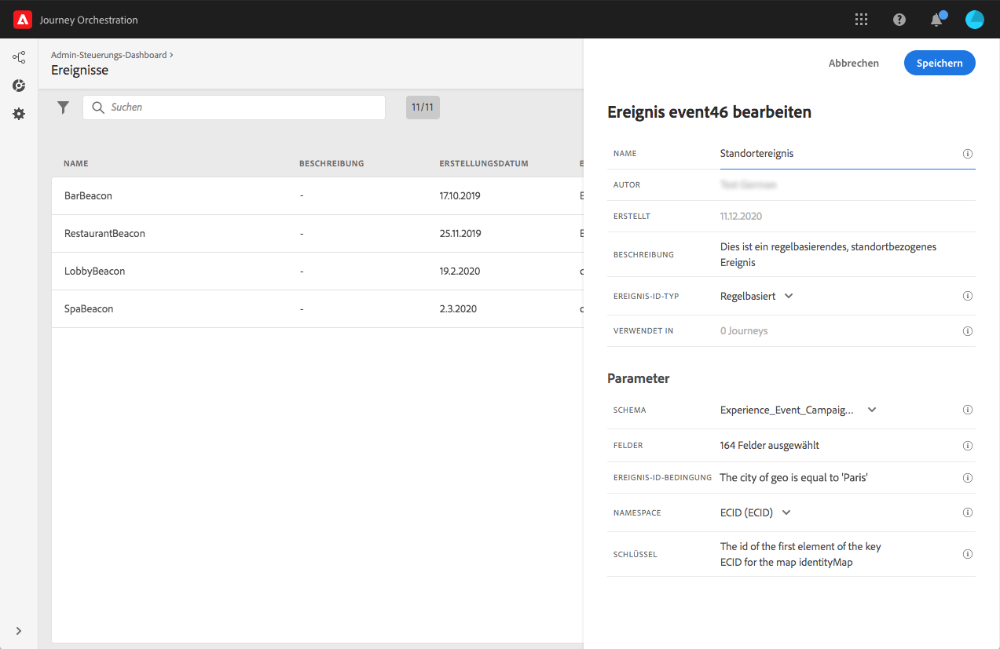
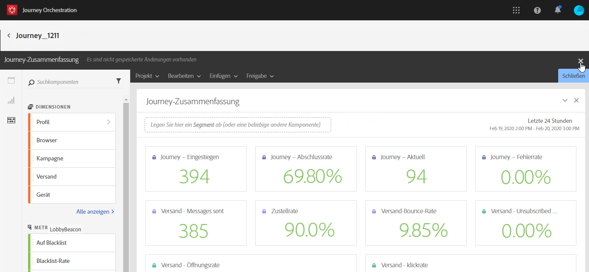

# Erste Schritte{#concept_y4b_4qt_52b}

Bei [!DNL Journey Orchestration] gibt es zwei Arten von Benutzern, die jeweils eigene Aufgaben erledigen: den **technischen Anwender** und den **Business-Anwender**. Der Benutzerzugriff wird mithilfe von Produktprofilen und Berechtigungen verwaltet. Refer to [this page](../about/access-management.md) to learn how to configure user access.

Im Folgenden finden Sie die wichtigsten Schritte zum Konfigurieren und Verwenden von [!DNL Journey Orchestration]:

1. **Ereignis konfigurieren**

   Sie müssen die erwarteten Informationen sowie deren Verarbeitungsmethode definieren. Die Konfiguration ist obligatorisch. Dieser Schritt wird von einem **technischen Anwender** ausgeführt.

   Weiterführende Informationen hierzu finden Sie auf dieser [Seite](../event/about-events.md).

   

1. **Konfigurieren der Datenquelle**

   Sie müssen eine Verbindung zu einem System definieren, um zusätzliche Informationen abrufen zu können, die bei Ihren Journeys verwendet werden (z. B. in Ihren Bedingungen). Außerdem wird zur Bereitstellungszeit eine integrierte Adobe Experience Platform-Datenquelle konfiguriert. Dieser Schritt ist nicht erforderlich, wenn Sie ausschließlich Daten aus den Ereignissen Ihrer Journey nutzen. Dieser Schritt wird von einem **technischen Anwender** ausgeführt.

   Weiterführende Informationen hierzu finden Sie auf dieser [Seite](../datasource/about-data-sources.md).

   

1. **Konfigurieren einer Aktion**

   Wenn Sie zum Versand Ihrer Nachrichten ein Drittanbietersystem verwenden möchten, müssen Sie dessen Verbindung zu [!DNL Journey Orchestration] konfigurieren. Weiterführende Informationen finden Sie auf [dieser Seite](../action/about-custom-action-configuration.md).

   Wenn Sie Adobe Campaign Standard zum Senden von Nachrichten verwenden möchten, müssen Sie die integrierte Aktion konfigurieren. Weiterführende Informationen finden Sie auf [dieser Seite](../action/working-with-adobe-campaign.md).

   Diese Schritte werden von einem **technischen Anwender** ausgeführt.

   

1. **Gestalten Ihrer Journey**

   Kombinieren Sie die verschiedenen Ereignis-, Orchestrierungs- und Aktionsaktivitäten, um Ihre mehrstufigen kanalübergreifenden Szenarien zu erstellen. Dieser Schritt wird von einem **Business-Anwender** ausgeführt.

   Weiterführende Informationen hierzu finden Sie auf [dieser Seite](../building-journeys/journey.md).

   

1. **Testen und Veröffentlichen der Journey**

   Sie müssen die Journey validieren und aktivieren. Dieser Schritt wird von einem **Business-Anwender** ausgeführt.

   Weitere Informationen finden Sie auf den Seiten [Testen der Reise](../building-journeys/testing-the-journey.md) und [Veröffentlichen der Reise](../building-journeys/publishing-the-journey.md).

   

1. **Überwachen Ihrer Journey**

   Verwenden Sie die dedizierten Reporting-Tools, um zu messen, ob Ihre Journey effektiv ist. Dieser Schritt wird von einem **Business-Anwender** ausgeführt.

   Weiterführende Informationen hierzu finden Sie auf [dieser Seite](../reporting/about-journey-reports.md).

   

