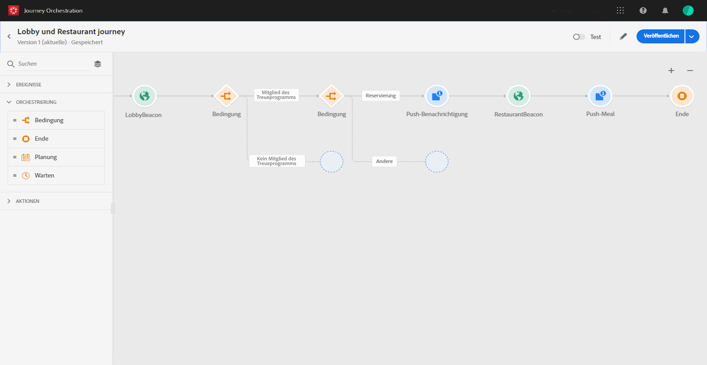

# Jetzt loslegen{#concept_y4b_4qt_52b}

In Journey Orchestration gibt es zwei Arten von Benutzern, die jeweils bestimmte Aufgaben ausführen: der **technische Nutzer** und der **Geschäftsbenutzer**. Der Benutzerzugriff wird über Produktprofile und -rechte verwaltet. Informationen  zum Konfigurieren des Benutzerzugriffs finden Sie unter .

Im Folgenden finden Sie die wichtigsten Schritte zur Konfiguration und Verwendung der Journey-Orchestrierung:

1. **Ereignis konfigurieren**

   Sie müssen die erwarteten Informationen definieren und wie sie verarbeitet werden. Diese Konfiguration ist obligatorisch. Dieser Schritt wird von einem **technischen Benutzer** ausgeführt.

   Weitere Informationen hierzu finden Sie im Abschnitt .

   

1. **Datenquelle konfigurieren**

   Sie müssen eine Verbindung zu einem System definieren, um zusätzliche Informationen abzurufen, die auf Ihren Reisen, z.B. in Ihren Bedingungen, verwendet werden. Eine integrierte Experience Platform-Datenquelle wird auch zur Bereitstellungszeit konfiguriert. Dieser Schritt ist nicht erforderlich, wenn Sie nur Daten aus den Ereignissen Ihrer Reise nutzen. Dieser Schritt wird von einem **technischen Benutzer** ausgeführt.

   Weitere Informationen hierzu finden Sie im Abschnitt .

   

1. **Aktionen konfigurieren**

   Wenn Sie ein Drittanbietersystem verwenden, um Ihre Nachrichten zu senden, müssen Sie die Verbindung mit dem Journey Orchestration konfigurieren. Näheres wird im Abschnitt  beschrieben.

   Wenn Sie Adobe Campaign Standard zum Senden von Nachrichten verwenden, müssen Sie die integrierte Aktion konfigurieren. Näheres wird im Abschnitt  beschrieben.

   Diese Schritte werden von einem **technischen Benutzer** ausgeführt.

   

1. **Entwerfen Sie Ihre Reise**

   Kombinieren Sie die verschiedenen Ereignis-, Orchestrierungs- und Aktionsaktivitäten, um Ihre mehrstufigen kanalübergreifenden Szenarien zu erstellen. Dieser Schritt wird von einem **Geschäftsbenutzer** ausgeführt.

   Weiterführende Informationen dazu finden Sie unter .

   

1. **Testen und Veröffentlichen der Reise**

   Sie müssen die Reise validieren und aktivieren. Dieser Schritt wird von einem **Geschäftsbenutzer** ausgeführt.

   For more on this, see  and .

   

1. **Ihre Reise überwachen**

   Verwenden Sie die dedizierten Berichterstellungswerkzeuge, um die Effektivität Ihrer Reise zu messen. Dieser Schritt wird von einem **Geschäftsbenutzer** ausgeführt.

   Weiterführende Informationen dazu finden Sie unter .

   

