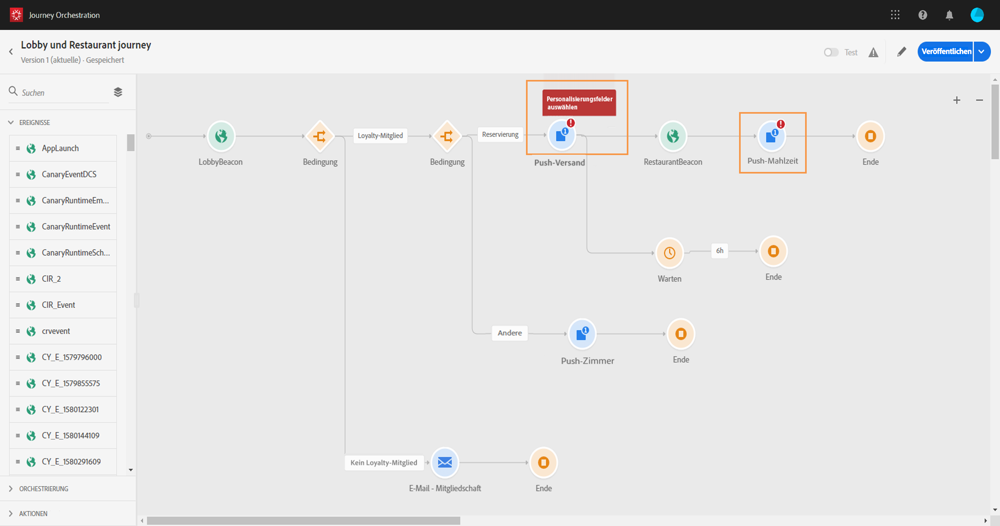
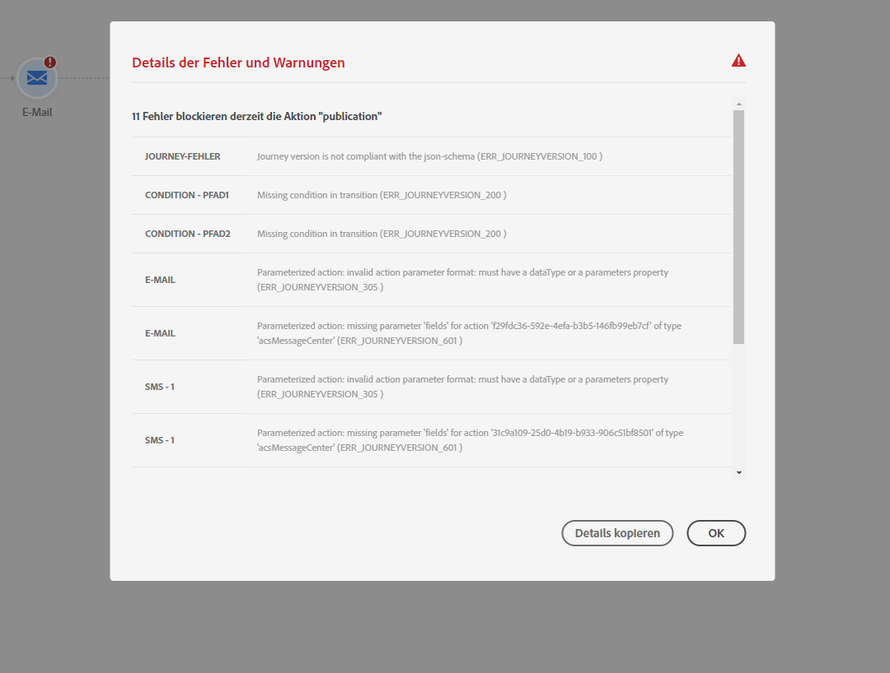

# Fehlerbehebung{#concept_nlv_bcv_2fb}

In diesem Abschnitt erfahren Sie, wie Sie Probleme bei Journeys vor dem Testen oder Veröffentlichen beheben können. Alle unten aufgeführten Prüfungen können durchgeführt werden, wenn sich die Journey im Testmodus befindet oder live ist. Wir empfehlen, alle unten aufgeführten Prüfungen im Testmodus vorzunehmen und dann mit der Veröffentlichung fortzufahren. Weiterführende Informationen finden Sie auf [dieser Seite](../building-journeys/testing-the-journey.md).

## Fehlersuche vor dem Testen{#section_h3q_kqk_fhb}

Überprüfen Sie vor dem Testen und Veröffentlichen Ihrer Journey, ob alle Aktivitäten ordnungsgemäß konfiguriert sind. Es können keine Tests oder Veröffentlichungen vorgenommen werden, solange das System noch Fehler findet.

Fehler werden in der Arbeitsfläche mit einem Warnsymbol auf den Aktivitäten selbst angezeigt. Platzieren Sie den Cursor auf dem Ausrufezeichen, um die entsprechende Fehlermeldung anzuzeigen. Wenn Sie auf die Aktivität klicken, sollte die fehlerhafte Zeile mit einer Warnung angezeigt werden. Beispielsweise wird ein Fehler angezeigt, wenn ein Pflichtfeld leer ist.



Auch wenn zwei Aktivitäten auf der Arbeitsfläche getrennt werden, wird eine Warnung angezeigt.


Neben dem Umschalter **[!UICONTROL Testen]** und der Schaltfläche **[!UICONTROL Veröffentlichen]** kann ein Warnzeichen angezeigt werden. Dieses Warnzeichen weist auf Fehler hin, die vom System erkannt wurden, und verhindert die Aktivierung des Testmodus oder die Veröffentlichung der Journey. In den meisten Fällen sind vom System erkannte Fehler mit Fehlern verbunden, die in den Aktivitäten sichtbar sind, gelegentlich aber auch mit anderen Problemen. In diesem Fall können Sie sie anzeigen und versuchen, das Problem anhand der Fehlerbeschreibung zu ermitteln. Gelingt es Ihnen nicht, das Problem zu identifizieren, können Sie die Details kopieren und an den Administrator oder den Support senden. Beachten Sie, dass Fehler, die den Test blockieren, und Fehler, die die Veröffentlichung blockieren, ähnlich sind.

Das System erkennt zwei Arten von Problemen: Fehler und Warnungen. Fehler blockieren die Veröffentlichung und Testaktivierung. Warnungen weisen auf mögliche Probleme hin, blockieren aber nicht die Testaktivierung oder Veröffentlichung. Angezeigt werden eine Beschreibung des Problems sowie eine Problem-Protokoll-ID vom Typ ERR_XXX_XXX. Damit kann der technische Support das Problem identifizieren.

Auf dem Zeichen neben dem Umschalter **[!UICONTROL Testen]** und der Schaltfläche **[!UICONTROL Veröffentlichen]** können zwei verschiedene Farben angezeigt werden. Bei Fehlern wird ein rotes Zeichen angezeigt. Bei Warnungen wird ein orangefarbenes Zeichen angezeigt.



Fehler und Warnungen, die die gesamte Journey betreffen, werden in der Liste zuerst aufgeführt. Fehler und Warnungen, die einzelne Aktivitäten betreffen, werden danach aufgeführt (anhand der Aktivitätsreihenfolge oder des Auftretens in der Journey von links nach rechts). Mit der Schaltfläche **[!UICONTROL Details kopieren]** lassen sich technische Informationen zur Journey kopieren, die dem Support-Team bei der Problembehebung helfen.

Wenn in einer Aktion oder einer Bedingung ein Fehler auftritt, wird die Journey der Person gestoppt. Die einzige Möglichkeit zum Fortsetzen des Vorgangs besteht darin, das Kontrollkästchen **[!UICONTROL Alternativen Pfad hinzufügen, falls eine Zeitüberschreitung oder ein Fehler auftritt]** zu aktivieren. Siehe [diesen Abschnitt](../building-journeys/using-the-journey-designer.md#paths).

## Überprüfen, ob Ereignisse ordnungsgemäß gesendet werden{#section_rqz_11t_dgb}

Der Ausgangspunkt einer Journey ist stets ein Ereignis. Sie können mithilfe von Tools wie Postman Tests durchführen.

Sie können prüfen, ob der API-Aufruf, den Sie über diese Tools versenden, richtig gesendet wurde oder nicht. Wenn Sie einen Fehler erhalten, bedeutet das, dass es bei Ihrem Aufruf zu einem Fehler kommt. Überprüfen Sie erneut die Payload, die Kopfzeile (insbesondere die Organisations-ID) sowie die Ziel-URL. Sie können Ihren Administrator nach der richtigen URL fragen.

Ereignisse werden von der Quelle nicht direkt an [!DNL Journey Orchestration] weitergeleitet. [!DNL Journey Orchestration] benötigt dazu Streaming-Aufnahme-APIs von Adobe Experience Platform. As a result, in case of event related issues, you can refer to [this page](https://docs.adobe.com/content/help/de-DE/experience-platform/ingestion/streaming/troubleshooting.html) for Streaming ingestion APIs troubleshooting.

## Überprüfen, ob Personen in die Journey einsteigen{#section_x4v_zzs_dgb}

[!DNL Journey Orchestration]-Berichte messen den Eintritt von Personen in eine Journey auf Echtzeitbasis.

Wenn Sie das Ereignis erfolgreich versenden, aber keinen Eintritt in die Journey erkennen können, bedeutet das, dass es zwischen dem Senden und Empfangen des Ereignisses in der Journey zu Problemen kommt.

Im Folgenden sind einige Faktoren aufgeführt, die der Administrator überprüfen sollte:

* Sind Sie sicher, dass sich die Journey, bei der Sie das eingehende Ereignis erwarten, im Testmodus befindet oder live ist?
* Haben Sie das Ereignis gespeichert, bevor Sie die Payload aus der Payload-Vorschau kopiert haben?
* Enthält die Payload des Ereignisses eine Ereignis-ID?
* Haben Sie die richtige URL aufgerufen?
* Haben Sie die Payload-Struktur der Streaming-Aufnahme-APIs mithilfe der Payload-Strukturvorschau im Ereigniskonfigurationsbereich beachtet? Weiterführende Informationen finden Sie auf [dieser Seite](../event/previewing-the-payload.md).
* Haben Sie in der Kopfzeile die richtigen Schlüssel/Wert-Paare Ihres Ereignisses verwendet?

   ```
   X-gw-ims-org-id - your ORGID
   Content-type - application/json
   ```

## Überprüfen, wie Personen durch die Journey navigieren{#section_l5y_yzs_dgb}

[!DNL Journey Orchestration]-Berichte messen den Fortschritt von Kontakten innerhalb einer Journey. So können Sie leicht ermitteln, wo und warum eine Person gestoppt wurde.

Prüfen Sie folgende Punkte:

* Ist das Problem auf eine Bedingung zurückzuführen, mit der die Person ausgeschlossen wird? Beispiel: Die Bedingung lautet „Geschlecht = männlich“, während die Person eine Frau ist. Die Prüfung kann von einem Business-Anwender vorgenommen werden, solange die Bedingung nicht zu komplex ist.
* Ist das Problem auf einen Aufruf einer Datenquelle zurückzuführen, die nicht reagiert? Wenn sich die Journey im Test befindet, können diese Informationen in Testmodusprotokollen angezeigt werden. Wenn die Journey live ist, kann ein Administrator direkte Aufrufe an die Datenquelle testen und die erhaltene Antwort überprüfen. Alternativ kann ein Administrator die Journey duplizieren und dann testen.

## Überprüfen, ob Nachrichten erfolgreich gesendet werden{#section_qb1_yzs_dgb}

Wenn Kontakte dem richtigen Weg entlang der Journey folgen, aber keine Nachrichten erhalten, die sie erhalten sollten, können Sie Folgendes prüfen:

* Bei Transaktionsnachrichten wurde die Anfrage zum Senden der Nachricht richtig berücksichtigt. Ein Business-Anwender kann auf die zu sendende Transaktionsnachricht zugreifen und prüfen, ob der Zeitpunkt der letzten Ausführung mit der Ausführungszeit Ihrer Journey übereinstimmt. Außerdem kann er die neuesten API-Aufrufe/Ereignisse prüfen, die von Transaktionsnachrichten empfangen wurden.
* Die Transaktionsnachrichtenfunktion hat die Nachricht erfolgreich gesendet. In den Versandprotokollen der Transaktionsnachricht können Sie den Status der jeweiligen Ausführung anzeigen. Sie können sehen, ob der Status grün oder rot ist und worin das Problem bestand. Ein Business-Anwender kann auf diesen Bildschirm zugreifen und die Protokolle zur weiteren Analyse an einen Administrator senden.

Bei einer Nachricht, die über eine benutzerdefinierte Aktion gesendet wird, kann während des Journey­Tests nur geprüft werden, ob der Systemaufruf der benutzerdefinierten Aktion zu einem Fehler führt oder nicht. Wenn der Aufruf an das externe System, das mit der benutzerdefinierten Aktion verknüpft ist, nicht zu einem Fehler führt, aber auch nicht zum Senden der Nachricht, sollten Sie das externe System überprüfen.

