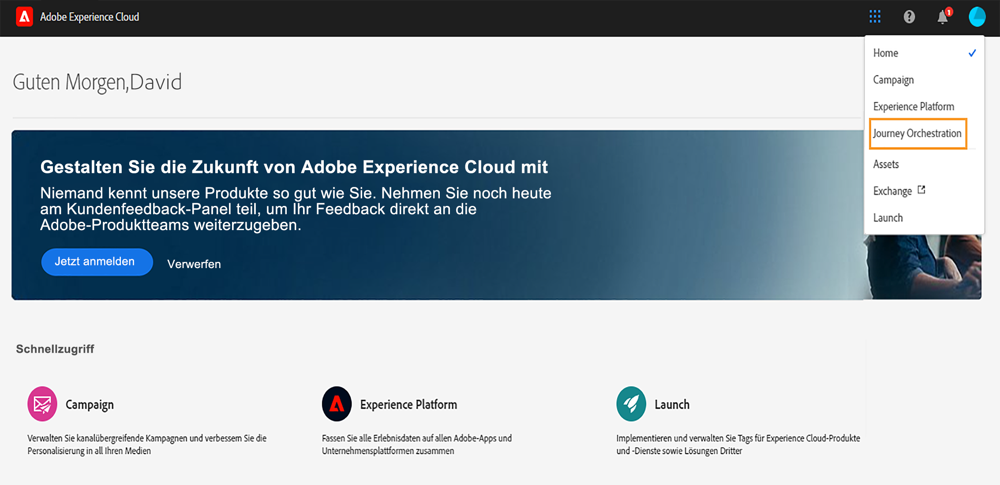
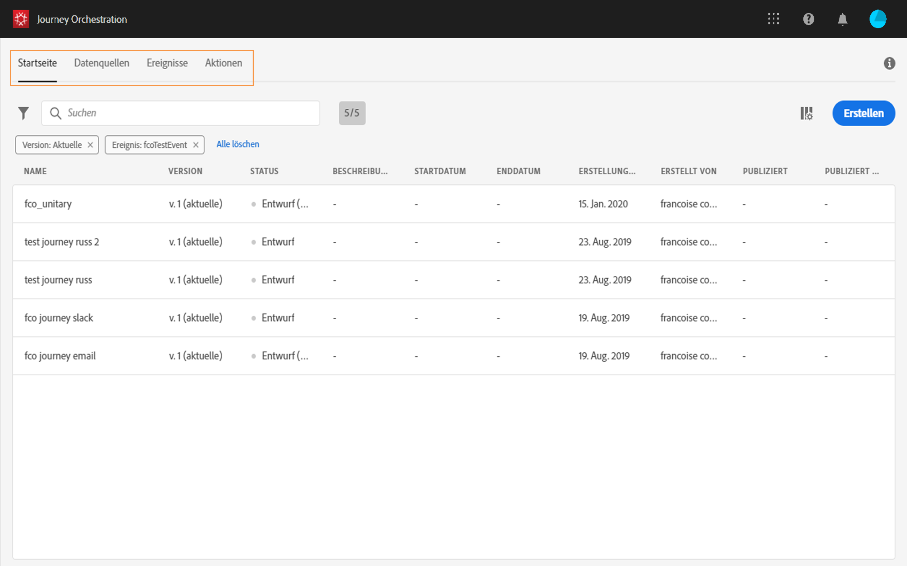
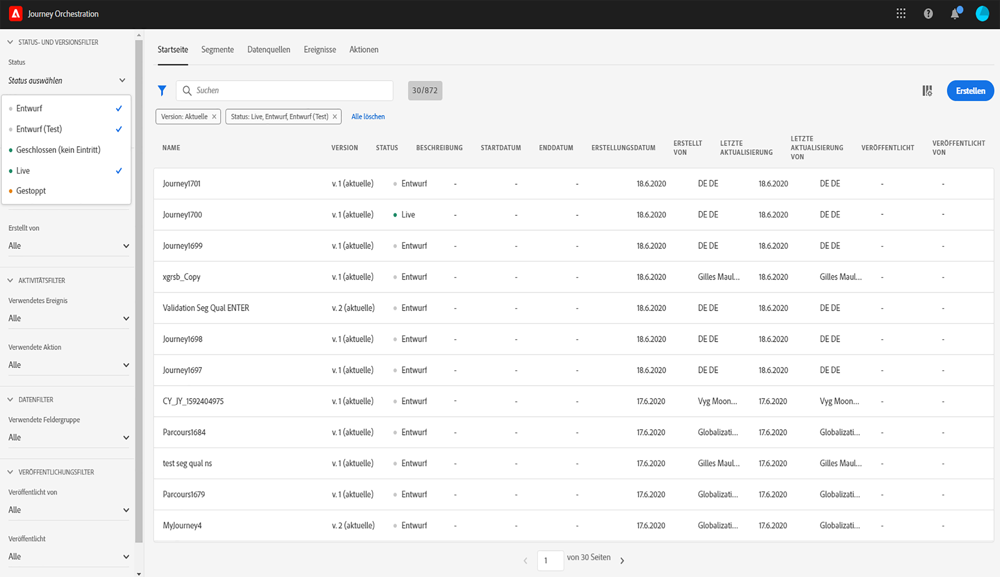
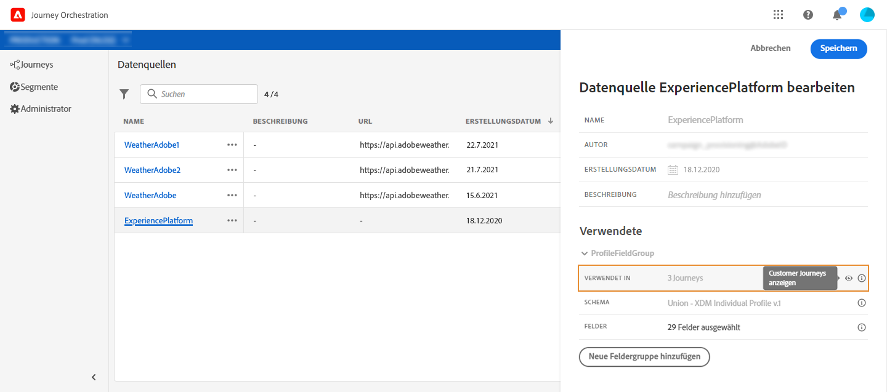
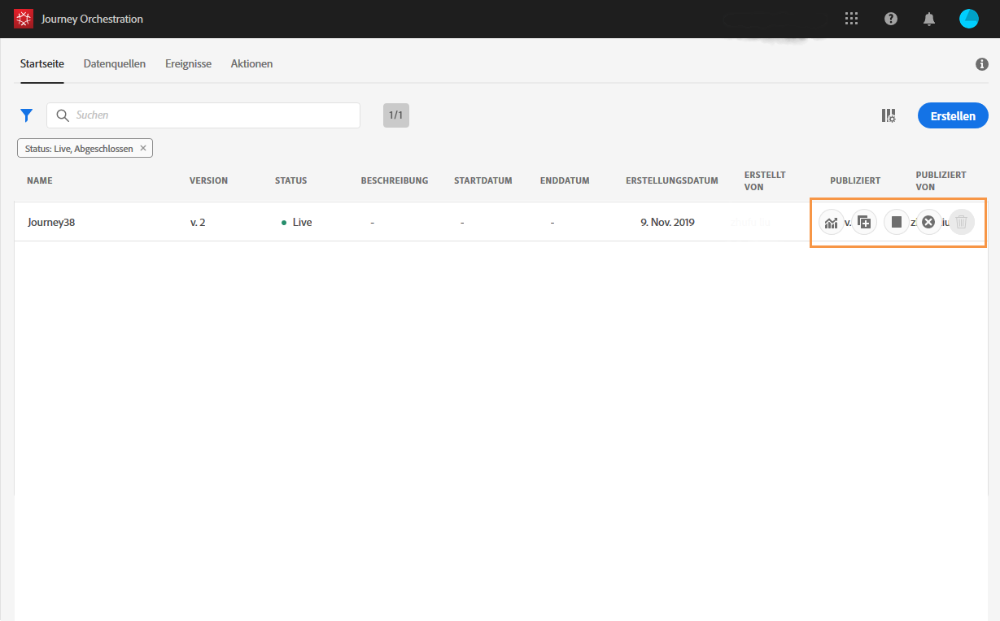

# User interface {#concept_rcq_lqt_52b}

>[!NOTE]
>
>Um das Beste aus dem Journey Orchestration zu holen, empfehlen wir Chrome als Ihren Internetbrowser.
>
>Diese Dokumentation wird häufig aktualisiert, um die jüngsten Änderungen am Produkt widerzuspiegeln. Einige Screenshots unterscheiden sich jedoch geringfügig von der Benutzeroberfläche des Produkts.

## Benutzeroberfläche{#section_jsq_zr1_ffb}

Klicken Sie auf das Symbol **[!UICONTROL App-Auswahl]**oben rechts, um die Benutzeroberfläche des Reisezeichens aufzurufen. Klicken Sie dann auf**[!UICONTROL  Journey Orchestration]**, rechts unter &quot;Experience Platform&quot;.

Sie können auch über die Experience Cloud-Homepage im Abschnitt **[!UICONTROL Schnellzugriff]**auf die Journey Orchestration zugreifen.

Die Hauptmenüs ermöglichen Ihnen die Navigation durch die verschiedenen Funktionen der Reiseorchestrierung: **[!UICONTROL Home]**(die Reisen),**[!UICONTROL  Data Sources]**, **[!UICONTROL Ereignisse]**,**[!UICONTROL  Aktionen]**.

## Suchen und Filtern{#section_lgm_hpz_pgb}

In der Liste **[!UICONTROL Startseite]**,**[!UICONTROL  Datenquellen]**, **[!UICONTROL Ereignisse]**und**[!UICONTROL  Aktionen]** können Sie in einer Suchleiste nach einem Element suchen.

Auf die **[!UICONTROL Filter]**können Sie durch Klicken auf das Filtersymbol oben links in der Liste zugreifen. Mit dem Menü &quot;Filter&quot;können Sie die angezeigten Elemente nach unterschiedlichen Kriterien filtern. Sie können festlegen, dass nur die Elemente eines bestimmten Typs oder Status, die von Ihnen erstellten oder die in den letzten 30 Tagen geänderten Elemente angezeigt werden.

Verwenden Sie in den Listen **[!UICONTROL Data Sources]**,**[!UICONTROL  Ereignisse]** und **[!UICONTROL Aktionen]**die** Erstellungsfilter **, um nach Erstellungsdatum und Benutzer zu filtern. Sie können beispielsweise festlegen, dass nur die Ereignisse angezeigt werden, die Sie in den letzten 30 Tagen erstellt haben.

In der Reiseliste (unter &quot; **[!UICONTROL Home]**&quot;) können Sie zusätzlich zu den**[!UICONTROL  Erstellungsfiltern]**auch die angezeigten Reisen nach Status und Version (**[!UICONTROL Status- und Versionsfilter]**) filtern. Sie können auch festlegen, dass nur die Reisen angezeigt werden, die ein bestimmtes Ereignis, eine bestimmte Feldgruppe oder eine bestimmte Aktion (**[!UICONTROL  Aktivitätsfilter]** und **[!UICONTROL Datenfilter]**) verwenden. Mit den**[!UICONTROL  Veröffentlichungsfiltern]** können Sie ein Veröffentlichungsdatum oder einen Benutzer auswählen. Sie können beispielsweise festlegen, dass nur die neuesten Versionen der gestern veröffentlichten Live-Reisen angezeigt werden. Näheres wird im Abschnitt  beschrieben.

>[!NOTE]
>
>Beachten Sie, dass die angezeigten Spalten mithilfe der Konfigurationsschaltfläche oben rechts in den Listen personalisiert werden können. Die Personalisierung wird für jeden Benutzer gespeichert.

In den Konfigurationsbereichen für die Datenquelle und Aktion zeigt das Feld **[!UICONTROL Verwendet in]**die Anzahl der Reisen an, die dieses bestimmte Ereignis, diese Feldgruppe oder diese Aktion verwenden. Sie können auf die Schaltfläche**[!UICONTROL  Fahrten]** anzeigen klicken, um die Liste der entsprechenden Fahrten anzuzeigen.

In den verschiedenen Listen können Sie grundlegende Aktionen für jedes Element durchführen. Sie können beispielsweise ein Element duplizieren oder löschen.

## Verwenden der verschiedenen Tastaturbefehle{#section_ksq_zr1_ffb}

Hier finden Sie die verschiedenen Tastaturbefehle, die in der Benutzeroberfläche des Journey Orchestration verfügbar sind.

_In der Liste der Fahrten, Aktionen, Datenquellen oder Ereignisse:_

* Drücken Sie **c** , um eine neue Reise, Aktion, Datenquelle oder ein neues Ereignis zu erstellen.

_Beim Konfigurieren einer Aktivität auf einer Reise:_

Die Arbeitsfläche wird automatisch gespeichert. Oben links auf der Arbeitsfläche sehen Sie den Speicherstatus.

* Drücken Sie **Esc** , um den Konfigurationsbereich zu schließen und die vorgenommenen Änderungen zu verwerfen. Dies entspricht der Schaltfläche **[!UICONTROL Abbrechen]**.
* Drücken Sie die **[!UICONTROL Eingabetaste]**oder klicken Sie außerhalb des Bereichs, um den Konfigurationsbereich zu schließen. Änderungen werden gespeichert. Dies entspricht der Schaltfläche**[!UICONTROL  OK]** .
* Wenn Sie die Taste **[!UICONTROL Löschen]**oder** Rücktaste **drücken, können Sie den Löschvorgang durch Drücken der**[!UICONTROL  Eingabetaste]** bestätigen.

_In Popups:_

* Drücken Sie **Esc** , um es zu schließen (entspricht der Schaltfläche **Abbrechen** ).
* Drücken Sie **[!UICONTROL die Eingabetaste]**, um zu speichern oder zu bestätigen (entspricht der Schaltfläche**[!UICONTROL  OK]** oder **[!UICONTROL Speichern]**).

_Im Ereigniskonfigurationsbereich, in der Datenquelle- oder Aktionskonfiguration:_

* Drücken Sie **Esc** , um den Konfigurationsbereich ohne Speichern zu schließen.
* Drücken Sie die **[!UICONTROL Eingabetaste]**, um Änderungen zu speichern und den Konfigurationsbereich zu schließen.
* Drücken Sie die **Tabulatortaste** , um zwischen den verschiedenen Feldern zu wechseln, die konfiguriert werden sollen.

_Im Editor für einfache Ausdrücke_

* Doppelklicken Sie auf ein Feld auf der linken Seite, um eine Abfrage hinzuzufügen (entsprechend dem Drag &amp; Drop).

_Beim Durchsuchen von XDM-Feldern:_

* Wenn Sie eine &quot;Node&quot; überprüfen, werden alle Felder des Knotens ausgewählt.

_In allen Textbereichen:_

* Verwenden Sie die Tastenkombination **Strg/Befehl + A** , um den Text auszuwählen. In der Payload-Vorschau wird die Nutzlast ausgewählt.

_In einem Bildschirm mit einer Suchleiste:_

* Verwenden Sie die Tastenkombination **Strg/Befehl + F** , um die Suchleiste auszuwählen.

_Auf der Arbeitsfläche einer Reise:_

* Verwenden Sie die Tastenkombination **Strg/Befehl + A** , um alle Aktivitäten auszuwählen.
* Wenn eine oder mehrere Aktivitäten ausgewählt sind, drücken Sie die **[!UICONTROL Entf]**- oder die** Rücktaste **, um sie zu löschen. Dann können Sie die**[!UICONTROL  Eingabetaste]** drücken, um dies im Bestätigungs-Popup zu bestätigen.
* Doppelklicken Sie auf eine Aktivität in der linken Palette, um sie an der ersten verfügbaren Position (von oben nach unten) hinzuzufügen.
