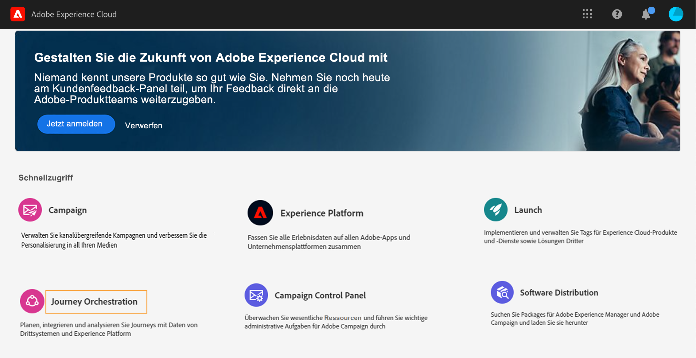
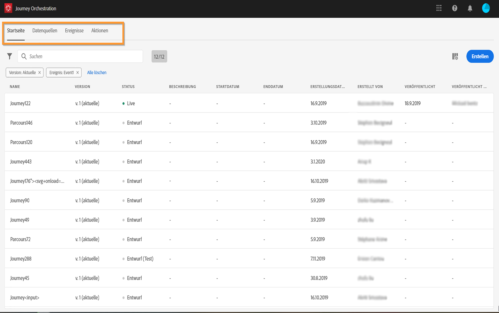

# Benutzeroberfläche{#concept_rcq_lqt_52b}

>[!NOTE]
>
>Um [!DNL Journey Orchestration] optimal nutzen zu können, empfehlen wir die Verwendung von Chrome als Internetbrowser. Die Benutzeroberfläche wird in der im IMS definierten Sprache angezeigt. Wenn Ihre IMS-Sprache von [!DNL Journey Orchestration] nicht unterstützt wird, wird die Benutzeroberfläche in Englisch angezeigt.
>
>Die vorliegende Dokumentation wird entsprechend den Produktänderungen regelmäßig aktualisiert. Manche Screenshots können jedoch geringfügig von der Benutzeroberfläche des Produkts abweichen.

## Zugreifen auf [!DNL Journey Orchestration]{#accessing_journey_orchestration}

Um die Benutzeroberfläche von [!DNL Journey Orchestration] aufzurufen, klicken Sie oben rechts auf das Symbol **[!UICONTROL App Selector]**. Klicken Sie dann auf **[!UICONTROL Journey Orchestration]**.

Alternativ können Sie auf [!DNL Journey Orchestration] über die Experience Cloud-Startseite im Bereich **[!UICONTROL Schnellzugriff]** zugreifen.

## Kennenlernen der Benutzeroberfläche{#section_jsq_zr1_ffb}

>[!CONTEXTUALHELP]
>id="jo_home"
>title="Informationen zur Liste der Journeys"
>abstract="Die Liste der Journeys ermöglicht es Ihnen, alle Ihre Journeys gleichzeitig anzuzeigen, deren Status zu sehen und allgemeine Aktionen durchzuführen. Sie können Ihre Journeys duplizieren, stoppen oder löschen. Je nach Journey stehen bestimmte Aktionen möglicherweise nicht zur Verfügung. Sie können beispielsweise eine geschlossene Journey nicht löschen oder erneut starten. Stattdessen können Sie eine neue Version davon erstellen oder sie duplizieren. Sie können auch die Suchleiste verwenden, um nach einer Journey zu suchen."
>additional-url="https://images-tv.adobe.com/mpcv3/38af62cb-9390-4bc0-a576-d336849adb97_1574809570.1920x1080at3000_h264.mp4" text="Demovideo ansehen"

Die Menüs am oberen Seitenrand bieten Zugriff auf die verschiedenen Funktionen von [!DNL Journey Orchestration]: **[!UICONTROL Startseite]** (die Journeys), **[!UICONTROL Datenquellen]**, **[!UICONTROL Ereignisse]**, **[!UICONTROL Aktionen]**.

Klicken Sie auf das -Symbol oben rechts im Bildschirm, um die Kontexthilfe anzuzeigen. Sie ist jetzt in allen Listenbildschirmen (Journeys, Ereignisse, Aktionen und Datenquellen) von [!DNL Journey Orchestration] verfügbar. Auf diese Weise können Sie eine kurze Beschreibung der aktuellen Funktion anzeigen und auf zugehörige Artikel und Videos zugreifen.

## Suchen und Filtern{#section_lgm_hpz_pgb}

In den Listen **[!UICONTROL Startseite]**, **[!UICONTROL Datenquellen]**, **[!UICONTROL Ereignisse]** und **[!UICONTROL Aktionen]** können Sie über eine Suchleiste nach einem Element suchen.

Sie können auf die **[!UICONTROL Filter]** zugreifen, indem Sie auf das Filtersymbol links oben in der Liste klicken. Mit dem Filtermenü können Sie die angezeigten Elemente anhand unterschiedlicher Kriterien filtern. Sie können festlegen, dass nur die Elemente eines bestimmten Typs oder Status, die von Ihnen erstellten Elemente oder die in den letzten 30 Tagen geänderten Elemente angezeigt werden sollen.

Verwenden Sie in den Listen **[!UICONTROL Datenquellen]**, **[!UICONTROL Ereignisse]** und **[!UICONTROL Aktionen]** die **[!UICONTROL Erstellungsfilter]**, um nach dem Erstellungsdatum und Anwender zu filtern. Sie können beispielsweise festlegen, dass nur die Ereignisse angezeigt werden sollen, die Sie in den letzten 30 Tagen erstellt haben.

In der Journey-Liste (unter **[!UICONTROL Startseite]**) können Sie die angezeigten Journeys zusätzlich zu den **[!UICONTROL Erstellungsfiltern]** auch nach Status und Version filtern (**[!UICONTROL Status- und Versionsfilter]**). Sie können auch festlegen, dass nur die Journeys angezeigt werden, die ein bestimmtes Ereignis, eine bestimmte Feldergruppe oder eine bestimmte Aktion verwenden (**[!UICONTROL Aktivitätsfilter]** und **[!UICONTROL Datenfilter]**). Mit den **[!UICONTROL Veröffentlichungsfiltern]** können Sie ein Veröffentlichungsdatum oder einen bestimmten Benutzer auswählen. Sie können beispielsweise entscheiden, dass nur die aktuellen Versionen von Live-Journeys, die am Vortag veröffentlicht wurden, angezeigt werden sollen. Weiterführende Informationen finden Sie auf [dieser Seite](../building-journeys/using-the-journey-designer.md).

>[!NOTE]
>
>Beachten Sie, dass angezeigte Spalten mithilfe der Konfigurationsschaltfläche oben rechts in den Listen personalisiert werden können. Personalisierung wird für jeden Benutzer individuell gespeichert.

Mit den Spalten **[!UICONTROL Letzte Aktualisierung]** und **[!UICONTROL Letzte Aktualisierung von]** können Sie anzeigen, wann und durch wen Ihre Journeys zuletzt aktualisiert wurden.

In den Konfigurationsbereichen für Ereignis, Datenquelle und Aktion zeigt das Feld **[!UICONTROL Verwendet in]** die Zahl der Journeys an, die dieses bestimmte Ereignis, diese Feldergruppe oder diese Aktion verwenden. Sie können auf die Schaltfläche **[!UICONTROL Customer Journeys anzeigen]** klicken, um die Liste der entsprechenden Journeys zu öffnen.

In den verschiedenen Listen können Sie grundlegende Aktionen für einzelne Elemente durchführen. Sie können Elemente beispielsweise duplizieren oder löschen.

## Durchsuchen von Adobe Experience Platform-Feldern {#friendly-names-display}

Bei der Definition von [Ereignis-Payload](../event/defining-the-payload-fields.md), [Feldgruppen-Payload](../datasource/field-groups.md) und der Auswahl von Feldern im [Ausdruckseditor](../expression/expressionadvanced.md) wird der Anzeigename zusätzlich zum Feldnamen angezeigt. Diese Informationen werden aus der Schemadefinition im Experience-Datenmodell abgerufen.

Wenn beim Einrichten von Schemata Deskriptoren wie „xdm:alternateDisplayInfo“ angegeben werden, werden die Anzeigenamen durch benutzerfreundliche Namen ersetzt. Dies ist besonders bei der Verwendung von eVars und generischen Feldern nützlich. Deskriptoren für benutzerfreundliche Namen können über einen API-Aufruf konfiguriert werden. Weitere Informationen finden Sie im [Entwicklerhandbuch zur Schema Registry](https://docs.adobe.com/content/help/de-DE/experience-platform/xdm/api/getting-started.html).

Wenn ein benutzerfreundlicher Name verfügbar ist, wird das Feld als `<friendly-name>(<name>)` angezeigt. Ist kein benutzerfreundlicher Name verfügbar, wird der Anzeigename angezeigt, z. B. `<display-name>(<name>)`. Wenn keiner der Namen definiert ist, wird nur der technische Name des Felds `<name>` angezeigt.

>[!NOTE]
>
>Benutzerfreundliche Namen werden nicht abgerufen, wenn Sie Felder aus einer Vereinigungsmenge von Schemata auswählen.

## Verwenden der verschiedenen Tastaturbefehle{#section_ksq_zr1_ffb}

Hier finden Sie die verschiedenen Tastaturbefehle, die in der Benutzeroberfläche von [!DNL Journey Orchestration] verfügbar sind.

_In der Liste der Journeys, Aktionen, Datenquellen oder Ereignisse:_

* Drücken Sie **c**, um eine neue Journey, Aktion, Datenquelle oder ein neues Ereignis zu erstellen.

_Beim Konfigurieren einer Aktivität in einer Journey:_

Die Arbeitsfläche wird automatisch gespeichert. Oben links in der Arbeitsfläche sehen Sie den Speicherstatus.

* Drücken Sie **Esc**, um den Konfigurationsbereich zu schließen und die vorgenommenen Änderungen zu verwerfen. Dies entspricht der Schaltfläche **[!UICONTROL Abbrechen]**.
* Drücken Sie die **Eingabetaste** oder klicken Sie außerhalb des Bereichs, um den Konfigurationsbereich zu schließen. Änderungen werden gespeichert. Dies entspricht der Schaltfläche **[!UICONTROL OK]**.
* Wenn Sie die Taste **Löschen** oder die **Rücktaste** drücken, können Sie den Löschvorgang durch anschließendes Drücken der **Eingabetaste** bestätigen.

_In Popups:_

* Drücken Sie **Esc**, um sie zu schließen (entspricht der Schaltfläche **[!UICONTROL Abbrechen]**).
* Drücken Sie zum Speichern oder Bestätigen die **Eingabetaste** (entspricht der Schaltfläche **[!UICONTROL OK]** oder **[!UICONTROL Speichern]**).

_Im Ereignis-, Datenquellen- oder Aktionskonfigurationsbereich:_

* Drücken Sie **Esc**, um den Konfigurationsbereich ohne Speichern zu schließen.
* Drücken Sie die **Eingabetaste**, wenn Sie Änderungen speichern und den Konfigurationsbereich schließen möchten.
* Drücken Sie die **Tabulatortaste**, um zwischen den verschiedenen zu konfigurierenden Feldern zu wechseln.

_Im einfachen Ausdruckseditor:_

* Doppelklicken Sie links auf ein Feld, um eine Abfrage hinzuzufügen (entspricht Drag-and-Drop).

_Beim Durchsuchen von XDM-Feldern:_

* Bei Aktivierung eines „Knotens“ werden alle Felder des Knotens ausgewählt.

_In allen Textbereichen:_

* Verwenden Sie die Tastenkombination **Strg-Taste/Befehlstaste+A**, um den Text auszuwählen. In der Payload-Vorschau wird die Payload ausgewählt.

_In einem Bildschirm mit einer Suchleiste:_

* Verwenden Sie die Tastenkombination **Strg-Taste/Befehlstaste+F**, um die Suchleiste auszuwählen.

_In der Arbeitsfläche einer Journey:_

* Verwenden Sie die Tastenkombination **Strg-Taste/Befehlstaste+A**, um alle Aktivitäten auszuwählen.
* Wenn eine oder mehrere Aktivitäten ausgewählt sind, drücken Sie die Taste **Entf** oder die **Rücktaste**, um diese Aktivitäten zu löschen. Dann können Sie die **Eingabetaste** drücken, um den Vorgang im Bestätigungs-Popup zu bestätigen.
* Doppelklicken Sie auf eine Aktivität in der linken Palette, um sie an der ersten verfügbaren Position (von oben nach unten) hinzuzufügen.
