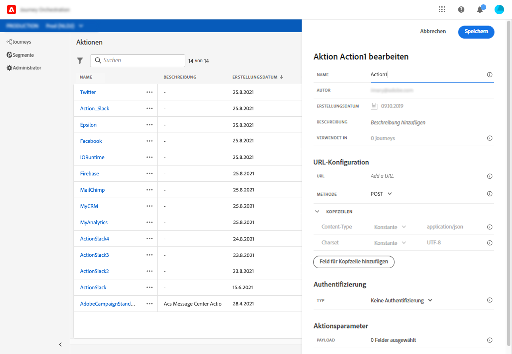

# Informationen zur Konfiguration einer benutzerdefinierten Aktion {#concept_sxy_bzs_dgb}

Wenn Sie zum Senden von Nachrichten ein Drittanbietersystem verwenden oder möchten, dass Journey Orchestration API-Aufrufe an ein Drittanbietersystem sendet, konfigurieren Sie hier die Verbindung zu Journey Orchestration. The custom action defined by technical users will then be available in the left palette of your journey, in the **[!UICONTROL Action]** category (see . Im Folgenden finden Sie Beispiele für Systeme, mit denen Sie über benutzerdefinierte Aktionen eine Verbindung herstellen können: Epsilon, Facebook, Adobe.io, Firebase usw.
Einschränkungen sind hier aufgeführt: .

Im Folgenden werden die wichtigsten Schritte beschrieben, die zum Konfigurieren einer benutzerdefinierten Aktion ausgeführt werden müssen:

1. From the **[!UICONTROL Actions]** list, click **[!UICONTROL Add]** to create a new action. Der Bereich für die Konfiguration der Aktion wird auf der rechten Seite des Bildschirms geöffnet.

   

1. Geben Sie einen Namen für die Aktion ein.

   >[!NOTE]
   >
   >Verwenden Sie keine Leerzeichen oder Sonderzeichen. Verwenden Sie nicht mehr als 30 Zeichen.

1. Fügen Sie Ihrer Aktion eine Beschreibung hinzu. Dieser Schritt ist optional.
1. The number of journeys that use this action is displayed in the **[!UICONTROL Used in]** field. You can click the **[!UICONTROL View journeys]** button to display the list of  journeys using this action.
1. Definieren Sie die verschiedenen **[!UICONTROL URL Configuration]** Parameter. Siehe .
1. Konfigurieren Sie den **[!UICONTROL Authentication]** Abschnitt. Diese Konfiguration ist mit der für Datenquellen identisch.  Siehe .
1. Definieren Sie die **[!UICONTROL Message parameters]**. Siehe .
1. Klicks **[!UICONTROL Save]**.

   Die benutzerdefinierte Aktion ist nun konfiguriert und kann in Ihren Journeys verwendet werden. Siehe .

   >[!NOTE]
   >
   >Wird eine benutzerdefinierte Aktion in einer Journey-Version verwendet, sind die meisten Parameter schreibgeschützt. Sie können nur die **[!UICONTROL Name]**-, **[!UICONTROL Description]**-, **[!UICONTROL URL]** - und den **[!UICONTROL Authentication]** -Abschnitt ändern.
