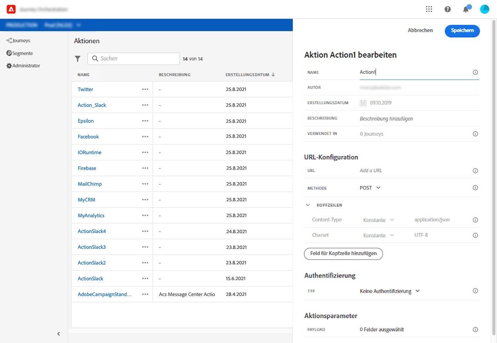

# Informationen zur Konfiguration einer benutzerdefinierten Aktion {#concept_sxy_bzs_dgb}

>[!CAUTION]
>
>**Sie möchten mehr über Adobe Journey Optimizer erfahren**? Klicken Sie [hier](https://experienceleague.adobe.com/de/docs/journey-optimizer/using/ajo-home){target="_blank"}, um auf die Journey Optimizer-Dokumentation zuzugreifen.
>
>
>_Diese Dokumentation bezieht sich auf veraltete Journey Orchestration-Materialien, die durch Journey Optimizer ersetzt wurden. Wenden Sie sich an Ihr Accountteam, wenn Sie Fragen zu Ihrem Zugriff auf Journey Orchestration oder Journey Optimizer haben._

Wenn Sie zum Senden von Nachrichten ein Drittanbietersystem verwenden oder möchten, dass [!DNL Journey Orchestration] API-Aufrufe an ein Drittanbietersystem sendet, konfigurieren Sie hier die Verbindung zu [!DNL Journey Orchestration]. Die von technischen Anwendern definierte Aktion steht dann in der linken Palette Ihrer Journey in der Kategorie **[!UICONTROL Aktion]** zur Verfügung (siehe [diese Seite](../building-journeys/about-action-activities.md). Im Folgenden finden Sie Beispiele für Systeme, mit denen Sie über benutzerdefinierte Aktionen eine Verbindung herstellen können: Epsilon, Facebook, Adobe.io, Firebase usw.

Einschränkungen sind auf [dieser Seite](../about/limitations.md) aufgeführt.

In den Parametern für benutzerdefinierte Aktionen können Sie sowohl eine einfache Sammlung als auch eine Sammlung von Objekten übergeben. Bezüglich der Einschränkungen siehe [diese Seite](../usecase/collections.md#limitations). Beachten Sie außerdem, dass die Parameter ein erwartetes Format haben (Beispiel: Zeichenfolge, Dezimalzahl usw.). Sie müssen darauf achten, dass diese erwarteten Formate eingehalten werden. Siehe diesen [Anwendungsfall](../usecase/collections.md).

Im Folgenden werden die wichtigsten Schritte beschrieben, die zum Konfigurieren einer benutzerdefinierten Aktion erforderlich sind:

1. Klicken Sie in der Liste **[!UICONTROL Aktionen]** auf **[!UICONTROL Hinzufügen]**, um eine neue Aktion zu erstellen. Der Bereich für die Aktionskonfiguration wird auf der rechten Seite des Bildschirms geöffnet.

   

1. Geben Sie einen Namen für Ihre Aktion ein.

   >[!NOTE]
   >
   >Verwenden Sie keine Leerzeichen oder Sonderzeichen. Verwenden Sie nicht mehr als 30 Zeichen.

1. Fügen Sie Ihrer Aktion eine Beschreibung hinzu. Dieser Schritt ist optional.
1. Die Anzahl der Journeys, die diese Aktion verwenden, wird im Feld **[!UICONTROL Verwendet in]** angezeigt. Sie können auf **[!UICONTROL Customer Journeys anzeigen]** klicken, um die Liste der Journeys, die diese Aktion verwenden, anzuzeigen.
1. Definieren Sie die verschiedenen **[!UICONTROL URL-Konfigurations]**-Parameter. Weitere Informationen finden Sie auf [dieser Seite](../action/url-configuration.md).
1. Konfigurieren Sie den Abschnitt **[!UICONTROL Authentifizierung]**. Diese Konfiguration entspricht der für Datenquellen.  Weitere Informationen finden Sie in [diesem Abschnitt](../datasource/external-data-sources.md#section_wjp_nl5_nhb).
1. Definieren Sie die **[!UICONTROL Aktionsparameter]**. Weitere Informationen finden Sie auf [dieser Seite](../action/defining-the-message-parameters.md).
1. Klicken Sie auf **[!UICONTROL Speichern]**.

   Die Aktion ist jetzt konfiguriert und kann in Ihren Journeys verwendet werden. Weitere Informationen finden Sie auf [dieser Seite](../building-journeys/about-action-activities.md).

   >[!NOTE]
   >
   >Wenn eine benutzerdefinierte Aktion in einer Journey verwendet wird, sind die meisten Parameter schreibgeschützt. Sie können nur die Felder **[!UICONTROL Name]**, **[!UICONTROL Beschreibung]**, **[!UICONTROL URL]** und den Abschnitt **[!UICONTROL Authentifizierung]** ändern.
