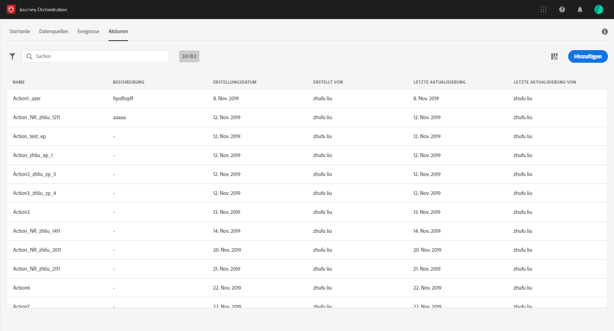

# Aktionen {#about_actions}

>[!CONTEXTUALHELP]
>id=&quot;jo_actions&quot;
>title=&quot;Info&quot;
>abstract=&quot;Hier definieren Sie die Verbindung zum System, das Nachrichten sendet. Die hier definierten Aktionen stehen dann in der linken Palette Ihrer Reise in der Kategorie Aktion zur Verfügung. &quot;

Die Konfiguration von benutzerdefinierten Aktionen wird immer von einem **technischen Benutzer** durchgeführt.

Hier definieren Sie die Verbindung zum System, das Nachrichten senden soll. Die hier definierten Aktionen stehen dann in der linken Palette Ihrer Reise in der Kategorie **[!UICONTROL Aktion]**zur Verfügung (siehe.

Um die Aktionsliste anzuzeigen oder eine neue Aktion zu konfigurieren, klicken Sie in den oberen Menüs auf **[!UICONTROL Aktionen]**. Die Liste der Aktionen wird angezeigt. Weitere Informationenzur Benutzeroberfläche finden Sie unter .

Wenn Sie über Adobe Campaign Standard verfügen, müssen Sie die vordefinierte Aktion konfigurieren. Siehe Abschnitt .

Wenn Sie zum Senden von Nachrichten ein Drittanbietersystem verwenden, müssen Sie eine benutzerdefinierte Aktion hinzufügen und konfigurieren. Siehe Abschnitt .
