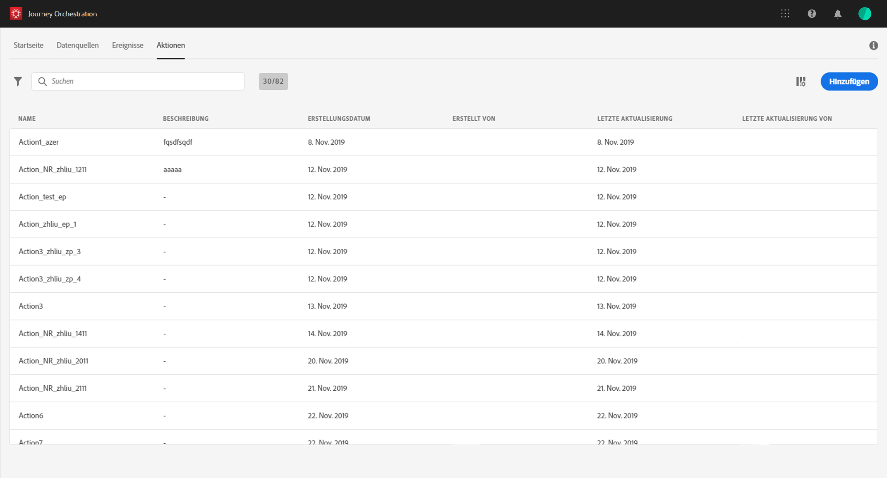

# Informationen zu Aktionen {#about_actions}

>[!CAUTION]
>
>**Sie möchten mehr über Adobe Journey Optimizer erfahren**? Klicken Sie [hier](https://experienceleague.adobe.com/de/docs/journey-optimizer/using/ajo-home){target="_blank"}, um auf die Journey Optimizer-Dokumentation zuzugreifen.
>
>
>_Diese Dokumentation bezieht sich auf veraltete Journey Orchestration-Materialien, die durch Journey Optimizer ersetzt wurden. Wenden Sie sich an Ihr Accountteam, wenn Sie Fragen zu Ihrem Zugriff auf Journey Orchestration oder Journey Optimizer haben._

>[!CONTEXTUALHELP]
>id="jo_actions"
>title="Informationen zu Aktionen"
>abstract="Hier legen Sie die Verbindung zum System fest, über die die Nachrichten versendet werden sollen. Die hier definierten Aktionen werden dann in der linken Palette Ihrer Journey in der Kategorie „Aktion“ verfügbar sein. "

Aktionen sind Verbindungen, über die Sie Kunden personalisierte Echtzeit-Erlebnisse bieten können. Dies sind z. B. Push-Benachrichtigungen, E-Mails, SMS oder andere digitale Interaktionen, die Sie in Ihrem Geschäft verwenden.

Mit benutzerdefinierten Aktionen können Sie die Verbindung eines Drittanbietersystems konfigurieren, um Nachrichten oder API-Aufrufe zu senden. Eine Aktion kann mit jedem Dienst eines beliebigen Anbieters konfiguriert werden, der über eine REST-API mit einer JSON-formatierten Payload aufgerufen werden kann.

Die Aktionen sind in der linken Palette Ihrer Journey in der Kategorie **[!UICONTROL Aktion]** verfügbar. Weitere Informationen finden Sie auf [dieser Seite](../building-journeys/about-action-activities.md).

>[!NOTE]
>
>Die Konfiguration von benutzerdefinierten Aktionen wird immer von einem **technischen Anwender** durchgeführt.

Drücken Sie in der Liste der **Aktionen** „c“, um eine neue Journey, Aktion oder Datenquelle oder ein neues Ereignis zu erstellen. Weitere Informationen zu den Tastaturbefehlen in [!DNL Journey Orchestration] finden Sie in [diesem Abschnitt](../about/user-interface.md#section_ksq_zr1_ffb).

Um die Aktionsliste anzuzeigen oder eine neue Aktion zu konfigurieren, klicken Sie in den oberen Menüs auf **[!UICONTROL Aktionen]**. Die Liste der Aktionen wird angezeigt. Weitere Informationen zur Schnittstelle finden Sie auf [dieser Seite](../about/user-interface.md).

Falls Sie Adobe Campaign Standard verwenden, müssen Sie die vordefinierte Aktion zum Senden von E-Mails, Push-Benachrichtigungen und SMS mit den nativen Funktionen für Transaktionsnachrichten konfigurieren. Mehr dazu erfahren Sie auf [dieser Seite](../action/working-with-adobe-campaign.md).

Wenn Sie über Adobe Campaign v7 oder v8 verfügen, ist auf Anfrage eine Integration verfügbar. Mehr dazu erfahren Sie auf [dieser Seite](../action/acc-action.md).

Wenn Sie ein Drittanbietersystem (z. B. Epsilon, Facebook, Adobe.io, Firebase) zum Senden von Nachrichten verwenden, müssen Sie eine benutzerdefinierte Aktion hinzufügen und konfigurieren. Mehr dazu erfahren Sie auf [dieser Seite](../action/about-custom-action-configuration.md).

