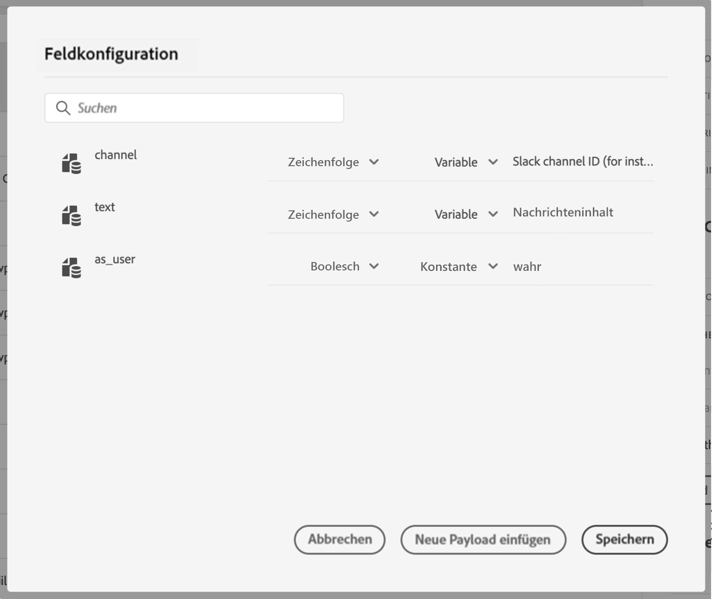

# Definieren der Aktionsparameter {#concept_wy4_bf1_2gb}

Fügen Sie im Abschnitt **[!UICONTROL Aktionsparameter]** ein Beispiel der JSON-Payload ein, die an den externen Service gesendet werden soll.

>[!NOTE]
>
>Feldnamen in der Payload dürfen das Zeichen „.“ nicht enthalten. Sie können nicht mit dem Zeichen „$“ beginnen.

Sie können den Parametertyp definieren (z. B. Zeichenfolge, Ganzzahl usw.).

Sie können auch angeben, ob ein Parameter eine Konstante oder eine Variable ist:

* Konstante bedeutet, dass der Wert des Parameters im Bereich für die Konfiguration der Aktion von einem technischen Anwender definiert wird. Der Wert bleibt über all Journeys hinweg immer gleich. Er ändert sich nicht und wird dem Marketing-Experten nicht angezeigt, wenn die benutzerdefinierte Aktion während der Journey verwendet wird. Es kann sich beispielsweise um eine ID handeln, die das Drittanbietersystem erwartet. In diesem Fall ist das Feld rechts neben dem Umschalter zwischen Konstante und Variable der übergebene Wert.
* Variable bedeutet, dass der Wert des Parameters variiert. Der Marketing-Experte, der diese benutzerdefinierte Aktion in einer Journey verwendet, kann den von ihm gewünschten Wert weitergeben oder angeben, wo der Wert für diesen Parameter abgerufen werden soll (z. B. vom Ereignis oder von Adobe Experience Platform usw.). In diesem Fall ist das Feld rechts neben dem Umschalter zwischen Konstante und Variable der Titel, den der Marketing-Experte in der Journey sieht, um diesen Parameter zu benennen.

