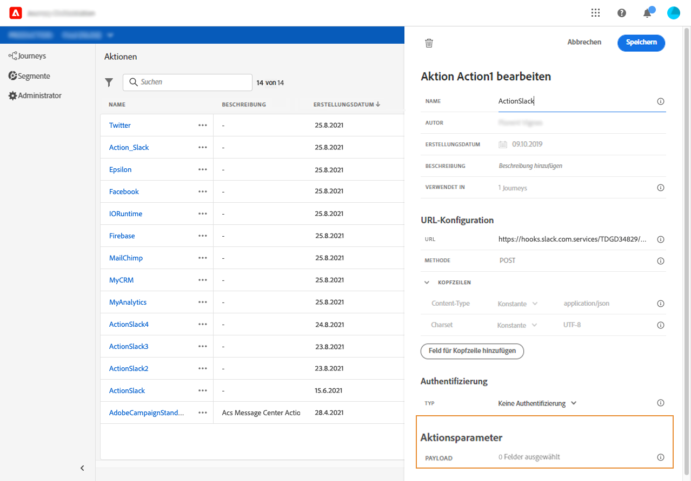
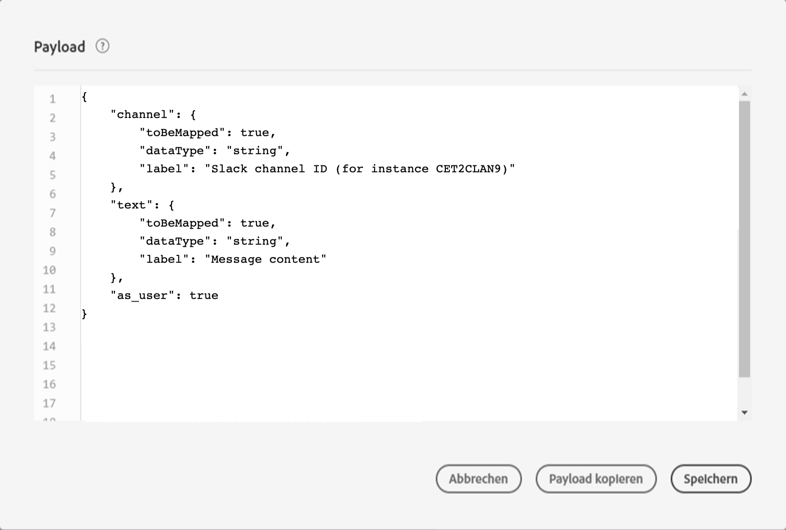

# Definieren der Nachrichtenparameter {#concept_wy4_bf1_2gb}

Fügen Sie im Abschnitt **[!UICONTROL Nachrichtenparameter]** ein Beispiel der JSON-Payload ein, die an den externen Dienst gesendet werden soll.

Sie können festlegen, ob der Parametertyp richtig ist (z. B.: Zeichenfolge, Ganzzahl usw.).

Sie können außerdem angeben, ob ein Parameter eine Konstante oder eine Variable ist:

* Konstante bedeutet, dass der Wert des Parameters im Bereich für die Konfiguration der Aktion von einem technischen Anwender definiert wird. Der Wert bleibt über all Journeys hinweg immer gleich. Er ändert sich nicht und wird dem Marketing-Experten nicht angezeigt, wenn die benutzerdefinierte Aktion während der Journey verwendet wird. Er könnte beispielsweise eine ID sein, die das Drittanbietersystem erwartet. In diesem Fall ist das Feld rechts neben dem Umschalter zwischen Konstante und Variable der übergebene Wert.
* Variable bedeutet, dass der Wert des Parameters variiert. Der Marketingexperte, der diese benutzerdefinierte Aktion auf einer Reise verwendet, kann den gewünschten Wert weitergeben oder angeben, wo der Wert für diesen Parameter abgerufen werden soll (z. B. vom Ereignis, von der Adobe Experience Platform usw.). In diesem Fall ist das Feld rechts neben dem Umschalter zwischen Konstante und Variable der Titel, den der Marketing-Experte in der Journey sieht, um diesen Parameter zu benennen.
