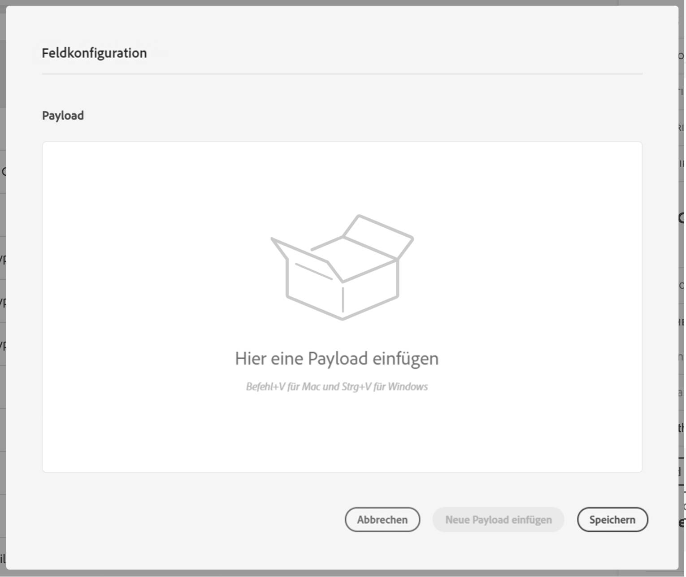

# Definieren der Nachrichtenparameter {#concept_wy4_bf1_2gb}

Fügen Sie im Abschnitt **[!UICONTROL Meldungsparameter]**ein Beispiel der JSON-Nutzlast ein, die an den externen Dienst gesendet werden soll.

Sie können festlegen, ob der Parametertyp richtig ist (z.B.: Zeichenfolge, Ganzzahl usw.).

Sie haben außerdem die Wahl zwischen der Angabe eines Parameters als Konstante oder Variable:

* Konstante bedeutet, dass der Wert des Parameters im Aktionskonfigurationsbereich von einer technischen Person definiert wird. Der Wert ist über Reisen hinweg immer gleich. Es ändert sich nicht, und der Marketingspezialist sieht es nicht, wenn er die benutzerdefinierte Aktion während der Reise verwendet. Es könnte beispielsweise eine ID sein, die das Drittanbietersystem erwartet. In diesem Fall ist das Feld rechts neben der Umschalt-Konstante/Variable der weitergegebene Wert.
* Variable bedeutet, dass der Wert des Parameters variiert. Der Marketingexperte, der diese benutzerdefinierte Aktion auf einer Reise verwendet, kann den von ihm gewünschten Wert weitergeben oder angeben, wo der Wert für diesen Parameter abgerufen werden soll (z. B. vom Ereignis oder von der Datenplattform...). In diesem Fall ist das Feld auf der rechten Seite der umschaltbaren Konstante/Variable die Beschriftung, die der Marketingexperte auf der Reise sehen wird, um diesen Parameter zu benennen.
