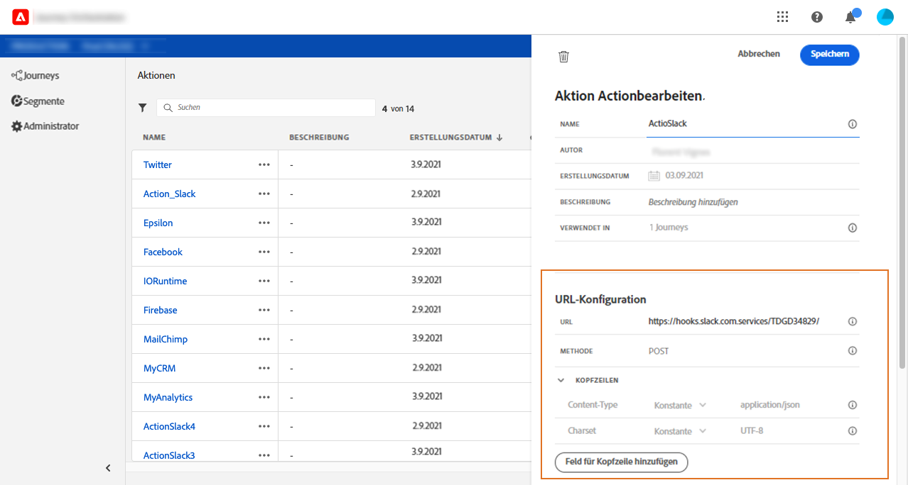

# URL configuration {#concept_gbg_1f1_2gb}

Beim Konfigurieren einer benutzerdefinierten Aktion müssen Sie die folgenden **[!UICONTROL URL-Konfigurationsparameter]**definieren:

1. Fügen Sie die **[!UICONTROL URL]**des externen Dienstes hinzu.

   >[!NOTE]
   >
   >Aus Sicherheitsgründen wird die Verwendung von HTTPS dringend empfohlen. Die Verwendung nicht öffentlicher Adobe-Adressen und die Verwendung von IP-Adressen ist nicht zulässig.

1. Wählen Sie die Aufrufmethode **[!UICONTROL aus]**: kann entweder**[!UICONTROL  POST]** oder **[!UICONTROL PUT]**sein.
1. Klicken Sie im Abschnitt **[!UICONTROL Kopfzeilen]**auf Kopfzeilenfeld****hinzufügen, um ein neues Schlüssel/Wert-Paar zu definieren. Sie entsprechen den HTTP-Headern der Anforderung an den externen Dienst. Um Schlüssel/Wert-Paare zu löschen, platzieren Sie den Cursor im Feld **[!UICONTROL Kopfzeilen]**und klicken Sie auf das Symbol**[!UICONTROL  Löschen]** .

   **[!UICONTROL Content-Type]**und**[!UICONTROL  Charset]** werden standardmäßig eingestellt und können nicht gelöscht oder überschrieben werden.

   >[!NOTE]
   >
   >Kopfzeilen werden gemäß den folgenden [Parsing-Regeln](https://tools.ietf.org/html/rfc7230#section-3.2.4)validiert.
