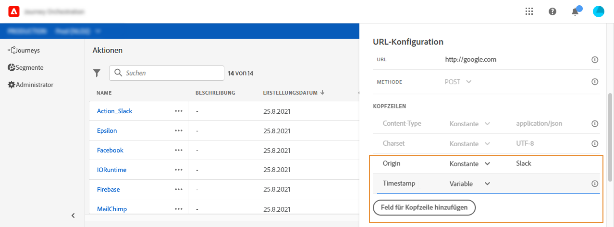

# URL-Konfiguration {#concept_gbg_1f1_2gb}

Beim Konfigurieren einer benutzerdefinierten Aktion müssen Sie die folgenden **[!UICONTROL URL-Konfigurationsparameter]** definieren:

1. Geben Sie im Feld **[!UICONTROL URL]** die URL des externen Services an:

   * Wenn die URL statisch ist, geben Sie die URL in dieses Feld ein.

   * Wenn die URL einen dynamischen Pfad enthält, geben Sie nur den statischen Teil der URL ein, d. h. das Schema, den Host, den Port und optional einen statischen Teil des Pfads.

      Beispiel: `https://xxx.yyy.com:8080/somethingstatic/`

      Sie geben den dynamischen Pfad der URL später an, wenn Sie die benutzerdefinierte Aktion zu einer Journey hinzufügen. [Weitere Informationen](../building-journeys/using-custom-actions.md).
   >[!NOTE]
   >
   >Aus Sicherheitsgründen empfehlen wir dringend, das HTTPS-Schema für die URL zu verwenden. Die Verwendung nicht öffentlicher Adobe-Adressen und die Verwendung von IP-Adressen sind nicht zulässig.

1. Wählen Sie die **[!UICONTROL Aufrufmethode]** aus: Sie kann entweder **[!UICONTROL POST]** oder **[!UICONTROL PUT]** sein.
1. Definieren Sie im Abschnitt **[!UICONTROL Header]** die HTTP-Header der Anfragenachricht, die an den externen Service gesendet werden soll:
   1. Um ein Header-Feld hinzuzufügen, klicken Sie auf **[!UICONTROL Feld für Kopfzeile hinzufügen]**.
   1. Geben Sie den Schlüssel des Header-Felds ein.
   1. Um einen dynamischen Wert für das Schlüssel-Wert-Paar festzulegen, wählen Sie **[!UICONTROL Variabel]** aus. Wählen Sie andernfalls **[!UICONTROL Konstant]** aus.

      Beispielsweise können Sie für einen Zeitstempel einen dynamischen Wert festlegen.

   1. Wenn Sie **[!UICONTROL Konstant]** ausgewählt haben, geben Sie den konstanten Wert ein.

      Wenn Sie **[!UICONTROL Variabel]** ausgewählt haben, geben Sie diese Variable an, wenn Sie die benutzerdefinierte Aktion zu einer Journey hinzufügen. [Weitere Informationen](../building-journeys/using-custom-actions.md).

      

   1. Um ein Header-Feld zu löschen, zeigen Sie auf das Header-Feld und klicken Sie auf das Symbol **[!UICONTROL Löschen]**.
   Die Header-Felder **[!UICONTROL Content-Typ]** und **[!UICONTROL Charset]** werden standardmäßig festgelegt. Sie können diese Felder nicht ändern oder löschen.

   Nachdem Sie die benutzerdefinierte Aktion zu einer Journey hinzugefügt haben, können Sie ihr weiterhin Header-Felder hinzufügen, wenn sich die Journey im Entwurfsstatus befindet. Wenn Sie nicht möchten, dass die Journey von Konfigurationsänderungen betroffen ist, duplizieren Sie die benutzerdefinierte Aktion und fügen Sie die Header-Felder zur neuen benutzerdefinierten Aktion hinzu.

   >[!NOTE]
   >
   >Header werden gemäß den folgenden Parsing-Regeln validiert. [Weitere Informationen](https://tools.ietf.org/html/rfc7230#section-3.2.4).
