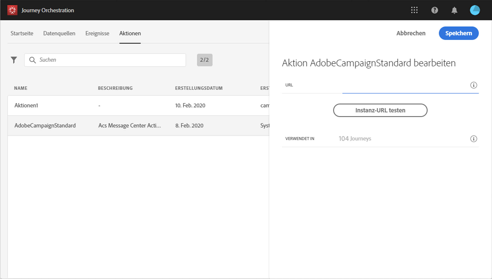
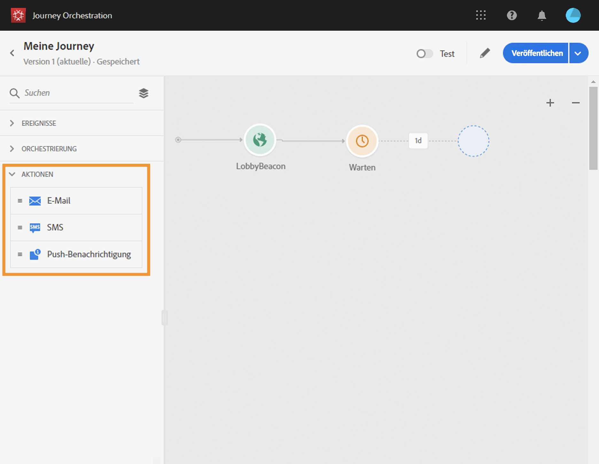

# Verwenden von Adobe Campaign Standard {#using_adobe_campaign_standard}

>[!CAUTION]
>
>**Sie möchten mehr über Adobe Journey Optimizer erfahren**? Klicken Sie [hier](https://experienceleague.adobe.com/de/docs/journey-optimizer/using/ajo-home){target="_blank"}, um auf die Journey Optimizer-Dokumentation zuzugreifen.
>
>
>_Diese Dokumentation bezieht sich auf veraltete Journey Orchestration-Materialien, die durch Journey Optimizer ersetzt wurden. Wenden Sie sich an Ihr Accountteam, wenn Sie Fragen zu Ihrem Zugriff auf Journey Orchestration oder Journey Optimizer haben._

Mit der Transaktionsnachrichten-Funktion von Adobe Campaign Standard können Sie E-Mails, Push-Benachrichtigungen und SMS senden.

Für [!DNL Journey Orchestration] steht eine native Aktion zur Verfügung, die die Verbindung mit Adobe Campaign Standard ermöglicht.

Die Transaktionsnachricht in Campaign Standard und das zugehörige Ereignis müssen veröffentlicht werden, damit sie in Journey Orchestration verwendet werden können. Wenn das Ereignis veröffentlicht wird, die Nachricht jedoch nicht, wird sie nicht in der Benutzeroberfläche von Journey Orchestration angezeigt. Wenn die Nachricht veröffentlicht wird, das zugehörige Ereignis jedoch nicht, wird sie in der Benutzeroberfläche von Journey Orchestration angezeigt, sie kann jedoch nicht verwendet werden.

>[!NOTE]
>
>Für Adobe Campaign Standard-Aktionen wird automatisch eine Begrenzungsregel von 4.000 Aufrufen pro fünf Minuten definiert, sobald die Adobe Campaign Standard-Integration eingerichtet ist. Dies entspricht dem offiziellen Umfang von Transaktionsnachrichten in Adobe Campaign Standard.
>
>Lesen Sie mehr über Service-Level-Vereinbarungen für Transaktionsnachrichten in der [Produktbeschreibung von Adobe Campaign Standard](https://helpx.adobe.com/de/legal/product-descriptions/campaign-standard.html).

Im Folgenden werden die Konfigurationsschritte beschrieben:

1. Klicken Sie in der Liste **[!UICONTROL Aktionen]** auf die integrierte Aktion **[!UICONTROL AdobeCampaignStandard]**. Der Bereich für die Aktionskonfiguration wird auf der rechten Seite des Bildschirms geöffnet.

   

1. Kopieren Sie die URL der Adobe Campaign Standard-Instanz und fügen Sie sie in das Feld **[!UICONTROL URL]** ein.

1. Klicken Sie auf **[!UICONTROL Instanz-URL testen]**, um die Gültigkeit der Instanz zu testen.

   >[!NOTE]
   >
   >Dieser Test bestätigt Folgendes:
   >
   >Der Host ist „.campaign.adobe.com“, „.campaign-sandbox.adobe.com“, „.campaign-demo.adobe.com“, „.ats.adobe.com“ oder „.adls.adobe.com“.
   >
   >Die URL beginnt mit https.
   >
   >die mit dieser Adobe Campaign Standard-Instanz verknüpfte ORG ist identisch mit der ORG von Journey Orchestration.

Bei der Gestaltung Ihrer Journey stehen in der Kategorie **[!UICONTROL Aktion]** drei Aktionen zur Verfügung: **[!UICONTROL E-Mail]**, **[!UICONTROL Push]**, **[!UICONTROL SMS]** (siehe [Verwenden von Adobe Campaign-Aktionen](../building-journeys/using-adobe-campaign-actions.md)). Das **Reaktionsereignis** ermöglicht es Ihnen auch, auf das Anklicken, Öffnen usw. von Nachrichten zu reagieren (siehe [Reaktionsereignisse](../building-journeys/reaction-events.md)).

Wenn Sie zum Senden von Nachrichten ein Drittanbietersystem verwenden, müssen Sie eine benutzerdefinierte Aktion hinzufügen und konfigurieren. Siehe [Informationen zur Konfiguration einer benutzerdefinierten Aktion](../action/about-custom-action-configuration.md).
