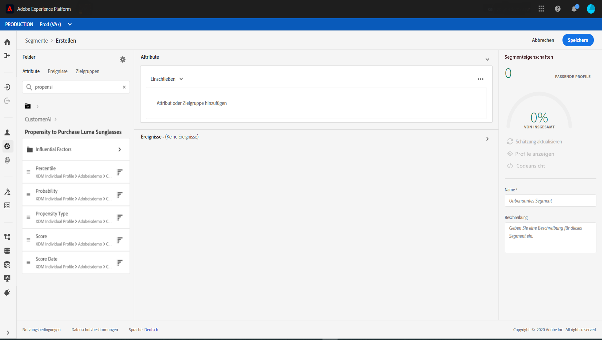

# Verwenden von Kunden-KI {#customer-ai}

>[!CAUTION]
>
>**Sie möchten mehr über Adobe Journey Optimizer erfahren**? Klicken Sie [hier](https://experienceleague.adobe.com/de/docs/journey-optimizer/using/ajo-home){target="_blank"}, um auf die Journey Optimizer-Dokumentation zuzugreifen.
>
>
>_Diese Dokumentation bezieht sich auf veraltete Journey Orchestration-Materialien, die durch Journey Optimizer ersetzt wurden. Wenden Sie sich an Ihr Accountteam, wenn Sie Fragen zu Ihrem Zugriff auf Journey Orchestration oder Journey Optimizer haben._

Kunden-KI ist Teil von Intelligent Services. Der Service hilft, vorauszusagen, was eine Kundin bzw. ein Kunde wahrscheinlich tun wird. Weitere Informationen finden Sie in der [Dokumentation](https://experienceleague.adobe.com/docs/experience-platform/intelligent-services/customer-ai/overview.html?lang=de).

Mit Kunden-KI können Marken auf maschinellem Lernen basierende Abwanderungs- oder Konversionswerte erstellen, die anschließend als Profilattribute in den Adobe Experience Platform-Profilen (Echtzeit-Kundenprofilen) verfügbar sind.

Folglich können sie wie jedes andere Profilattribut in den Bedingungen von Journey Orchestration (zum Treffen der besten Entscheidungen), bei Aktionen oder beim Erstellen von Segmenten verwendet werden.

Beachten Sie, dass Kunden-KI eine gebührenpflichtige Funktion von Adobe Experience Platform ist.
