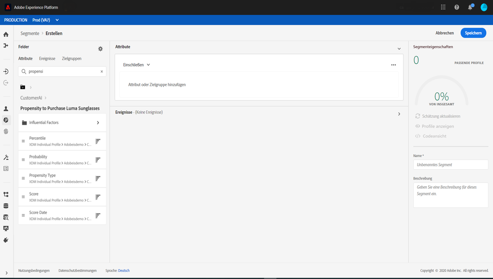

# Nutzung der Kundenaktivität {#customer-ai}

Kunden-API ist Teil von Intelligent Services. Es hilft vorherzusagen, was ein Kunde wahrscheinlich tun wird. See the [documentation](https://docs.adobe.com/content/help/en/experience-platform/intelligent-services/customer-ai/overview.html).

Die Kundentechnik-API ermöglicht es Marken, Kurven- oder Konvertierungsmaschinenerkennungswerte zu erstellen, die als Profil-Attribute in den Experience Platform-Profilen verfügbar sind (Echtzeit-Customer-Profil).

Daher können sie als alle anderen Profil-Attribute in den Bedingungen der Journey Orchestration (um die besten Entscheidungen zu treffen), Aktionen oder Segmentaufbau verwendet werden.

Beachten Sie, dass die Kundentraining eine gebührenpflichtige Funktion der Experience Platform ist.

