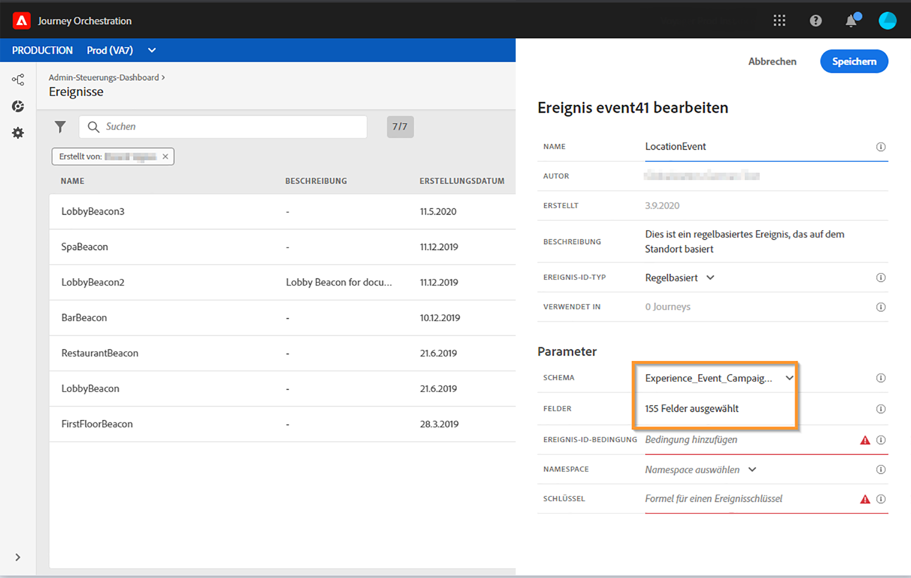

# Regelbasierte Ereignisse{#simplified-events}

Die Einrichtung von Erlebnisereignissen wurde vereinfacht. Bei der neuen Methode muss keine eventID verwendet werden. Wenn Sie Ihr Ereignis in Journey Orchestration einrichten, können Sie jetzt ein regelbasiertes Ereignis definieren.

Dieser neue Ereignistyp generiert keine eventID. Mit dem einfachen Ausdruckseditor definieren Sie jetzt einfach eine Regel, anhand derer das System die relevanten Ereignisse identifiziert, die Ihre Journeys auslösen. Diese Regel kann auf einem beliebigen Feld basieren, das in der Ereignis-Payload verfügbar ist, z. B. dem Standort des Profils oder der Anzahl der Artikel, die dem Warenkorb des Profils hinzugefügt wurden.

Diese neue Methode ist für Benutzer weitgehend transparent. Die einzige Änderung ist ein neues Feld im Bildschirm zur Ereignisdefinition.

1. Klicken Sie im linken Menü auf das Symbol **[!UICONTROL Admin]** und dann auf **[!UICONTROL Ereignis]**. Die Liste der Ereignisse wird angezeigt.

   

1. Klicken Sie auf **[!UICONTROL Hinzufügen]**, um ein neues Ereignis zu erstellen. Der Bereich für die Ereigniskonfiguration wird auf der rechten Seite des Bildschirms geöffnet.

   

1. Geben Sie den Namen Ihres Ereignisses ein. Sie können auch eine Beschreibung hinzufügen.

   

1. Wählen Sie im neuen Feld **[!UICONTROL Ereignis-ID-Typ]** die Option **[!UICONTROL Regelbasiert]** aus.

   

   >[!NOTE]
   >
   >Der **[!UICONTROL systemgenerierte]** Typ ist die bestehende Methode, für die eine eventID erforderlich ist. Siehe [diesen Abschnitt](../event/about-events.md).

1. Definieren Sie die **[!UICONTROL Schema]**- und **[!UICONTROL Payload]**-Felder. Siehe [diesen Abschnitt](../event/defining-the-payload-fields.md).

   

   >[!NOTE]
   >
   >Wenn Sie den **[!UICONTROL systemgenerierten Typ]** auswählen, sind nur Schemata mit dem eventID-Typ „mixin“ verfügbar. Wenn Sie den **[!UICONTROL regelbasierten]** Typ auswählen, sind nur Erlebnisereignisschemata verfügbar.

1. Klicken Sie in das Feld **[!UICONTROL Ereignis-ID-Bedingung]**. Mit dem einfachen Ausdruckseditor definieren Sie eine Bedingung, anhand derer das System die Ereignisse identifiziert, die Ihre Journey auslösen.

   

   In unserem Beispiel haben wir eine Bedingung basierend auf der Stadt des Profils verwendet. Dies bedeutet, dass das System jedes Mal, wenn es ein Ereignis empfängt, das dieser Bedingung entspricht (Feld **[!UICONTROL Stadt]** und Wert **[!UICONTROL Paris]**), dieses an Journey Orchestration weiterleitet.

1. Geben Sie den **[!UICONTROL Namespace]** und den **[!UICONTROL Schlüssel]** an. Siehe [Auswählen des Namespace](../event/selecting-the-namespace.md) und [Definieren des Ereignisschlüssels](../event/defining-the-event-key.md).

   

Die anderen Schritte für die Ereigniskonfiguration und Journey-Erstellung bleiben unverändert.

Das Ereignis ist jetzt konfiguriert und kann wie jedes andere Ereignis in einer Journey abgelegt werden. Jedes Mal, wenn ein Ereignis, das der Regel entspricht, an das System gesendet wird, wird es an Journey Orchestration übergeben, um Ihre Journeys auszulösen.

