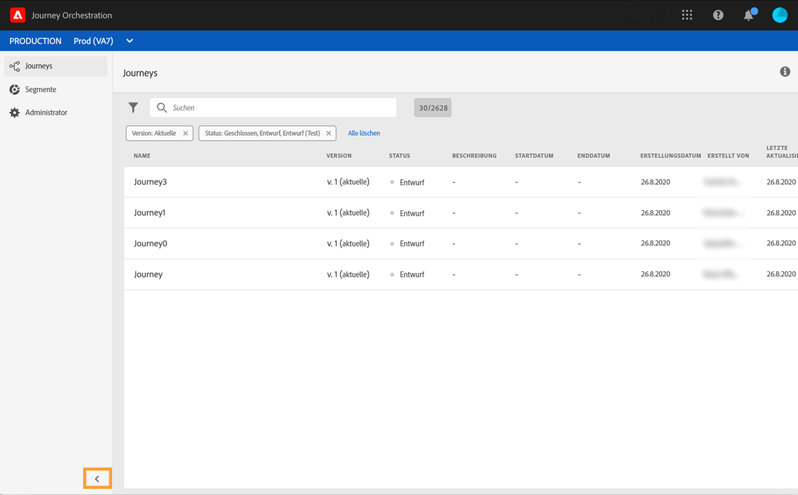
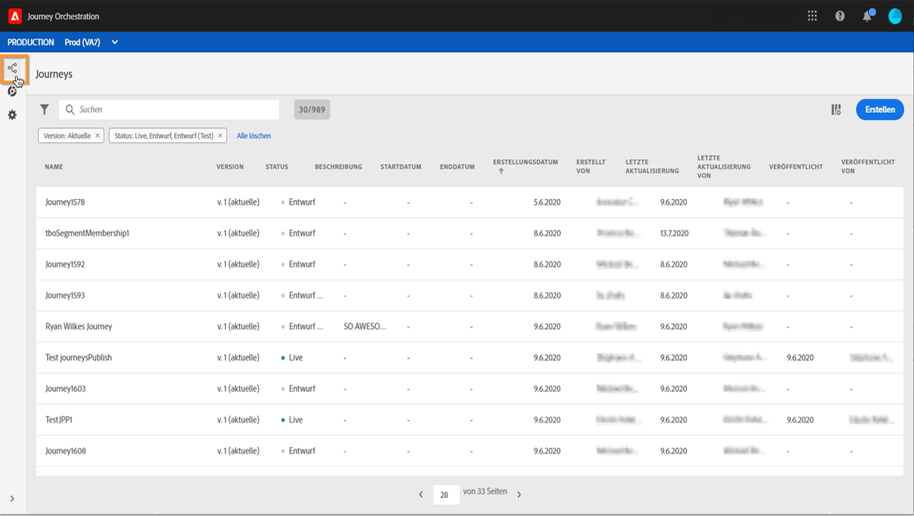
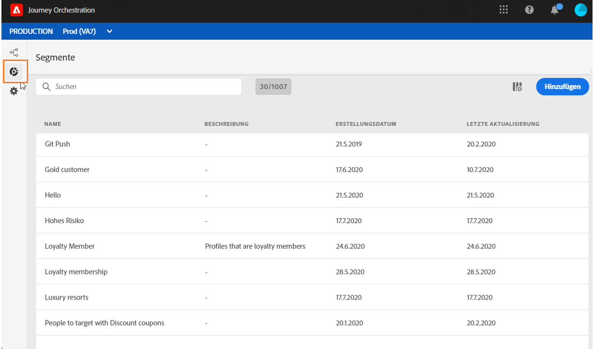
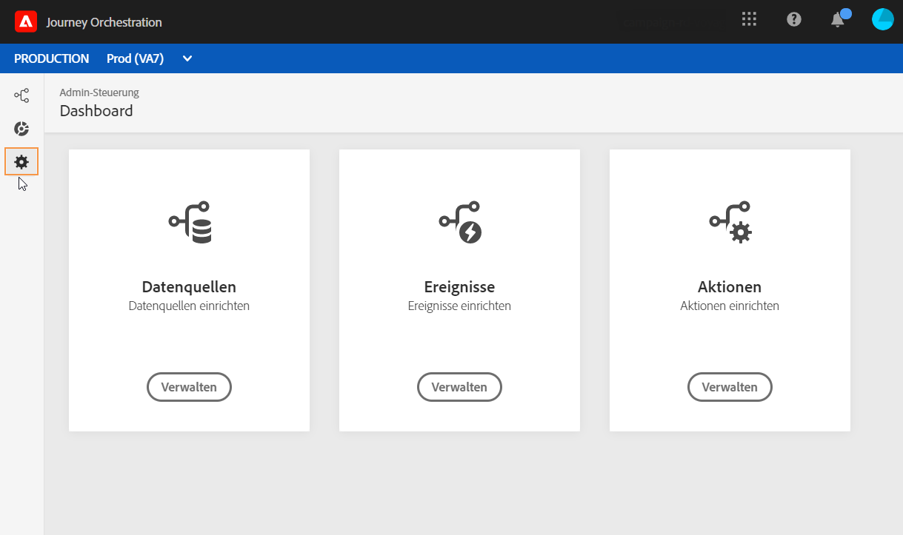

# Benutzeroberfläche der Alpha-Version {#discovering-alpha-interface}

## Informationen zur Benutzeroberfläche der Alpha-Version {#about-alpha-interface}

Die Navigation innerhalb der [!DNL Journey Orchestration]-Menüs wurde verbessert, um eine konsistente Schnittstelle mit Adobe Experience Platform zu schaffen. Zu den Änderungen gehören:

* Die Menüs wurden von der oberen zur linken Seite der Benutzeroberfläche verschoben,
* Gruppierung der Admin-Funktionen in einem einzigen Dashboard.

In diesem [Abschnitt](../about/user-interface.md) werden globale Konzepte zur Verwendung und Navigation in der Benutzeroberfläche (Suchen und Filtern, Durchsuchen von Adobe Experience Platform-Feldern, Shortcuts) vorgestellt.

## Aufrufen von [!DNL Journey Orchestration]-Funktionen {#accessing-journey-orchestration-functionalities}

Über die Menüleiste auf der linken Seite haben Sie Zugriff auf die verschiedenen Funktionen. Klicken Sie auf ein Symbol, um auf das entsprechende Menü zuzugreifen. Sie können auf den Pfeil unten links klicken, um die Menüleiste zu erweitern oder zu reduzieren.

Wenn Sie [!DNL Journey Orchestration] aufrufen, wird das Menü **[!UICONTROL Journeys]** angezeigt, über das Sie auf bestehende Journeys zugreifen oder neue Journeys erstellen können. Siehe [Verwenden des Journey-Designers](../building-journeys/using-the-journey-designer.md).

Über das Menü **[!UICONTROL Segmente]** können Sie auf Segmente von Adobe Experience Platform zugreifen und neue Segmente erstellen. Siehe [Über Adobe Experience Platform-Segmente](../segment/about-segments.md).

Das Menü **[!UICONTROL Admin]** steht allen Benutzern mit Administratorrechten zur Verfügung (siehe [Zugriffsverwaltung](../about/access-management.md)). Es bietet ein Dashboard, mit dem Sie [Datenquellen](../datasource/about-data-sources.md), [Ereignisse](../event/about-events.md) und [Aktionen](../action/action.md)einrichten können.

