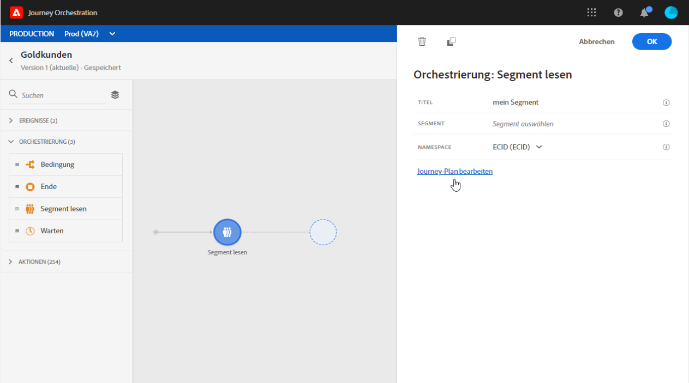

# Segmentauslöser-Aktivität {#segment-trigger-activity}

## Aktivität zum Segmentauslöser {#about-segment-trigger-actvitiy}

Mit der Segmentauslöser-Aktivität können Sie alle Experience Platformen, die zu einem Segmentsegment gehören, in eine Reise einbinden. Eintritt in eine Reise kann einmal oder regelmäßig ausgeführt werden.

Nehmen wir an, Sie haben ein Gold-Kundensegment auf der Experience Platform. Mit der Segmentauslöser-Aktivität können Sie alle dem Gold-Kundensegment angehörenden Personen in eine Reise einbinden und sie zu individuellen Reisen machen, die alle Reisefunktionalitäten nutzen: Bedingungen, Timer, Ereignisse, Aktionen.

>[!NOTE]
>
>Aufgrund von Segmentexportlatenzen ist es nicht möglich, eine segmentbasierte Reise in einem kürzeren Zeitrahmen als 1 Stunde auszulösen.

## Configuring the activity {#configuring-segment-trigger-activity}

1. Unfold the **[!UICONTROL Orchestration]** category and drop a **[!UICONTROL Segment Trigger]** activity into your canvas.

   Die Aktivität muss als erster Schritt einer Reise positioniert werden.

1. Konfigurieren Sie den **[!UICONTROL Planung-Typ]** der Aktivität.

   Standardmäßig wird das Segment **[!UICONTROL so bald wie möglich]** in die Reise aufgenommen, d. h. 1 Stunde nach der Veröffentlichung der Reise. Wenn Sie möchten, dass das Segment zu einem bestimmten Datum/zu einer bestimmten Uhrzeit oder wiederholt auf die Reise gelangt, wählen Sie die gewünschte Option in der Liste aus.

   Bei wiederkehrenden Reisen können Sie auch den Beginn und das Ende der Reise festlegen.

   

1. Wählen Sie im Feld **[!UICONTROL Segment]** das Segmentsegment aus, das die Experience Platform aufrufen soll, und klicken Sie dann auf **[!UICONTROL Speichern]**.

   

1. Wählen Sie im Feld **[!UICONTROL Namensraum]** den Namensraum aus, der zur Identifizierung der Personen verwendet werden soll. For more on namespaces, refer to [this section](../event/selecting-the-namespace.md).

   >[!NOTE]
   >
   >Personen, die zu einem Segment gehören, das nicht über die jeweilige Namensraum-ID verfügt, können nicht an der Reise teilnehmen.

1. Click **[!UICONTROL Ok]** to confirm. Sie können dann verfügbare Aktivitäten nutzen, um Ihre Reise zu gestalten.

1. Sobald die Reise fertig ist, können Sie sie potenziell testen (siehe [Testen der Reise](../building-journeys/testing-the-journey.md)).

   Wenn der Testmodus auf einer Reise aktiviert wird, die mit einer **[!UICONTROL Segmentauslöser]** -Aktivität beginnt, werden 100 Profil zufällig unter den für das ausgewählte Segment qualifizierten Profilen ausgewählt. Die Testprotokolle ermöglichen es Ihnen, den Pfad der einzelnen Personen während der Reise und mögliche aufgetretene Fehler anzuzeigen (siehe [Anzeigen der Protokolle](../building-journeys/testing-the-journey.md#viewing_logs)).

   >[!NOTE]
   >
   >Beachten Sie, dass Sie die 100 Personen, die auf die Reise folgen, nicht mit der visuellen Flussfunktion sehen können, die auf einheitlichen Reisen vorhanden ist.

1. Anschließend können Sie Ihre Reise veröffentlichen (siehe [Veröffentlichen der Reise](../building-journeys/publishing-the-journey.md)). Die dem Segment angehörenden Personen treten zu dem in der Planung Segmentauslöser angegebenen Datum/der Uhrzeit in die Aktivität ein.

   >[!IMPORTANT]
   >
   >Beachten Sie, dass Experience Platformen-Segmente entweder einmal täglich (**Stapelsegmente** ) oder in Echtzeit (**Streaming** -Segmente) berechnet werden.
   >
   >Wenn das ausgewählte Segment gestreamt wird, können die zu diesem Segment gehörenden Personen die Reise möglicherweise in Echtzeit aufrufen. Wenn es sich bei dem Segment um einen Stapel handelt, können Personen, die für dieses Segment neu qualifiziert wurden, möglicherweise die Reise aufrufen, wenn die Segmentberechnung auf der Experience Platform ausgeführt wird.
