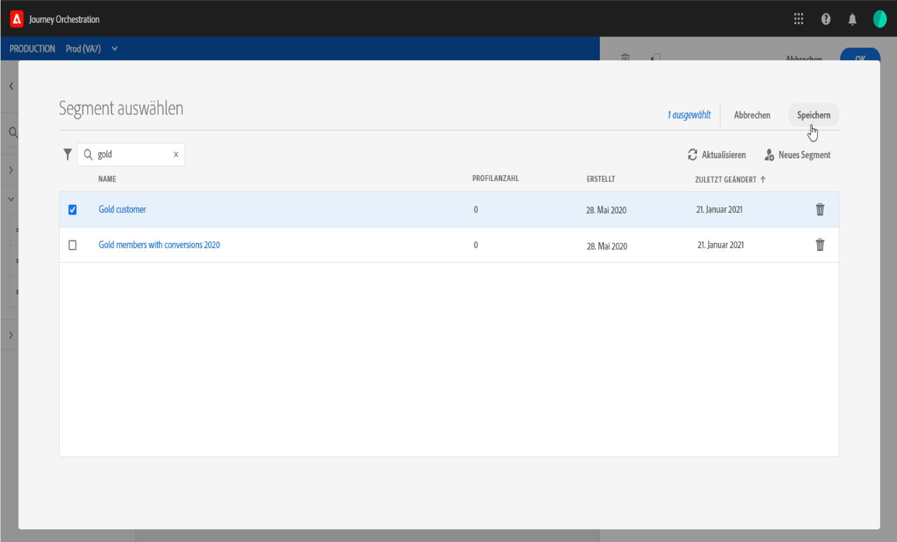
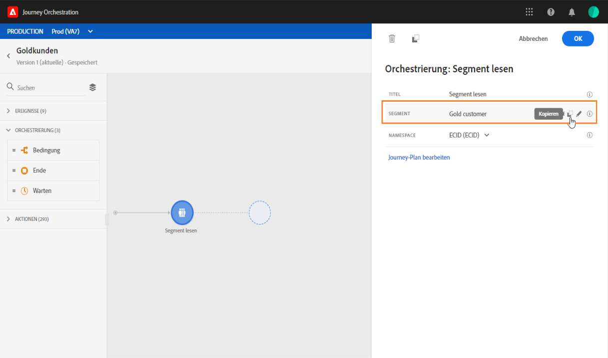

# Aktivität zum Lesen von Segmenten {#segment-trigger-activity}

## Aktivität zum Lesen von Segmenten {#about-segment-trigger-actvitiy}

>[!NOTE]
>
>Wenn zum Zeitpunkt der Veröffentlichung oder der Aktivierung des Testmodus eine native Aktionsaktivität von Adobe Campaign Standard auf der Arbeitsfläche vorhanden ist, wird die Journey auf 13 Eintritte pro Sekunde gedrosselt. Andernfalls wird die Reise um 1000 Ereignis pro Sekunde gedrosselt.

Mit der Aktivität zum Lesen von Segmenten können Sie alle Personen, die zu einem Adobe Experience Platform-Segment gehören, in eine Reise einbinden. Der Eintritt in eine Journey kann entweder einmalig oder regelmäßig erfolgen.

Nehmen wir an, Sie verfügen über ein Segment für „Gold-Kunden“ in Adobe Experience Platform. Mit der Aktivität &quot;Segment lesen&quot;können Sie alle Personen, die dem Gold-Kundensegment angehören, auf eine Reise bringen und sie in individuelle Reisen einmünden lassen, die alle Reisefunktionalitäten nutzen: Bedingungen, Timer, Ereignisse, Aktionen.

## Konfigurieren der Aktivität {#configuring-segment-trigger-activity}

>[!NOTE]
>
>Aufgrund von Latenzen beim Segmentexport ist es nicht möglich, eine segmentbasierte Journey in einem kürzeren Zeitraum als einer Stunde auszulösen.

1. Unfold the **[!UICONTROL Orchestration]** category and drop a **[!UICONTROL Read Segment]** activity into your canvas.

   Die Aktivität muss als erster Schritt einer Journey positioniert werden.

1. Add a **[!UICONTROL Label]** to the activity (optional).

1. Wählen Sie im Feld **[!UICONTROL Segment]** das Adobe Experience Platform-Segment aus, das in die Journey eintreten soll, und klicken Sie dann auf **[!UICONTROL Speichern]**.

   >[!NOTE]
   >
   >Beachten Sie, dass Sie die in der Liste angezeigten Spalten anpassen und sortieren können.

   

   Nachdem das Segment hinzugefügt wurde, können Sie mit der Schaltfläche **[!UICONTROL Kopieren]** dessen Namen und ID kopieren:

   `{"name":"Gold customers,”id":"8597c5dc-70e3-4b05-8fb9-7e938f5c07a3"}`

   

1. Wählen Sie im Feld **[!UICONTROL Namespace]** den Namespace aus, der zur Identifizierung der Einzelanwender verwendet werden soll. Weitere Informationen zu Namespaces finden Sie in [diesem Abschnitt](../event/selecting-the-namespace.md).

   >[!NOTE]
   >
   >Einzelanwender, die zu einem Segment gehören, das nicht die ausgewählte Identität (den ausgewählten Namespace) hat, können nicht in die Journey eintreten.

1. Mit der Aktivität zum **[!UICONTROL Lesen von Segmenten]** können Sie den Zeitpunkt angeben, zu dem das Segment in die Reise eintreten wird. Klicken Sie dazu auf den Link Fahrplan **** bearbeiten, um auf die Eigenschaften der Reise zuzugreifen, und konfigurieren Sie dann das Feld **[!UICONTROL Planung Typ]** .

   

   By default, segments enter the journey **[!UICONTROL As soon as possible]**, meaning 1 hour after the journey is published. Wenn Sie möchten, dass das Segment zu einem bestimmten Datum/zu einer bestimmten Uhrzeit oder wiederholt auf die Reise gelangt, wählen Sie den gewünschten Wert aus der Liste aus.

   >[!NOTE]
   >
   >Beachten Sie, dass der Abschnitt **[!UICONTROL Zeitplan]** nur verfügbar ist, wenn eine Aktivität zum **[!UICONTROL Lesen von Segmenten]** auf der Arbeitsfläche abgelegt wurde.

   

## Testen und Veröffentlichen der Reise {#testing-publishing}

Mit der Aktivität zum **[!UICONTROL Segmentlesen]** können Sie die Reise entweder auf einem einheitlichen Profil oder auf 100 zufällig ausgewählten Profilen unter den für das Segment qualifizierten Profilen testen.

Aktivieren Sie dazu den Testmodus und wählen Sie dann im linken Bereich die gewünschte Option aus.

Anschließend können Sie den Testmodus wie gewohnt konfigurieren. Ausführliche Anweisungen zum Testen einer Reise finden Sie in [diesem Abschnitt](../building-journeys/testing-the-journey.md).

Beachten Sie, dass das Testen der Reise mit bis zu 100 Profilen auf einmal den Fortschritt der einzelnen Personen auf der Reise mithilfe des visuellen Datenflusses nicht nachverfolgen kann.

Sobald die Tests erfolgreich sind, können Sie Ihre Reise veröffentlichen (siehe [Veröffentlichen der Reise](../building-journeys/publishing-the-journey.md)). Individuals belonging to the segment will enter the journey on the date/time specified in the journey&#39;s properties **[!UICONTROL Scheduler]** section.

>[!IMPORTANT]
>
>Beachten Sie, dass Adobe Experience Platform-Segmente entweder einmal täglich (**Batch**-Segmente) oder in Echtzeit (**gestreamte** Segmente) berechnet werden.
>
>Wenn das ausgewählte Segment gestreamt wird, können die zu diesem Segment gehörenden Personen die Reise möglicherweise in Echtzeit aufrufen. Wenn es sich bei dem Segment um ein Batch-Segment handelt, treten für dieses Segment neu qualifizierte Personen in die Journey ein, wenn die Segmentberechnung in Adobe Experience Platform ausgeführt wird.
