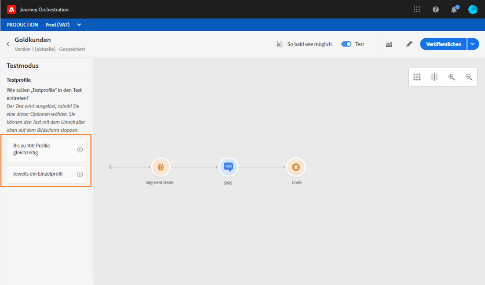

# Aktivität „Segment lesen“ {#segment-trigger-activity}

## Über die Aktivität „Segment lesen“ {#about-segment-trigger-actvitiy}

>[!NOTE]
>
>Wenn zum Zeitpunkt der Veröffentlichung oder der Aktivierung des Testmodus eine native Aktionsaktivität von Adobe Campaign Standard auf der Arbeitsfläche vorhanden ist, wird die Journey auf 13 Eintritte pro Sekunde gedrosselt. Andernfalls wird die Journey auf 1000 Ereignisse pro Sekunde gedrosselt.

Mit der Aktivität „Segment-Lesen“ können Sie alle Kontakte, die zu einem Adobe Experience Platform-Segment gehören, in eine Journey eintreten lassen. Der Eintritt in eine Journey kann entweder einmalig oder regelmäßig erfolgen.

Nehmen wir an, Sie verfügen über ein Segment für „Gold-Kunden“ in Adobe Experience Platform. Mit der Aktivität „Segment lesen“ können Sie alle Kontakte, die zum Gold-Kundensegment gehören, in eine Journey eintreten lassen und durch individuelle Journeys führen, die alle Journey-Funktionen nutzen: Bedingungen, Timer, Ereignisse, Aktionen.

## Konfigurieren der Aktivität {#configuring-segment-trigger-activity}

>[!NOTE]
>
>Aufgrund von Latenzen beim Segmentexport ist es nicht möglich, eine segmentbasierte Journey in einem kürzeren Zeitraum als einer Stunde auszulösen.

1. Erweitern Sie die Kategorie **[!UICONTROL Orchestrierung]** und legen Sie eine Aktivität vom Typ **[!UICONTROL Segment lesen]** auf Ihrer Arbeitsfläche ab.

   Die Aktivität muss als erster Schritt einer Journey positioniert werden.

1. Fügen Sie der Aktivität einen **[!UICONTROL Titel]** hinzu (optional).

1. Wählen Sie im Feld **[!UICONTROL Segment]** das Adobe Experience Platform-Segment aus, das in die Journey eintreten soll, und klicken Sie dann auf **[!UICONTROL Speichern]**.

   >[!NOTE]
   >
   >Beachten Sie, dass Sie die in der Liste angezeigten Spalten anpassen und sortieren können.

   

   Nachdem das Segment hinzugefügt wurde, können Sie mit der Schaltfläche **[!UICONTROL Kopieren]** dessen Namen und ID kopieren:

   `{"name":"Gold customers,”id":"8597c5dc-70e3-4b05-8fb9-7e938f5c07a3"}`

   

1. Wählen Sie im Feld **[!UICONTROL Namespace]** den Namespace aus, der zur Identifizierung der Einzelanwender verwendet werden soll. Weitere Informationen zu Namespaces finden Sie in [diesem Abschnitt](../event/selecting-the-namespace.md).

   >[!NOTE]
   >
   >Einzelanwender, die zu einem Segment gehören, das nicht die ausgewählte Identität (den ausgewählten Namespace) hat, können nicht in die Journey eintreten.

1. Mit der Aktivität **[!UICONTROL Segment lesen]** können Sie den Zeitpunkt festlegen, zu dem das Segment in die Journey eintreten wird. Klicken Sie dazu auf den Link **[!UICONTROL Journey-Planung bearbeiten]**, um auf die Eigenschaften der Journey zuzugreifen, und konfigurieren Sie dann das Feld **[!UICONTROL Planungstyp]**.

   

   Standardmäßig treten Segmente **[!UICONTROL so bald wie möglich]** in die Journey ein, d. h. eine Stunde nach der Veröffentlichung der Journey. Wenn das Segment zu einem bestimmten Datum/zu einer bestimmten Uhrzeit oder wiederholt in die Journey eintreten soll, wählen Sie den gewünschten Wert aus der Liste aus.

   >[!NOTE]
   >
   >Beachten Sie, dass der Bereich **[!UICONTROL Plan]** nur verfügbar ist, wenn eine **[!UICONTROL Segment lesen]**-Aktivität auf der Arbeitsfläche abgelegt wurde.

   

## Testen und Veröffentlichen der Journey {#testing-publishing}

Mit der Aktivität **[!UICONTROL Segment lesen]** können Sie die Journey entweder auf einem unitären Profil oder auf 100 Testprofilen testen, die per Zufallsauswahl aus den für das Segment qualifizierten Profilen entnommen werden.

Aktivieren Sie dazu den Testmodus und wählen Sie dann im linken Bereich die gewünschte Option aus.

Anschließend können Sie den Testmodus wie gewohnt konfigurieren und ausführen. Ausführliche Anweisungen zum Testen einer Journey finden Sie in [diesem Abschnitt](../building-journeys/testing-the-journey.md).

Sobald der Test ausgeführt wird, können Sie mit der Schaltfläche Protokolle **[!UICONTROL anzeigen]** die Testergebnisse entsprechend der ausgewählten Testoption anzeigen:

* **[!UICONTROL Einzelnes Profil gleichzeitig]**: Die Testprotokolle zeigen dieselben Informationen an wie bei Verwendung des einheitlichen Testmodus. Weiterführende Informationen hierzu finden Sie in [diesem Abschnitt](../building-journeys/testing-the-journey.md#viewing_logs)

* **[!UICONTROL Bis zu 100 Profil gleichzeitig]**: Mithilfe der Testprotokolle können Sie den Verlauf des Segmentexports aus Adobe Experience Platform sowie den individuellen Fortschritt aller Personen, die die Reise betreten haben, verfolgen.

   Beachten Sie, dass beim Testen der Journey mit bis zu 100 Profilen auf einmal der Fortschritt der einzelnen in der Journey enthaltenen Kontakte nicht über den visuellen Verlauf nachverfolgt werden kann.

   

Nach erfolgreichem Abschluss der Tests können Sie Ihre Journey veröffentlichen (siehe [Veröffentlichen der Journey](../building-journeys/publishing-the-journey.md)). Kontakte, die zum Segment gehören, treten an dem Datum/zu der Uhrzeit in die Journey ein, das bzw. die im Bereich **[!UICONTROL Planung]** der Eigenschaften der Journey festgelegt ist.

>[!NOTE]
>
>Bei einer neuen Version einer segmentbasierten Reise, die nicht wiederholt wird (sobald wie möglich beginnt oder &quot;einmal&quot;), geben alle Personen, die die Reise zuvor besucht haben, ihre neue Version nicht erneut ein, wenn sie sie veröffentlichen. Wenn Sie ihnen erlauben möchten, wieder einzureisen, sollten Sie die Reise Duplikat nehmen.
