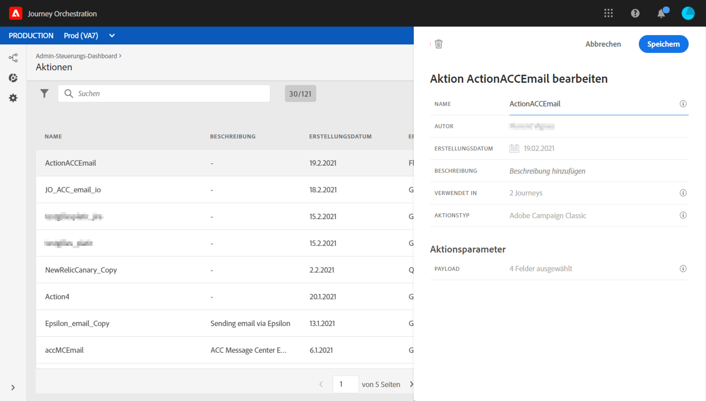
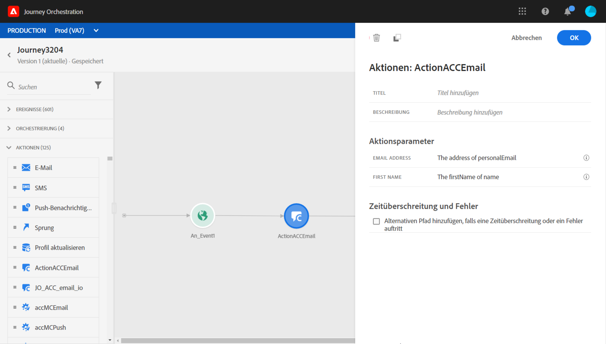

# Integration mit Adobe Campaign Classic {#integrating-with-adobe-campaign-classic}

Diese Integration ermöglicht Ihnen das Senden von E-Mails, Push-Benachrichtigungen und SMS mit Adobe Campaign Classic Transactional Messaging-Funktionen.

Die Verbindung zwischen der Journey Orchestration- und der Campaign Classic-Instanz wird zur Bereitstellungszeit nach Adobe eingerichtet.

>[!CAUTION]
>
> Diese Integration wird als private Beta veröffentlicht. Es steht nicht allen Journey Orchestrationen zur Verfügung.

## Wichtige Hinweise     

* Es gibt keine Einschränkungen bei Nachrichten. Wir begrenzen die Anzahl der Nachrichten, die je nach aktuellem Campaign Classic SLA auf 50.000/h gesendet werden können. Aus diesem Grund sollte die Journey-Orchestrierung nur in Fällen der einmaligen Verwendung (einzelne Ereignis, nicht in Segmenten) verwendet werden.

* Sie müssen pro Vorlage eine Aktion auf der Arbeitsfläche konfigurieren.

* Es wird empfohlen, eine dedizierte Message Center-Instanz zu verwenden, die für diese Integration gehostet wird, um zu vermeiden, dass andere Campaign Classic-Vorgänge, die Sie möglicherweise ausführen, beeinträchtigt werden. Der Marketing-Server kann gehostet oder lokal bereitgestellt werden. Der erforderliche Build ist 21.1 Release Candidate.

* Es wird nicht überprüft, ob die Nutzlast- oder Campaign Classic-Meldung korrekt ist.

* Sie können keine Segmentaktion mit einer Segmentqualifizierung verwenden.

## Voraussetzungen

In Campaign Classic müssen Sie eine Transaktionsnachricht und das zugehörige Ereignis erstellen und veröffentlichen. Weitere Informationen finden Sie in der [Adobe Campaign Classic-Dokumentation](https://experienceleague.adobe.com/docs/campaign-classic/using/transactional-messaging/introduction/about-transactional-messaging.html#transactional-messaging).

Wenden Sie sich an die Adobe, um die JSON-Nutzlast für jede Nachricht zu erhalten. Sie fügen diese Payload dann beim Konfigurieren der Aktion in Journey Orchestration ein (siehe unten).

Hier ein Beispiel:

```
{
    "channel": "email",
    "eventType": "welcome",
    "email": "example@adobe.com",
    "ctx": {
        "firstName": "John"
    }
}
```

## Konfigurieren der Aktion

In der Journey Orchestration müssen Sie eine Aktion pro Transaktionsnachricht konfigurieren. Führen Sie folgende Schritte aus:

1. Erstellen Sie eine neue Aktion. Siehe diesen [Abschnitt](../action/action.md).
1. Geben Sie einen Namen und eine Beschreibung ein.
1. Wählen Sie im Feld **Aktionstyp** **Adobe Campaign Classic** aus.
1. Klicken Sie in das Feld **Payload** und fügen Sie ein Beispiel der JSON-Nutzlast ein, die der Campaign Classic-Meldung entspricht. Wenden Sie sich an die Adobe, um diese Nutzlast zu erhalten.
1. Passen Sie die verschiedenen Felder an. Bestimmte Felder, wie z. B. Kanal und Personalisierungsfelder (ctx), müssen als Variablen definiert werden.
1. Wählen Sie **Speichern** aus.



Für jede konfigurierte Aktion ist in der Palette &quot;Journey-Designer&quot;eine Aktivität verfügbar.

## Hinzufügen einer Nachricht zu einer Journey

1. Entwerfen Sie Ihre Journey, beginnend mit einem Ereignis. Siehe diesen [Abschnitt](../building-journeys/journey.md).
1. Wählen Sie im Bereich **Aktion** der Palette eine Campaign Classic-Aktion aus und fügen Sie sie Ihrer Journey hinzu.
1. Unter **Aktionsparameter** werden alle Felder angezeigt, die in der Meldungsnutzlast erwartet werden. Sie müssen jedes dieser Felder im Ereignis oder der Datenquelle dem zu verwendenden Feld zuordnen. Dies ähnelt benutzerdefinierten Aktionen. Siehe diesen [Abschnitt](../building-journeys/using-custom-actions.md).



