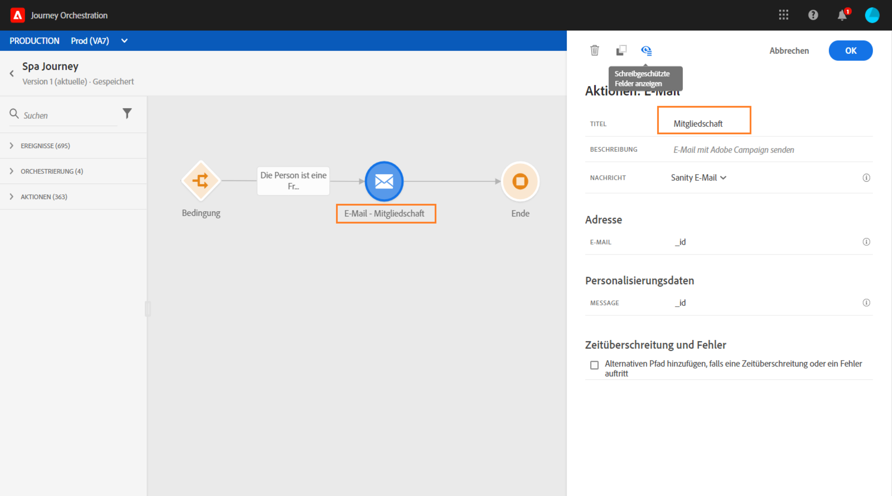

# Informationen zu Aktionsaktivitäten {#concept_hbj_hrt_52b}

In der Palette auf der linken Seite des Bildschirms finden Sie unter **[!UICONTROL Ereignisse]** und **[!UICONTROL Orchestrierung]** die Kategorie **[!UICONTROL Aktionen]**.

Diese Aktivitäten repräsentieren die verschiedenen Kommunikationskanäle. Sie können sie zu einem kanalübergreifenden Szenario verbinden.

Wenn Sie über Adobe Campaign Standard verfügen, stehen die folgenden vordefinierten Aktionsaktivitäten zur Verfügung: **[!UICONTROL E-Mail]**, **[!UICONTROL Push]** und **[!UICONTROL SMS]**. Mehr dazu erfahren Sie auf [dieser Seite](../building-journeys/using-adobe-campaign-actions.md).

Wenn Sie benutzerdefinierte Aktionen konfiguriert haben, werden diese hier auch angezeigt (siehe [diese Seite](../building-journeys/using-custom-actions.md)).

Wenn Sie eine Aktionsaktivität auf der Arbeitsfläche ablegen, können Sie einen **[!UICONTROL Titel]** definieren. Auf diese Weise können Sie dem Aktionsnamen, der unter Ihrer Aktivität auf der Arbeitsfläche angezeigt wird, ein Suffix hinzufügen. Dies ist nützlich, wenn Sie dieselbe Aktion mehrmals in Ihrer Journey verwenden und sie leichter identifizieren möchten. Berichte sind dann auch leichter zu lesen. Sie können auch eine optionale **[!UICONTROL Beschreibung]** hinzufügen.

Wenn in einer Aktion oder einer Bedingung ein Fehler auftritt, wird die Journey der Person gestoppt. Die einzige Möglichkeit zum Fortsetzen des Vorgangs besteht darin, das Kontrollkästchen **[!UICONTROL Alternativen Pfad hinzufügen, falls eine Zeitüberschreitung oder ein Fehler auftritt]** zu aktivieren. Siehe [diesen Abschnitt](../building-journeys/using-the-journey-designer.md#paths).
