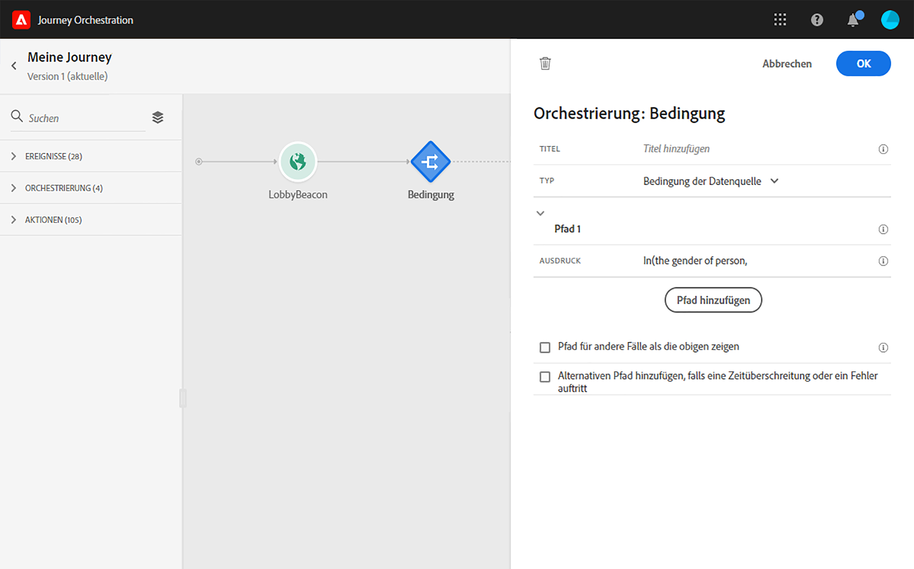

# Informationen zu Orchestrierungsaktivitäten {#concept_ksq_2rt_52b}

>[!CAUTION]
>
>**Suche nach Adobe Journey Optimizer**? Klicken Sie [hier](https://experienceleague.adobe.com/de/docs/journey-optimizer/using/ajo-home){target="_blank"}, um die Dokumentation zu Journey Optimizer anzuzeigen.
>
>
>_Diese Dokumentation bezieht sich auf veraltete Journey Orchestration-Materialien, die durch Journey Optimizer ersetzt wurden. Wenden Sie sich an Ihr Account-Team, wenn Sie Fragen zu Ihrem Zugriff auf Journey Orchestration oder Journey Optimizer haben._

In der Palette auf der linken Seite des Bildschirms stehen die folgenden Orchestrierungsaktivitäten zur Verfügung:

* [Bedingungsaktivität](../building-journeys/condition-activity.md)
* [Endaktivität](../building-journeys/end-activity.md)
* [Warteaktivität](../building-journeys/wait-activity.md)

