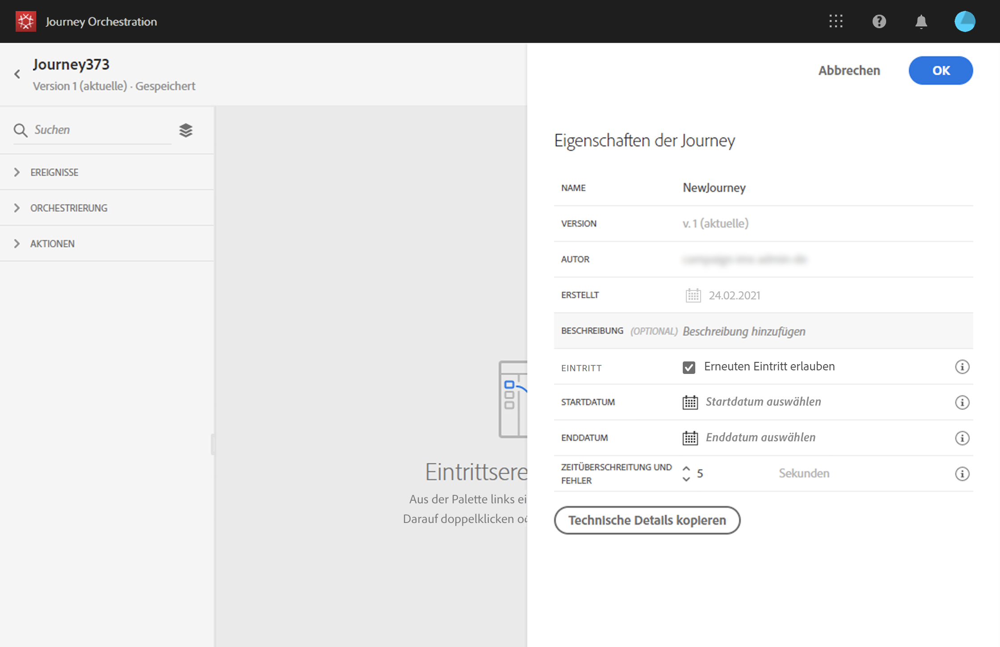

# Eigenschaften ändern {#concept_prq_wqt_52b}

Klicken Sie auf das Stiftsymbol, oben rechts, um auf die Eigenschaften der Reise zuzugreifen.

Sie können den Namen der Reise ändern, eine Beschreibung hinzufügen, Wiedereintritt zulassen, Start- und Enddaten auswählen und eine **[!UICONTROL Timeout- und Fehlerdauer]**definieren, wenn Sie Administrator sind.

## Zutritt{#entrance}

Neue Reisen ermöglichen standardmäßig den Wiedereintritt. Sie können die Option für &quot;eine Aufnahme&quot;-Reisen deaktivieren, z.B. wenn Sie ein einmaliges Geschenk anbieten möchten, wenn eine Person in einen Laden kommt. In diesem Fall möchten Sie nicht, dass der Kunde erneut auf die Reise gehen und das Angebot erneut erhalten kann.

Wenn eine Reise &quot;endet&quot;, wird der Status **[!UICONTROL beendet]**. Die Reise wird aufhören, neuen Personen die Reise zu ermöglichen. Personen, die sich bereits auf der Reise befinden, werden die Reise normal beenden.

## Zeitüberschreitung und Fehler bei Fahrtunterbrechungen {#timeout_and_error}

Beim Bearbeiten einer Aktion oder Bedingungsaktivität können Sie im Falle eines Fehlers oder einer Zeitüberschreitung einen alternativen Pfad definieren. Wenn die Verarbeitung der Aktivität, die ein Drittanbietersystem abfragt, die in den Eigenschaften der Reise festgelegte Zeitüberschreitungsdauer überschreitet (Feld **[!UICONTROL Timeout und Fehler]**), wird der zweite Pfad ausgewählt, um eine potenzielle Ausweichaktion durchzuführen.

Die zulässigen Werte liegen zwischen 1 und 30 Sekunden.

Es wird empfohlen, einen sehr kurzen **[!UICONTROL Timeout- und Fehlerwert]**zu definieren, wenn Ihre Reise zeitempfindlich ist (Beispiel: Reaktion auf den Echtzeit-Ort einer Person), da Sie Ihre Aktion nicht länger als einige Sekunden verzögern können. Wenn Ihre Reise weniger zeitempfindlich ist, können Sie einen längeren Wert verwenden, um dem System mehr Zeit zu geben, das zum Senden einer gültigen Antwort aufgerufen wurde.

Die Journey Orchestration nutzt auch einen globalen Timeout. Siehe [nächsten Abschnitt](#global_timeout).

## Zeitlimit für globale Reise {#global_timeout}

Zusätzlich zu dem [Timeout](#timeout_and_error) , der in den Aktivitäten für die Reise verwendet wird, gibt es auch einen globalen Timeout für die Reise, der nicht auf der Oberfläche angezeigt wird und nicht geändert werden kann. Dieser Timeout stoppt den Fortschritt von Personen auf der Reise 30 Tage nach ihrem Eintritt. Das bedeutet, dass die Reise eines Individuums nicht länger als 30 Tage dauern kann. Nach Ablauf der 30-Tage-Timeout-Frist werden die Daten der Person gelöscht. Personen, die am Ende des Timeout-Zeitraums noch auf der Reise sind, werden gestoppt und bei der Berichterstattung als Fehler berücksichtigt.

>[!NOTE]
>
>Die Journey Orchestration reagiert nicht direkt auf die Abmeldung, den Zugriff oder das Löschen von Anfragen zum Datenschutz. Der globale Timeout stellt jedoch sicher, dass Personen auf keinen Fall länger als 30 Tage auf einer Reise bleiben.

Aufgrund des 30-Tage-Timeouts für die Reise, bei dem der Rücktritt nicht erlaubt ist, können wir nicht sicherstellen, dass der Wiedereintritt länger als 30 Tage dauert. Da wir alle Informationen über Personen, die die Reise 30 Tage nach ihrer Einreise betreten haben, entfernen, können wir nicht wissen, welche Person vorher eingestiegen ist, vor über 30 Tagen.
