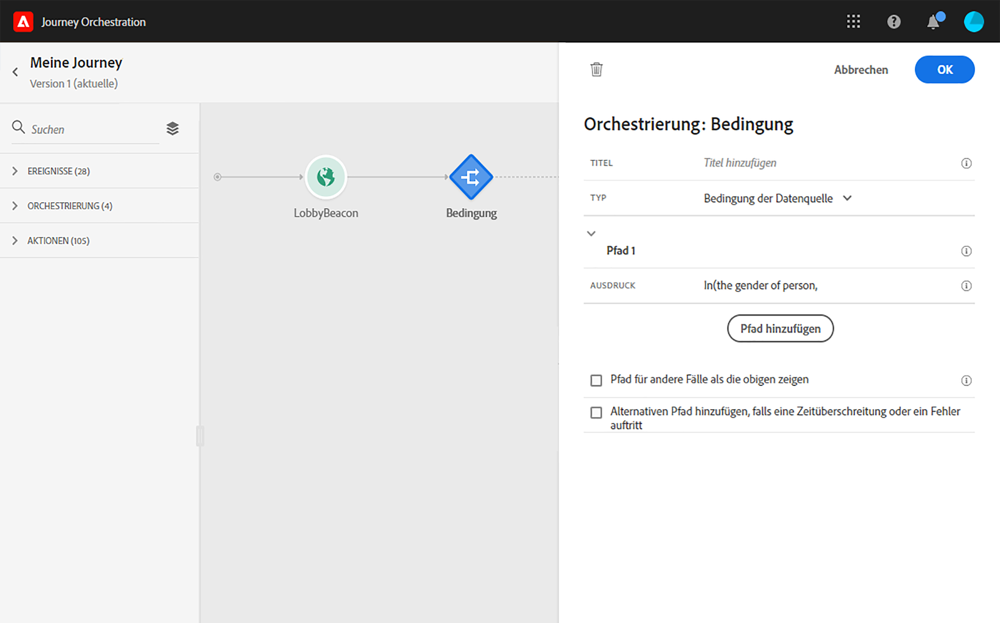
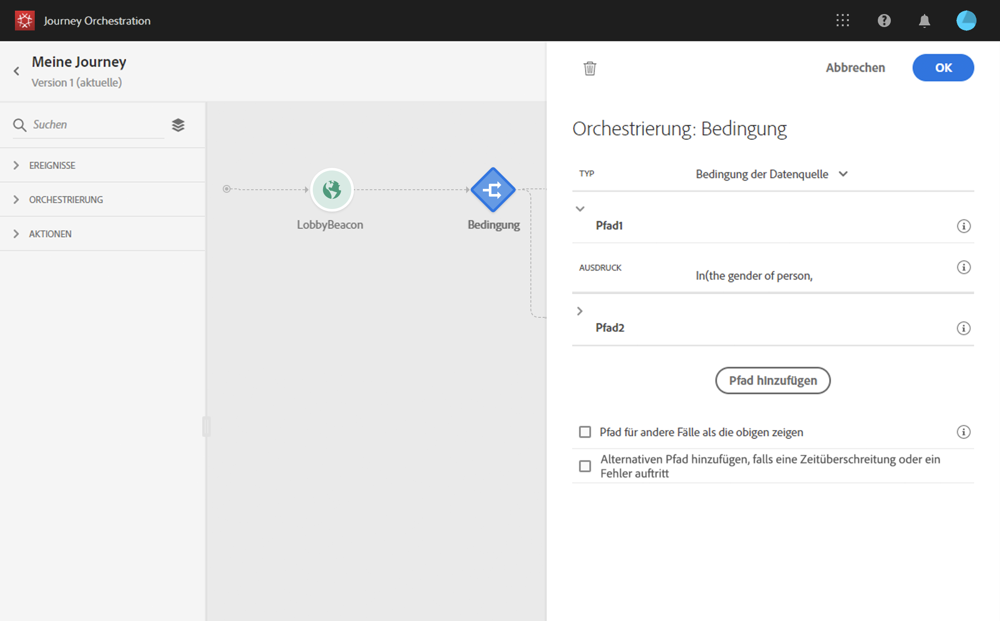
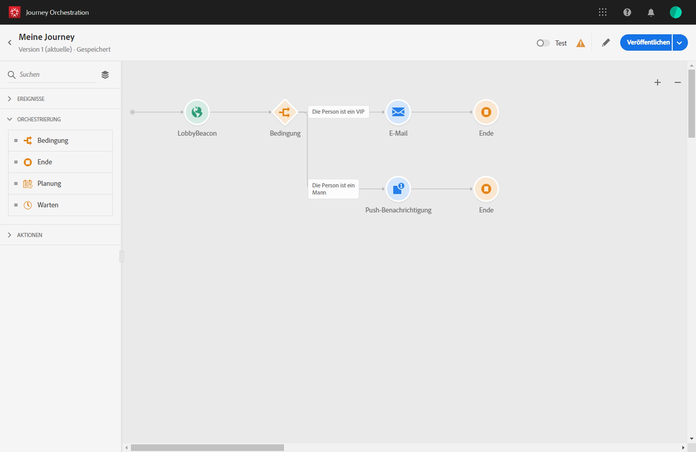
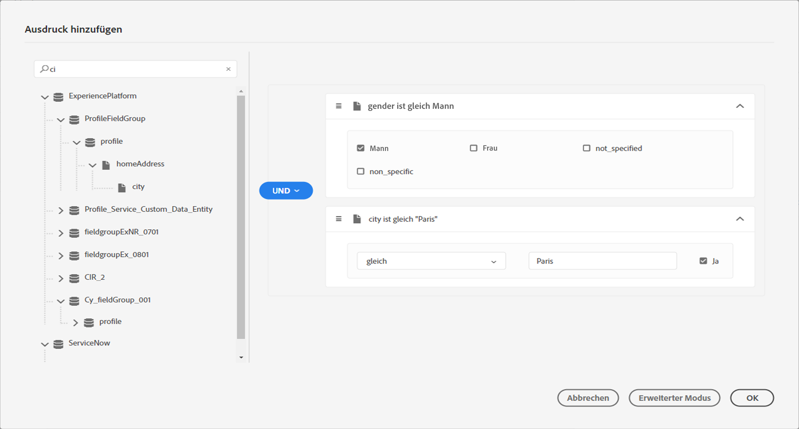
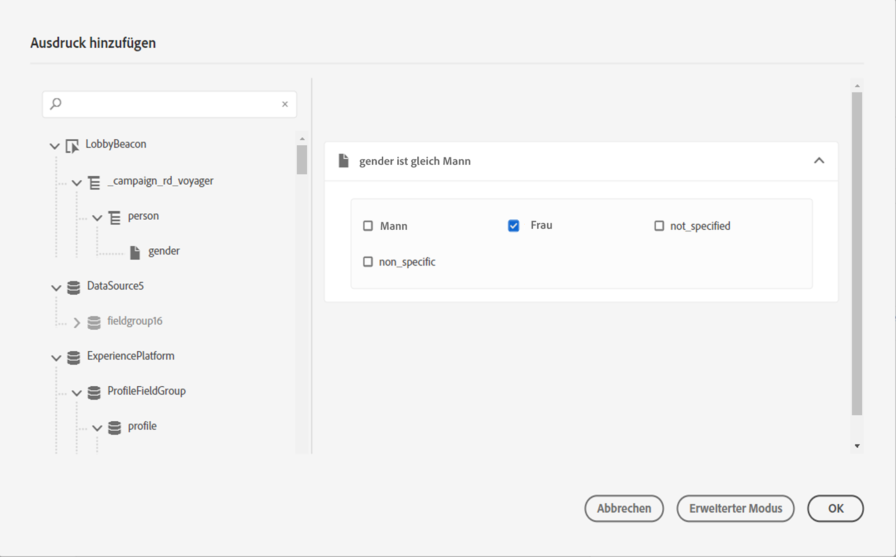
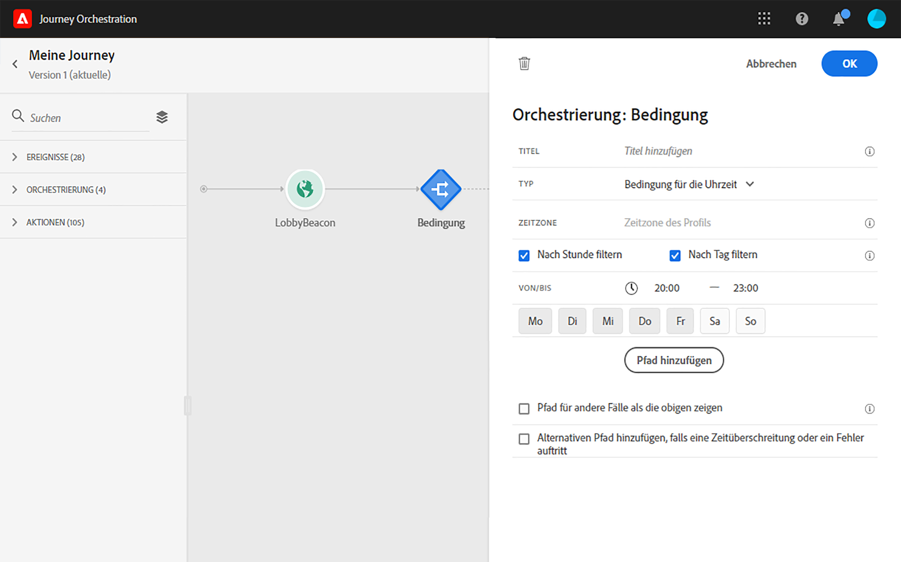
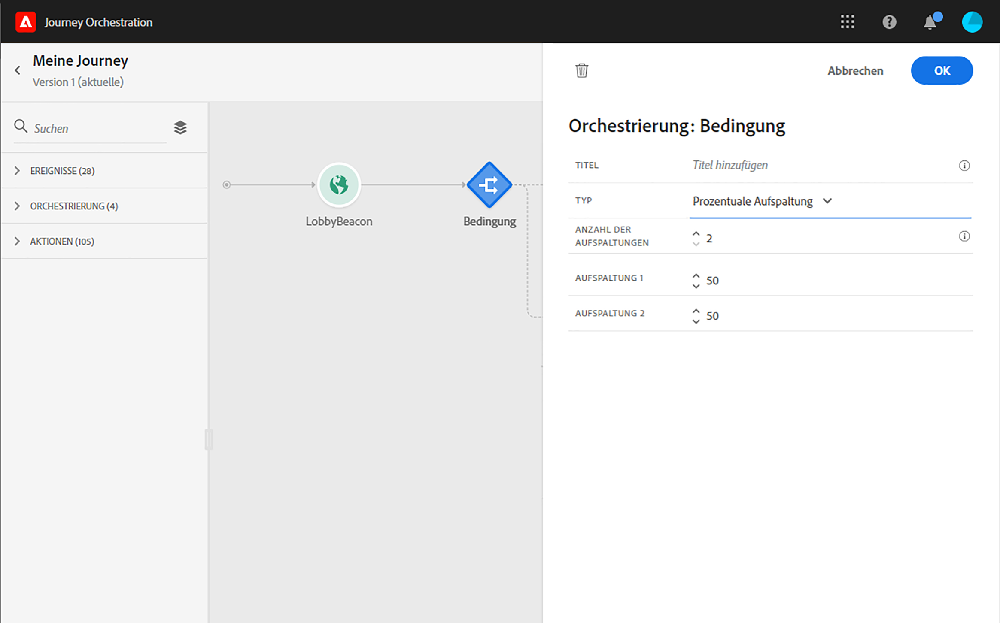
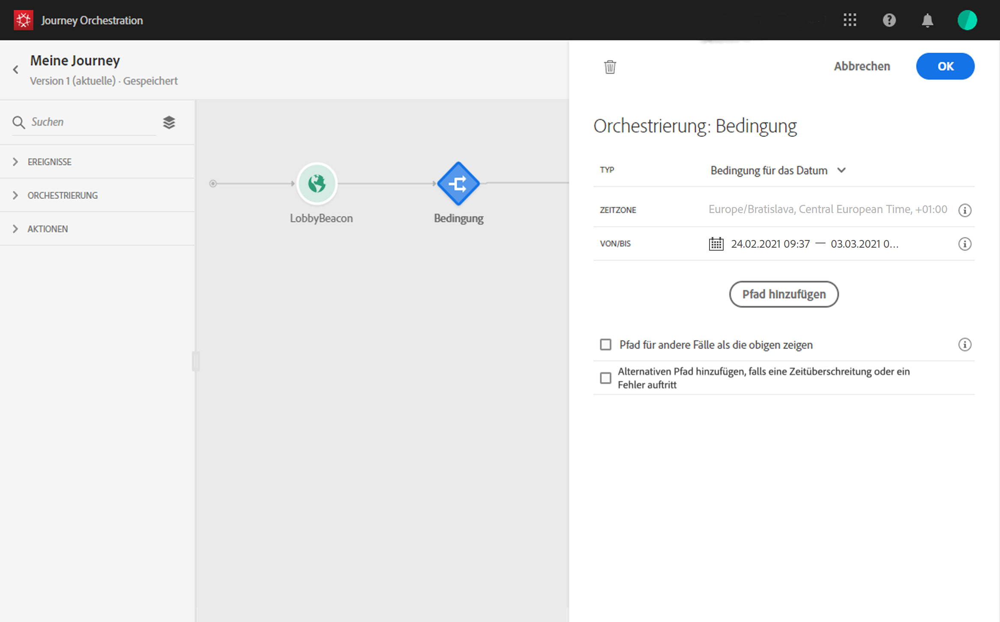

# Bedingungsaktivität{#section_e2n_pft_dgb}

Es stehen vier Bedingungstypen zur Verfügung:

* [Bedingung der Datenquelle](#data_source_condition)
* [Bedingung für die Uhrzeit](#time_condition)
* [Prozentuale Aufspaltung](#percentage_split)
* [Bedingung für das Datum](#date_condition)

## Informationen zu Bedingungsaktivitäten {#about_condition}

Klicken Sie auf **[!UICONTROL Pfad hinzufügen]**, wenn Sie mehrere Bedingungen definieren möchten. Für jede Bedingung wird der Arbeitsfläche nach der Aktivität ein neuer Pfad hinzugefügt.

Beachten Sie, dass die Gestaltung der Journeys funktionelle Auswirkungen hat. Wenn mehrere Pfade nach einer Bedingung definiert werden, wird nur der erste infrage kommende Pfad ausgeführt. Das bedeutet, dass Sie die Priorisierung von Pfaden ändern können, indem Sie sie über- oder untereinander platzieren. Beispiel: Die Bedingung des ersten Pfades lautet „Die Person ist ein VIP“ und des zweiten Pfades „Die Person ist männlich“. Wenn eine Person, die beide Bedingungen erfüllt (ein männlicher VIP) diesen Schritt durchläuft, wird der erste Pfad ausgewählt, auch wenn die Person ebenfalls für den zweiten Pfad infrage kommt, da der erste Pfad „über“ dem zweiten steht. Um diese Priorität zu ändern, verschieben Sie Ihre Aktivitäten in eine andere vertikale Reihenfolge.

Sie können einen anderen Pfad für Audiences erstellen, für die die definierten Bedingungen nicht gelten, indem Sie die Option **[!UICONTROL Pfad für andere Fälle als die obigen zeigen]** aktivieren. Beachten Sie, dass diese Option in Bedingungen für die Aufspaltung nicht verfügbar ist. Siehe [Prozentuale Aufspaltung](#percentage_split).

Im einfachen Modus können Sie einfache Abfragen anhand einer Kombination von Feldern durchführen. Alle verfügbaren Felder werden auf der linken Seite des Bildschirms angezeigt. Ziehen Sie Felder per Drag-and-Drop in den Hauptbereich. Um die verschiedenen Elemente zu kombinieren, verschachteln Sie diese, um Gruppen und/oder Gruppenebenen zu erstellen. Definieren Sie dann einen logischen Operator zwischen Elementen desselben Niveaus:

* UND bildet die Schnittmenge aus zwei Kriterien. Nur Elemente, die alle Kriterien entsprechen, werden berücksichtigt.
* ODER bildet die Vereinigungsmenge aus zwei Kriterien. Elemente, die wenigstens einem der Kriterien entsprechen, werden berücksichtigt.

>[!NOTE]
>
>Mit dem einfachen Editor können Sie keine Abfragen zu Zeitreihen (z. B. zu einer Liste der Käufe oder vergangenen Klicks auf Nachrichten) durchführen. Dazu müssen Sie den erweiterten Editor verwenden. Siehe .

## Bedingung der Datenquelle {#data_source_condition}

Auf diese Weise können Sie eine Bedingung basierend auf Feldern aus den Datenquellen oder den zuvor in der Journey positionierten Ereignissen definieren. Informationen zur Verwendung des Ausdruckseditors finden Sie unter . Mit dem erweiterten Ausdruckseditor können Sie erweiterte Bedingungen zur Bearbeitung von Kollektionen oder zur Verwendung von Datenquellen einrichten, für die Parameter übergeben werden müssen. Siehe .

## Bedingung für die Uhrzeit{#time_condition}

Auf diese Weise können Sie je nach Tageszeit und/oder Wochentag unterschiedliche Aktionen durchführen. So können Sie beispielsweise entscheiden, an Werktagen tagsüber SMS-Nachrichten und nachts E-Mails zu versenden. Sie können eine bestimmte Zeitzone für diese Bedingung definieren. Siehe .

## Prozentuale Aufspaltung {#percentage_split}

Mit dieser Option können Sie die Audience nach dem Zufallsprinzip aufspalten, um für jede Gruppe eine andere Aktion zu definieren. Definieren Sie die Anzahl der Aufspaltungen und die Neuaufteilung für jeden Pfad. Die Berechnung der Aufspaltung ist statistisch, da das System nicht vorhersehen kann, wie viele Personen an dieser Aktivität der Journey teilnehmen werden. Infolgedessen weist die Aufspaltung eine sehr geringe Fehlermarge auf. Diese Funktion basiert auf einem Java-Zufallsmechanismus (siehe diese [Seite](https://docs.oracle.com/javase/7/docs/api/java/util/Random.html)).

>[!NOTE]
>
>Beachten Sie, dass es in der Bedingung für die prozentuale Aufspaltung keine Schaltfläche zum Hinzufügen eines Pfades gibt. Die Anzahl der Pfade hängt von der Anzahl der Aufspaltungen ab. In Bedingungen für die Aufspaltung können Sie keinen Pfad für andere Fälle hinzufügen, da diese nicht möglich sind. Die Personen wählen immer einen der Pfade der Aufspaltung aus.

## Bedingung für das Datum {#date_condition}

Auf diese Weise können Sie basierend auf dem Datum einen anderen Fluss definieren. Wenn die Person beispielsweise während des „Verkaufszeitraums“ den Schritt aufruft, senden Sie ihr eine bestimmte Nachricht. Den Rest des Jahres senden Sie eine andere Nachricht. Wenn Sie eine Bedingung für das Datum definieren, müssen Sie eine Zeitzone angeben. Siehe .

