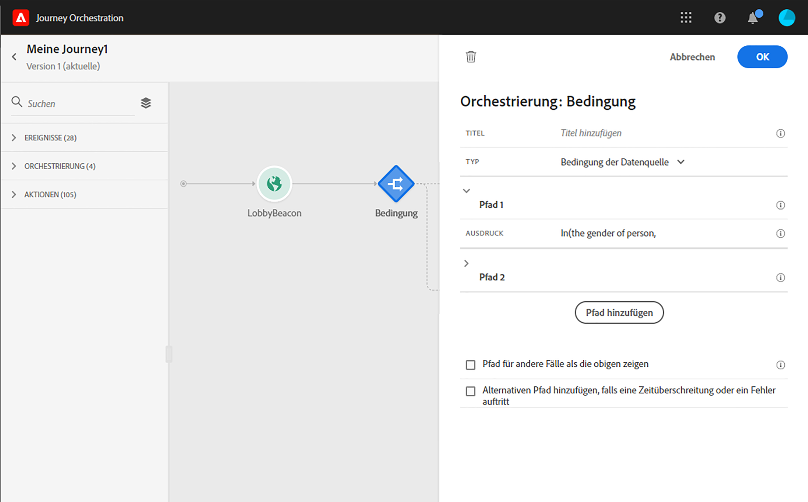

# Bedingungsaktivität{#section_e2n_pft_dgb}

Es stehen vier Bedingungstypen zur Verfügung:

* [Datenquelle-Bedingung](#data_source_condition)
* [Zeitbedingung](#time_condition)
* [Prozentuale Aufspaltung](#percentage_split)
* [Datumsbedingung](#date_condition)

## Informationen zur Bedingungsaktivität {#about_condition}

Klicken Sie auf Pfad **[!UICONTROL hinzufügen]**, wenn Sie mehrere Bedingungen definieren möchten. Für jede Bedingung wird der Arbeitsfläche nach der Aktivität ein neuer Pfad hinzugefügt.

Beachten Sie, dass die Gestaltung der Fahrten funktionelle Auswirkungen hat. Wenn mehrere Pfade nach einer Bedingung definiert werden, wird nur der erste berechtigte Pfad ausgeführt. Das bedeutet, dass Sie die Priorisierung von Pfaden ändern können, indem Sie sie über- oder untereinander platzieren. Beispiel: Wenn die Bedingung des ersten Pfads &quot;Die Person ist ein VIP&quot;und der zweite Pfad &quot;Die Person ist ein männlicher&quot;lautet. Wenn eine Person, die beide Bedingungen erfüllt (ein Mann, der VIP ist) diesen Schritt durchläuft, wird der erste Pfad gewählt, auch wenn er auch für den zweiten berechtigt ist, da der erste Pfad &quot;über&quot;ist. Um diese Priorität zu ändern, verschieben Sie Ihre Aktivitäten in eine andere vertikale Reihenfolge.

Sie können einen anderen Pfad für Zielgruppen erstellen, die nicht zu den definierten Bedingungen berechtigt sind, indem Sie den Pfad **[!UICONTROL anzeigen für andere Fälle als die oben]**genannten aktivieren. Beachten Sie, dass diese Option in geteilten Bedingungen nicht verfügbar ist. Siehe[prozentuale Aufteilung](#percentage_split).

Im einfachen Modus können Sie einfache Abfragen anhand einer Feldkombination durchführen. Alle verfügbaren Felder werden auf der linken Seite des Bildschirms angezeigt. Ziehen Sie Felder per Drag &amp; Drop in den Hauptbereich. Um die verschiedenen Elemente zu kombinieren, schließen Sie sie miteinander, um verschiedene Gruppen und/oder Gruppenebenen zu erstellen. Definieren Sie dann einen logischen Operator zwischen Elementen desselben Niveaus:

* UND bildet die Schnittmenge aus zwei Kriterien. Nur die Elemente, die alle Kriterien erfüllen, werden berücksichtigt.
* ODER bildet die Vereinigungsmenge aus zwei Kriterien. Elemente, die wenigstens einem der Kriterien entsprechen, werden berücksichtigt.

>[!NOTE]
>
>Mit dem einfachen Editor können Sie keine Abfragen für Zeitreihen (z. B. eine Liste von Käufen, vergangene Klicks auf Nachrichten) durchführen. Dazu müssen Sie den erweiterten Editor verwenden. Näheres wird im Abschnitt  beschrieben.

## Data Source condition {#data_source_condition}

Auf diese Weise können Sie eine Bedingung basierend auf Feldern aus den Datenquellen oder den zuvor auf der Reise positionierten Ereignissen definieren. Informationen zur Verwendung des Ausdruckseditors finden Sie unter . Mit dem erweiterten Ausdruckseditor können Sie erweiterte Bedingungen zur Bearbeitung von Sammlungen oder zur Verwendung von Datenquellen einrichten, für die Parameter übergeben werden müssen. Näheres wird im Abschnitt  beschrieben.

## Time condition{#time_condition}

Auf diese Weise können Sie je nach Tageszeit und Wochentag unterschiedliche Aktionen durchführen. Beispielsweise können Sie sich entscheiden, während des Tages SMS-Nachrichten und nachts nachts während der Woche zu versenden. Sie können eine bestimmte Zeitzone für diese Bedingung definieren. Näheres wird im Abschnitt  beschrieben.

## Prozentuale Aufspaltung {#percentage_split}

Mit dieser Option können Sie die Zielgruppe zufällig teilen, um für jede Gruppe eine andere Aktion zu definieren. Definieren Sie die Anzahl der Teilungen und die Neuaufteilung für jeden Pfad. Die Teilungsberechnung ist statistisch, da das System nicht vorhersehen kann, wie viele Personen in dieser Aktivität der Reise fließen. Die Aufteilung hat daher eine sehr niedrige Fehlermarge. Diese Funktion basiert auf einem Java-Zufallsmechanismus (siehe diese [Seite](https://docs.oracle.com/javase/7/docs/api/java/util/Random.html)).

>[!NOTE]
>
>Beachten Sie, dass es keine Schaltfläche zum Hinzufügen eines Pfades in der Bedingung für die prozentuale Aufteilung gibt. Die Anzahl der Pfade hängt von der Anzahl der Teilungen ab. In geteilten Bedingungen können Sie keinen Pfad für andere Fälle hinzufügen, da dies nicht möglich ist. Die Leute gehen immer in einen der geteilten Pfade.

## Date condition {#date_condition}

Auf diese Weise können Sie einen anderen Fluss basierend auf dem Datum definieren. Wenn die Person beispielsweise während des &quot;Verkaufs&quot;-Zeitraums den Schritt aufruft, senden Sie ihm eine bestimmte Nachricht. Den Rest des Jahres schicken Sie eine weitere Nachricht. Wenn Sie eine Datumsbedingung definieren, müssen Sie eine Zeitzone angeben. Näheres wird im Abschnitt  beschrieben.

