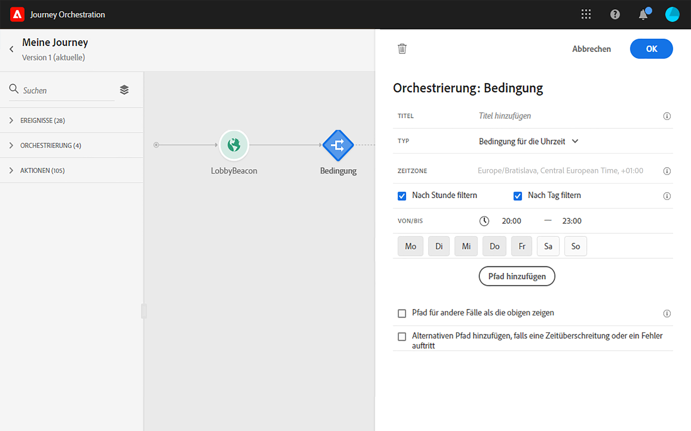

# Bedingungsaktivität{#section_e2n_pft_dgb}

>[!CAUTION]
>
>**Suche nach Adobe Journey Optimizer**? Klicken Sie [hier](https://experienceleague.adobe.com/de/docs/journey-optimizer/using/ajo-home){target="_blank"}, um die Dokumentation zu Journey Optimizer anzuzeigen.
>
>
>_Diese Dokumentation bezieht sich auf veraltete Journey Orchestration-Materialien, die durch Journey Optimizer ersetzt wurden. Wenden Sie sich an Ihr Account-Team, wenn Sie Fragen zu Ihrem Zugriff auf Journey Orchestration oder Journey Optimizer haben._

Es stehen vier Bedingungstypen zur Verfügung:

* [Bedingung der Datenquelle](#data_source_condition)
* [Bedingung für die Uhrzeit](#time_condition)
* [Prozentuale Aufspaltung](#percentage_split)
* [Bedingung für das Datum](#date_condition)

## Informationen zu Bedingungsaktivitäten {#about_condition}

Wenn Sie mehrere Bedingungen in einer Journey verwenden, können Sie für jede dieser Bedingungen Titel definieren, um sie leichter zu identifizieren.

Klicken Sie auf **[!UICONTROL Pfad hinzufügen]**, wenn Sie mehrere Bedingungen definieren möchten. Für jede Bedingung wird der Arbeitsfläche nach der Aktivität ein neuer Pfad hinzugefügt.

Beachten Sie, dass die Gestaltung der Journeys funktionelle Auswirkungen hat. Wenn mehrere Pfade nach einer Bedingung definiert werden, wird nur der erste infrage kommende Pfad ausgeführt. Das bedeutet, dass Sie die Priorisierung von Pfaden ändern können, indem Sie sie über- oder untereinander platzieren.

Nehmen wir beispielsweise die Bedingung eines ersten Pfads „Die Person ist eine VIP“ und die Bedingung eines zweiten Pfads „Die Person ist ein Mann“. Wenn eine Person, die beide Bedingungen erfüllt (ein männlicher VIP) diesen Schritt durchläuft, wird der erste Pfad ausgewählt, auch wenn die Person ebenfalls für den zweiten Pfad infrage kommt, da der erste Pfad „über“ dem zweiten steht. Um diese Priorität zu ändern, verschieben Sie Ihre Aktivitäten in eine andere vertikale Reihenfolge.

Sie können einen anderen Pfad für Zielgruppen erstellen, für die die definierten Bedingungen nicht gelten, indem Sie die Option **[!UICONTROL Pfad für andere Fälle als die obigen zeigen]** aktivieren. Beachten Sie, dass diese Option in Bedingungen für die Aufspaltung nicht verfügbar ist. Siehe [Prozentuale Aufspaltung](#percentage_split).

Im einfachen Modus können Sie einfache Abfragen anhand einer Kombination von Feldern durchführen. Alle verfügbaren Felder werden auf der linken Seite des Bildschirms angezeigt. Ziehen Sie Felder per Drag-and-Drop in den Hauptbereich. Um die verschiedenen Elemente zu kombinieren, verschachteln Sie diese, um Gruppen und/oder Gruppenebenen zu erstellen. Definieren Sie dann einen logischen Operator zwischen Elementen desselben Niveaus:

* UND bildet die Schnittmenge aus zwei Kriterien. Nur Elemente, die allen Kriterien entsprechen, werden berücksichtigt.
* ODER bildet die Vereinigungsmenge aus zwei Kriterien. Elemente, die wenigstens einem der Kriterien entsprechen, werden berücksichtigt.

Wenn Sie zur Erstellung Ihrer Segmente den [Segmentierungsdienst von Adobe Experience Platform](https://experienceleague.adobe.com/docs/experience-platform/segmentation/home.html?lang=de) verwenden, können Sie die Segmente in Ihren Journey-Bedingungen nutzen. Siehe [Verwenden von Segmenten in Bedingungen](../segment/using-a-segment.md).

>[!NOTE]
>
>Mit dem einfachen Editor können Sie keine Abfragen zu Zeitreihen (z. B. zu einer Liste der Käufe oder vergangenen Klicks auf Nachrichten) durchführen. Dazu müssen Sie den erweiterten Editor verwenden.  Weitere Informationen finden Sie auf [dieser Seite](../expression/expressionadvanced.md).

Wenn in einer Aktion oder einer Bedingung ein Fehler auftritt, wird die Journey des Kontakts gestoppt. Die einzige Möglichkeit zum Fortsetzen des Vorgangs besteht darin, das Kontrollkästchen **[!UICONTROL Alternativen Pfad hinzufügen, falls eine Zeitüberschreitung oder ein Fehler auftritt]** zu aktivieren. Weitere Informationen finden Sie in [diesem Abschnitt](../building-journeys/using-the-journey-designer.md#paths).

Im einfachen Editor finden Sie auch die Kategorie „Journey-Eigenschaften“ unter den Kategorien „Ereignis“ und „Datenquelle“. Diese Kategorie enthält technische Felder, die sich auf die Journey eines bestimmten Profils beziehen.  Dabei handelt es sich um die Informationen, die das System von Live-Journeys abruft, wie z. B. die Journey-ID oder die aufgetretenen Fehler. Weitere Informationen finden Sie auf [dieser Seite](../expression/journey-properties.md).

## Bedingung der Datenquelle {#data_source_condition}

Auf diese Weise können Sie eine Bedingung basierend auf Feldern aus den Datenquellen oder den zuvor in der Journey positionierten Ereignissen definieren. Informationen zur Verwendung des Ausdruckseditors finden Sie auf [dieser Seite](../expression/expressionadvanced.md). Mit dem erweiterten Ausdruckseditor können Sie erweiterte Bedingungen zur Bearbeitung von Sammlungen oder zur Verwendung von Datenquellen einrichten, für die Parameter übergeben werden müssen. Weitere Informationen finden Sie auf [dieser Seite](../datasource/external-data-sources.md).

## Bedingung für die Uhrzeit{#time_condition}

Auf diese Weise können Sie je nach Tageszeit und/oder Wochentag unterschiedliche Aktionen durchführen. So können Sie beispielsweise entscheiden, an Werktagen tagsüber SMS-Nachrichten und nachts E-Mails zu versenden.

>[!NOTE]
>
>Die Zeitzone hängt nicht mehr von einer Bedingung ab und wird jetzt auf Journey-Ebene in den Eigenschaften der Journey festgelegt. Mehr dazu erfahren Sie auf [dieser Seite](../building-journeys/timezone-management.md).

## Prozentuale Aufspaltung {#percentage_split}

Mit dieser Option können Sie die Zielgruppe nach dem Zufallsprinzip aufspalten, um für jede Gruppe eine andere Aktion zu definieren. Definieren Sie die Anzahl der Aufspaltungen und die Neuaufteilung für jeden Pfad. Die Berechnung der Aufspaltung ist statistisch, da das System nicht vorhersehen kann, wie viele Personen an dieser Aktivität der Journey teilnehmen werden. Infolgedessen weist die Aufspaltung eine sehr geringe Fehlermarge auf. Diese Funktion basiert auf einem Java-Zufallsmechanismus (siehe diese [Seite](https://docs.oracle.com/javase/7/docs/api/java/util/Random.html)).

Im Testmodus wird beim Erreichen einer Aufspaltung immer die obere Verzweigung ausgewählt. Wenn der Test einen anderen Pfad wählen soll, können Sie die Position der aufgespaltenen Verzweigungen neu anordnen. Mehr dazu erfahren Sie auf [dieser Seite](../building-journeys/testing-the-journey.md)

>[!NOTE]
>
>Beachten Sie, dass es in der Bedingung für die prozentuale Aufspaltung keine Schaltfläche zum Hinzufügen eines Pfades gibt. Die Anzahl der Pfade hängt von der Anzahl der Aufspaltungen ab. In Bedingungen für die Aufspaltung können Sie keinen Pfad für andere Fälle hinzufügen, da diese nicht möglich sind. Die Personen wählen immer einen der Pfade der Aufspaltung aus.

## Bedingung für das Datum {#date_condition}

Auf diese Weise können Sie basierend auf dem Datum einen jeweils anderen Fluss definieren. Wenn der Eintritt der Person beispielsweise während der Zeit des Ausverkaufs verfolgt, senden Sie ihr eine entsprechende Nachricht. Den Rest des Jahres senden Sie eine andere Nachricht.

>[!NOTE]
>
>Die Zeitzone hängt nicht mehr von einer Bedingung ab und wird jetzt auf Journey-Ebene in den Eigenschaften der Journey festgelegt. Weitere Informationen finden Sie auf [dieser Seite](../building-journeys/timezone-management.md).

<!--
## Profile cap {#profile_cap}

Use this condition type to set a maximum number of profiles for a journey path. When this limit is reached, the selected profiles take a second path.

You can use this condition type to ramp up the volume of your deliveries. For example, you might have recently moved to another email service provider, IP address, or email domain or subdomain. Using this feature, you can establish your reputation as a sender and avoid that your deliveries be blocked or moved to the spam folder of the recipients' mailbox. Learn how to increase your email reputation with IP warming in the [Deliverability Best Practice Guide](https://experienceleague.adobe.com/docs/deliverability-learn/deliverability-best-practice-guide/additional-resources/generic-resources/increase-reputation-with-ip-warming.html){target="_blank"}.

The default cap is 1000. You must set an integer value that is greater than or equal to 1.

The counter applies only to the selected journey version. By default, the counter is reset to zero after 180 days. After a reset, the selected profiles take the first path again until the counter limit is reached. You can gradually increase this limit up to the total number of your subscribers. After your IP has warmed up, you can remove this condition.

The first path always has priority over the second path, even if you move the second path above the first path on the journey canvas.

-->