# Erstellen von Test-Profilen {#create-test-profiles}


Beim Einsatz des Testmodus in einer Journey sind Profil erforderlich. Sie können entweder ein [vorhandenes Profil](../building-journeys/creating-test-profiles.md#turning-profile-into-test) in ein Test-Profil umwandeln oder [ein Test-Profil](../building-journeys/creating-test-profiles.md#create-test-profiles-csv) erstellen. Informationen zur Verwendung des Testmodus finden Sie in [diesem Abschnitt](../building-journeys/testing-the-journey.md).

Es gibt verschiedene Möglichkeiten, ein Profil in Adobe Experience Platform zu erstellen. In dieser Dokumentation konzentrieren wir uns auf zwei Methoden: Hochladen einer [csv-Datei](../building-journeys/creating-test-profiles.md#create-test-profiles-csv) und Verwenden von [API-Aufrufen](../building-journeys/creating-test-profiles.md#create-test-profiles-api). Sie können auch eine JSON-Datei in einen Dataset hochladen, siehe [Datenaufnahmendokumentation](https://experienceleague.adobe.com/docs/experience-platform/ingestion/tutorials/ingest-batch-data.html#add-data-to-dataset)

Das Erstellen eines Profils zum Testen ähnelt dem Erstellen regulärer Profil in Adobe Experience Platform. Weitere Informationen finden Sie in der [Kundendokumentation in Echtzeit](https://experienceleague.adobe.com/docs/experience-platform/profile/home.html).

## Voraussetzungen{#test-profile-prerequisites}

Um Profile erstellen zu können, müssen Sie zunächst ein Schema und einen Datensatz in Adobe Experience Platform erstellen.

Zuerst müssen Sie **ein Schema** erstellen. Führen Sie folgende Schritte aus:

1. Klicken Sie in Adobe Experience Platform im linken Menü auf **Schema**.
   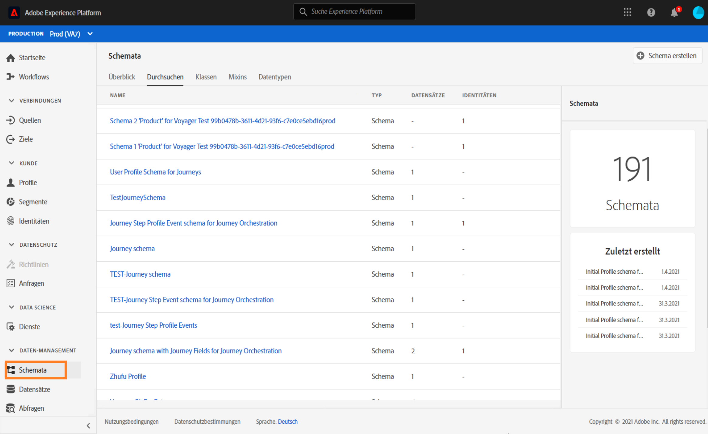
1. Klicken Sie oben rechts auf **Schema erstellen** und wählen Sie dann einen Schema-Typ aus, z. B. **XDM Individuelles Profil**.
   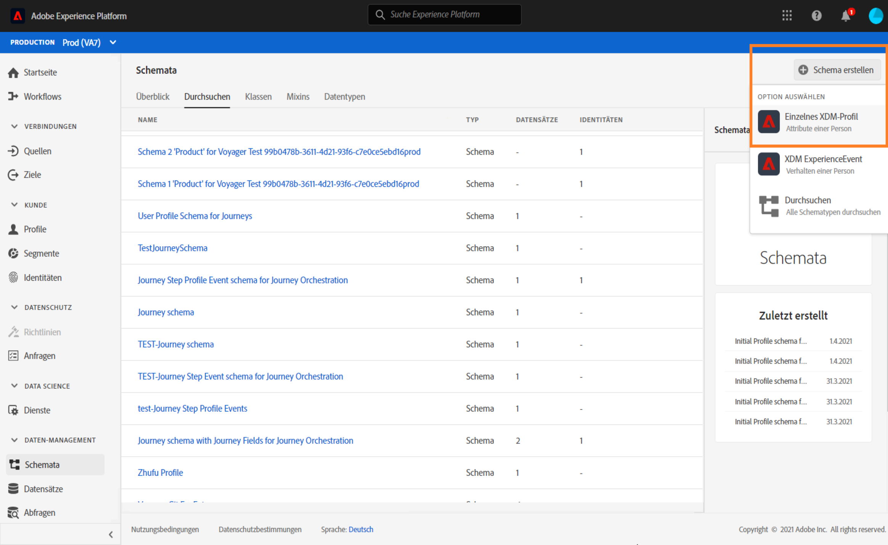
1. Wählen Sie einen Namen für Ihr Schema aus.
1. Klicken Sie im Abschnitt **Mixins** auf **Hinzufügen**.
   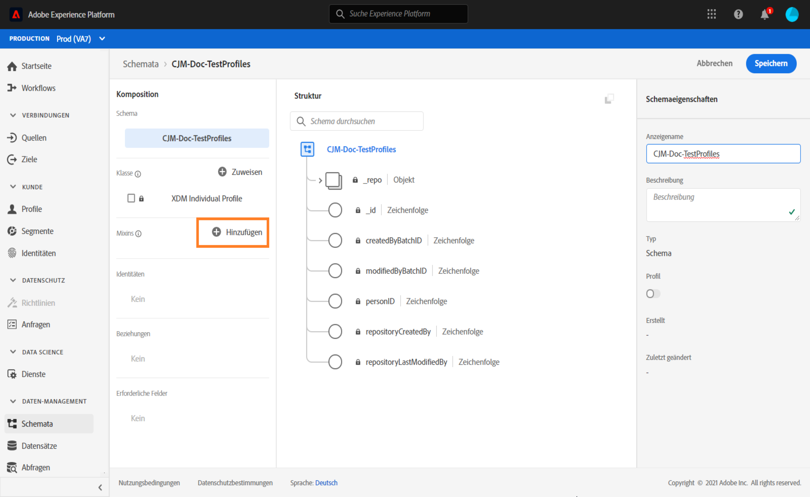
1. Wählen Sie die entsprechenden Mixins aus. Stellen Sie sicher, dass Sie die Mixin **Profil-Testdetails** hinzufügen. Klicken Sie auf **Hinzufügen mixin**.
   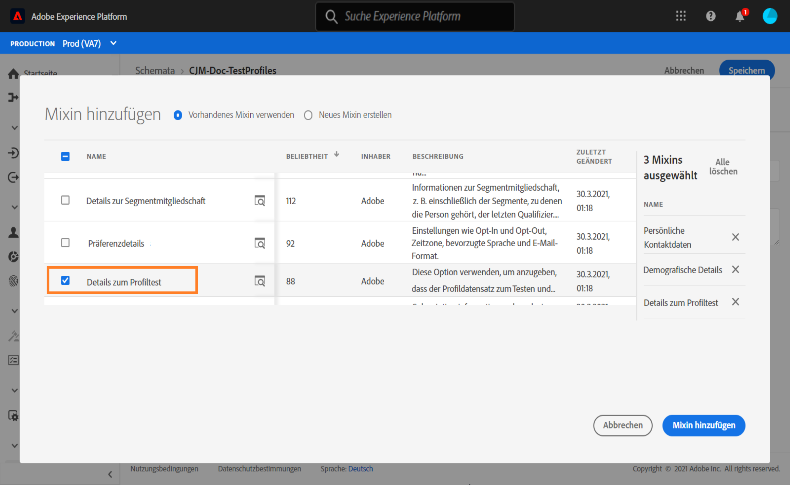
Die Liste der Mixins wird im Schema-Übersichtsbildschirm angezeigt.

   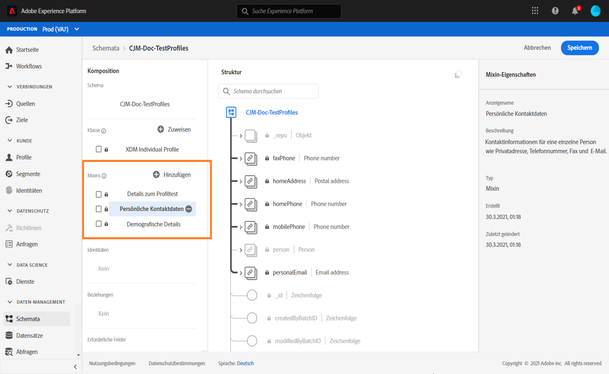
1. Klicken Sie in der Liste der Felder auf das Feld, das Sie als primäre Identität definieren möchten.
   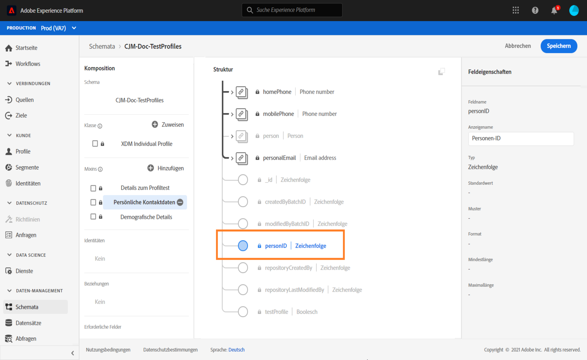
1. Markieren Sie im rechten Bereich **Feldeigenschaften** die Optionen **Identität** und **Primär Identität** und wählen Sie einen Namensraum aus. Wenn die primäre Identität eine E-Mail-Adresse sein soll, wählen Sie den Namensraum **E-Mail**. Klicken Sie auf **Apply**.
   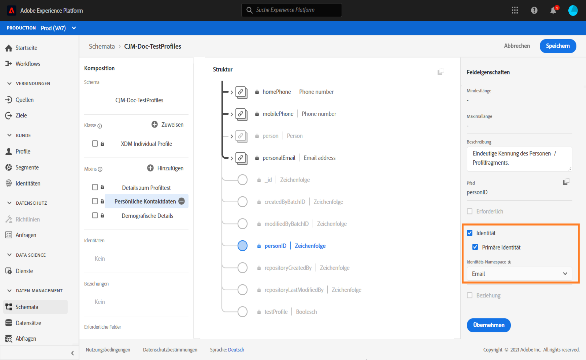
1. Wählen Sie das Schema aus und aktivieren Sie die Option **Profil** in den **Schema-Eigenschaften**.
   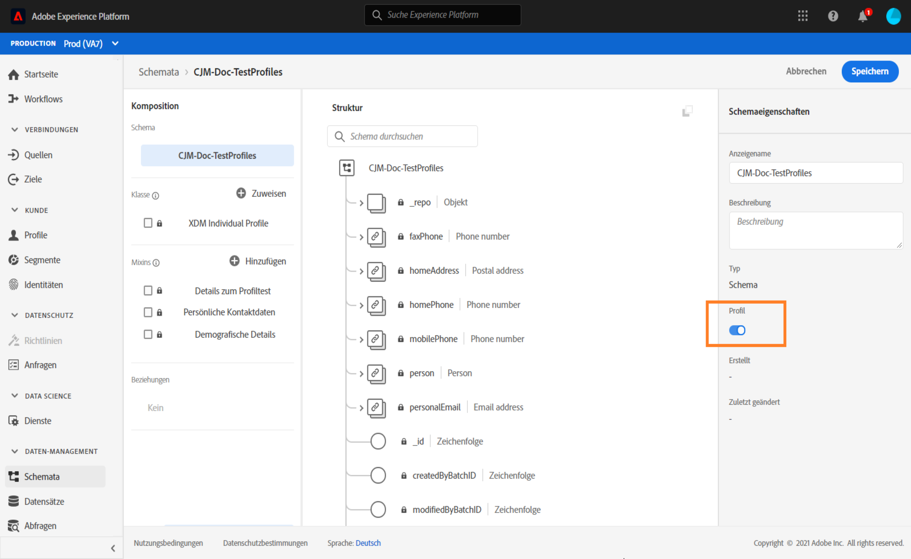
1. Wählen Sie **Speichern** aus.

>[!NOTE]
>
>Weitere Informationen zur Erstellung von Schemas finden Sie in der [XDM-Dokumentation](https://experienceleague.adobe.com/docs/experience-platform/xdm/ui/resources/schemas.html#prerequisites).

Anschließend müssen Sie **den Datensatz** erstellen, in den die Profil importiert werden. Führen Sie folgende Schritte aus:

1. Klicken Sie in Adobe Experience Platform auf **Datensätze**, im linken Menü und dann auf **Datensatz erstellen**.
   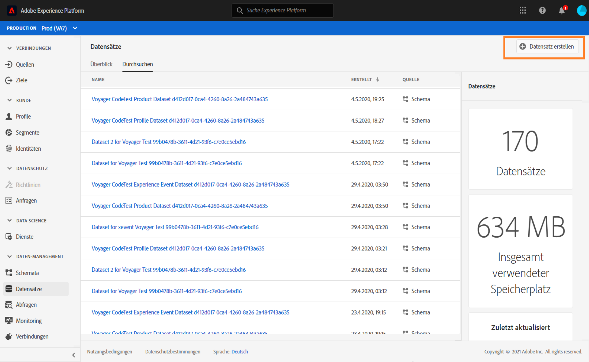
1. Wählen Sie **Datensatz aus Schema** erstellen.
   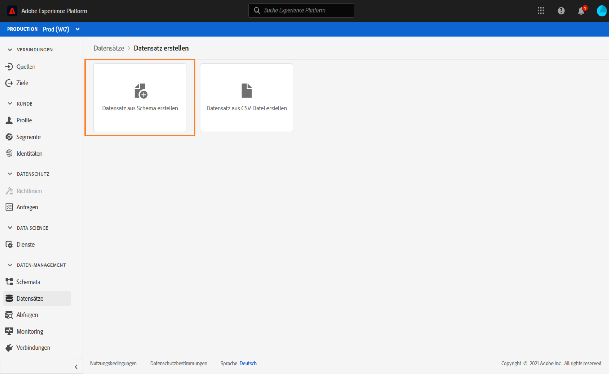
1. Wählen Sie das zuvor erstellte Schema aus und klicken Sie dann auf **Weiter**.
   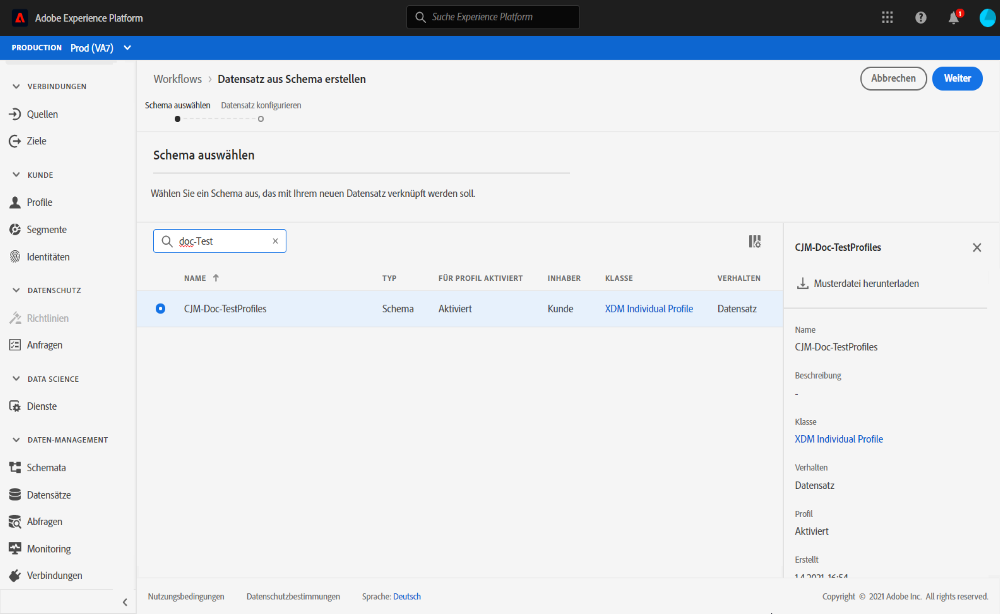
1. Wählen Sie einen Namen und klicken Sie dann auf **Fertigstellen**.
   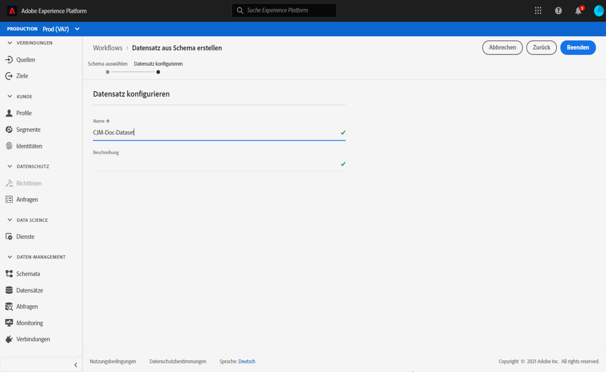
1. Aktivieren Sie die Option **Profil**.
   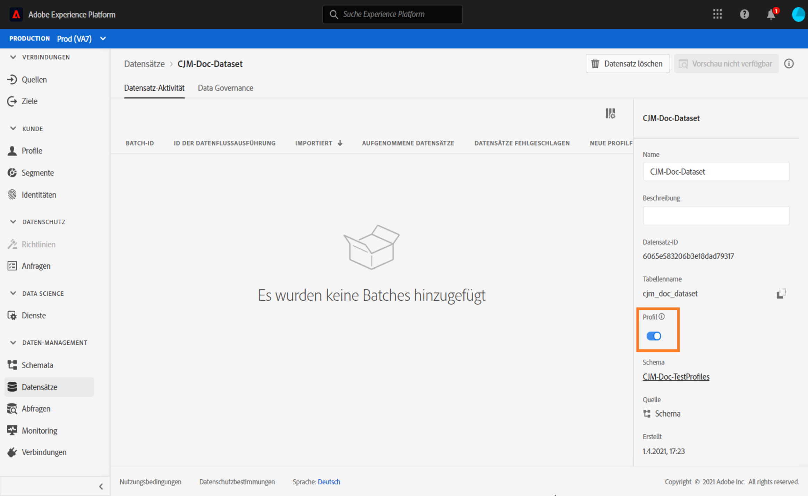

>[!NOTE]
>
> Weitere Informationen zur Dataset-Erstellung finden Sie in der [Katalogdienstdokumentation](https://experienceleague.adobe.com/docs/experience-platform/catalog/datasets/user-guide.html#getting-started).

## Umwandeln eines Profils in ein Testprofil{#turning-profile-into-test}

Sie können ein vorhandenes Profil in ein Testprofil umwandeln. In Adobe Experience Platform können Sie die Attribute von Profilen auf dieselbe Weise aktualisieren wie beim Erstellen eines Profils.

Eine einfachere Möglichkeit ist die Verwendung einer Aktion **Update-Profil** in einer Journey und die Änderung des booleschen Felds testProfile von false in true.

Ihre Journey besteht aus einem **Read-Profil** und einer **Update-Aktivität**. Zunächst müssen Sie ein Segment erstellen, das auf die Profil ausgerichtet ist, die Sie in Test-Profil umwandeln möchten.

>[!NOTE]
>
> Da Sie das Feld **testProfile** aktualisieren werden, müssen die ausgewählten Profil dieses Feld enthalten. Das zugehörige Schema muss die **Profil-Testdetails** enthalten. Siehe [diesen Abschnitt](../building-journeys/creating-test-profiles.md#test-profiles-prerequisites).

1. Klicken Sie in der Kundenverwaltung auf **Journey** im linken Menü und dann auf **Segment** erstellen, rechts oben.
   
1. Definieren Sie einen Namen für Ihr Segment und erstellen Sie das Segment: Wählen Sie die Felder und Werte aus, um die gewünschten Profil Zielgruppe.
   
1. Klicken Sie auf **Speichern** und überprüfen Sie, ob die Profil korrekt auf das Segment ausgerichtet sind.
   

   >[!NOTE]
   >
   > Die Segmentberechnung kann einige Zeit in Anspruch nehmen. Weitere Informationen zu Segmenten finden Sie in [diesem Abschnitt](../segment/about-segments.md).

1. Erstellen Sie jetzt eine neue Journey und einen neuen Beginn mit einer Orchestersegmentgruppe **Lesen**-Aktivität.
1. Wählen Sie das zuvor erstellte Segment und den Namensraum aus, den Ihre Profil verwenden.
   
1. hinzufügen Sie eine Aktivität für die Aktion **Profil aktualisieren**.
1. Wählen Sie das Schema, das Feld **testProfiles**, den Datensatz und legen Sie den Wert auf &quot;true&quot;fest.
   
1. hinzufügen Sie eine Aktivität **End** und klicken Sie auf **Publish**.
   
1. Überprüfen Sie in Adobe Experience Platform, ob die Profil korrekt aktualisiert wurden.
   

   >[!NOTE]
   >
   > Weitere Informationen zur Aktivität **Profil aktualisieren** finden Sie in [diesem Abschnitt](../building-journeys/update-profiles.md).

## Erstellen eines Profils mit einer CSV-Datei{#create-test-profiles-csv}

In Adobe Experience Platform können Sie Profile erstellen, indem Sie eine CSV-Datei hochladen, die die verschiedenen Profil-Felder enthält. Dies ist die einfachste Methode.

1. Erstellen Sie eine einfache CSV-Datei mit einer Tabellenkalkulationssoftware.
1. hinzufügen eine Spalte für jedes erforderliche Feld. Stellen Sie sicher, dass Sie das primäre Identitätsfeld (&quot;personID&quot;in unserem Beispiel oben) und das Feld &quot;testProfile&quot;auf &quot;true&quot;setzen.
   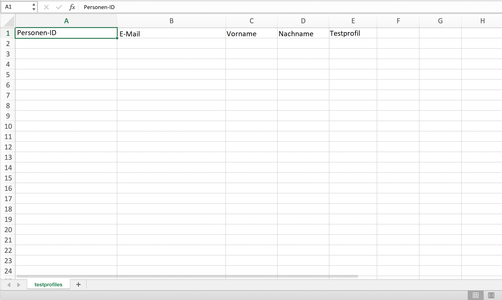
1. hinzufügen eine Zeile pro Profil und geben Sie die Werte für die einzelnen Felder ein.
   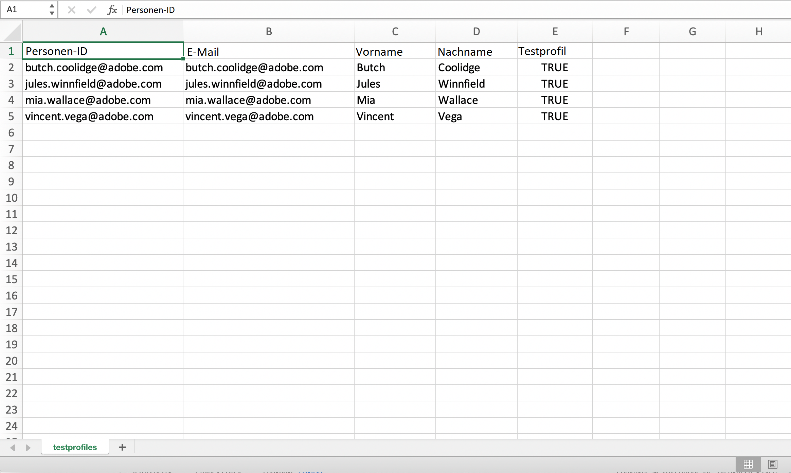
1. Speichern Sie die Tabelle als CSV-Datei. Stellen Sie sicher, dass Kommas als Trennzeichen verwendet werden.
1. Klicken Sie in Adobe Experience Platform im linken Menü auf **Workflows**.
   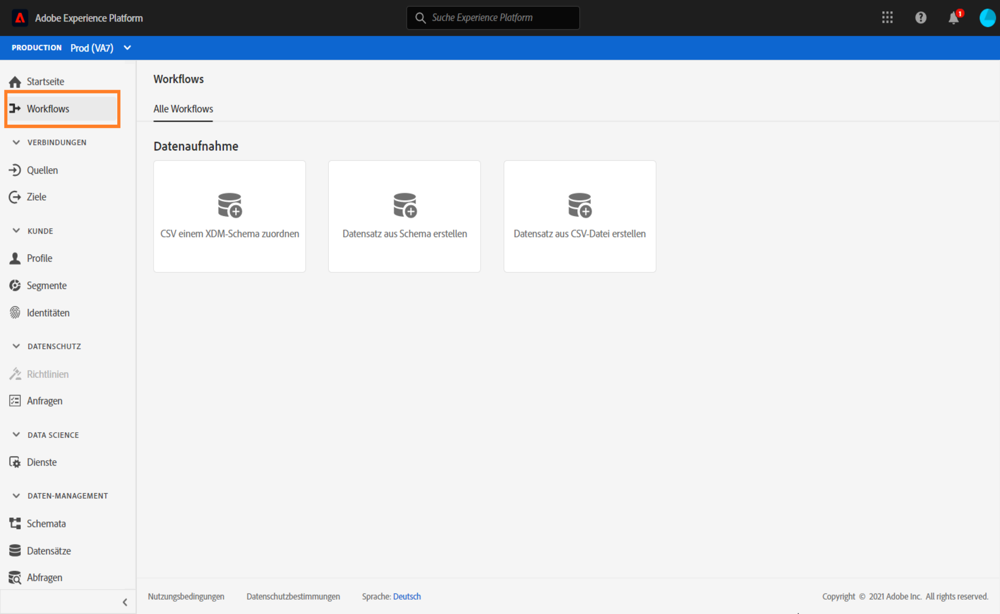
1. Wählen Sie **CSV XDM-Schema** zuordnen und klicken Sie dann auf **Starten**.
   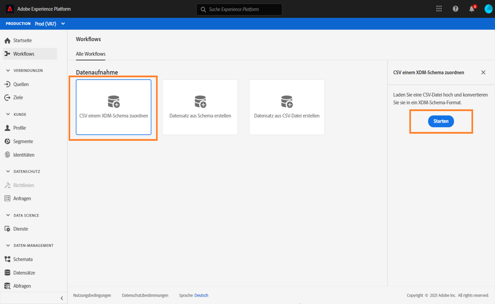
1. Wählen Sie den Datensatz aus, in den Sie die Profil importieren möchten. Klicken Sie auf **Weiter**.
   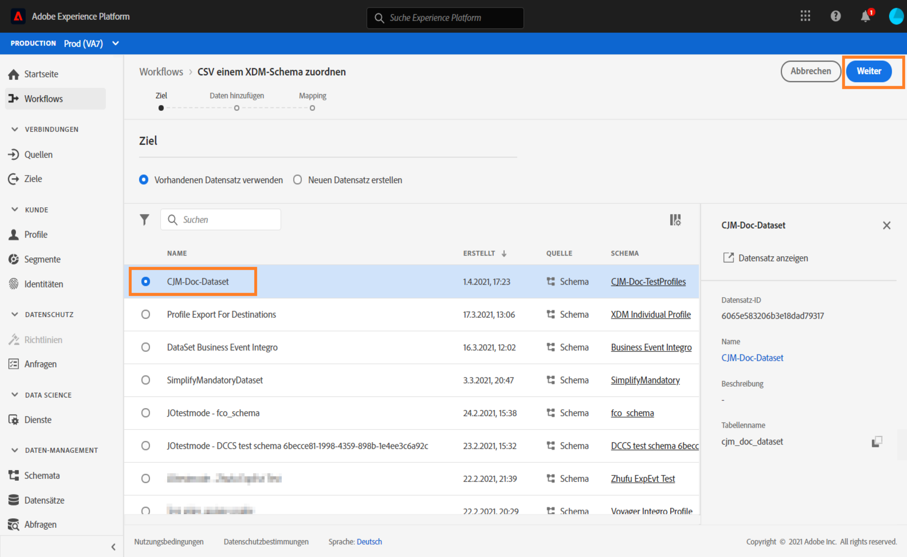
1. Klicken Sie auf **Dateien** auswählen und wählen Sie Ihre CSV-Datei aus. Klicken Sie beim Hochladen der Datei auf **Weiter**.
   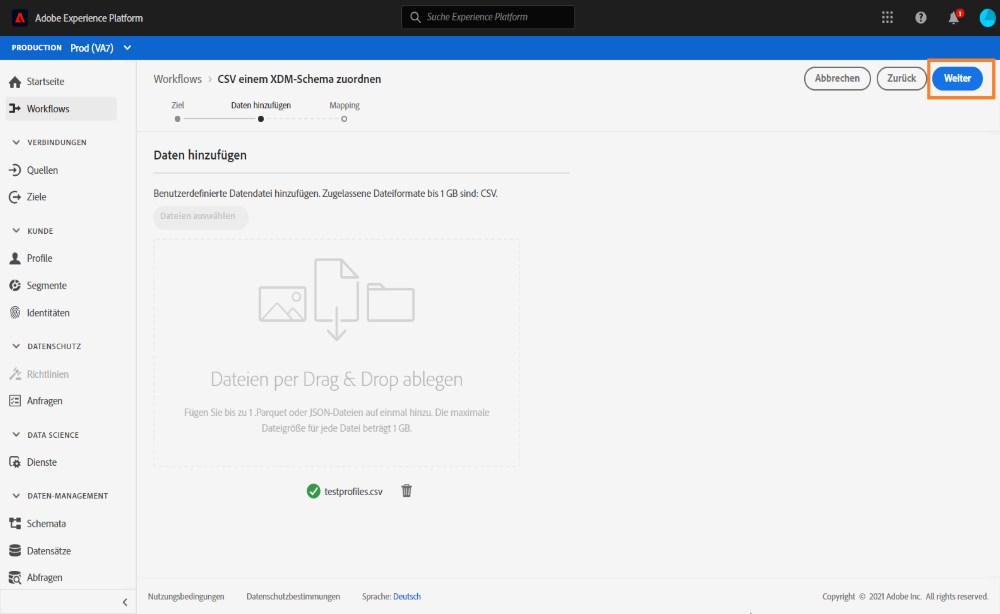
1. Ordnen Sie die CSV-Quellfelder den Schema-Feldern zu und klicken Sie dann auf **Fertigstellen**.
   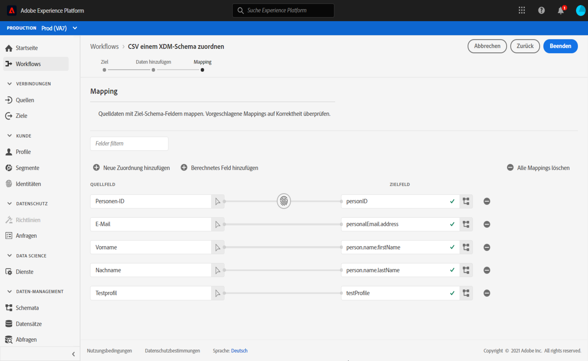
1. Der Datenimport beginnt. Der Status wechselt von **Verarbeitung** zu **Erfolg**. Klicken Sie oben rechts auf **Vorschau data set**.
   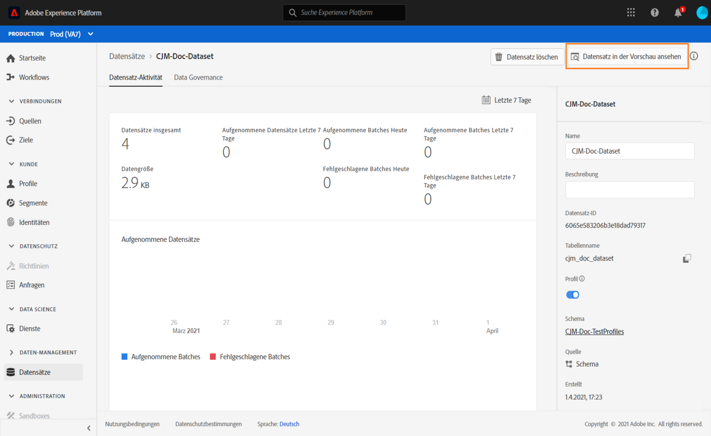
1. Vergewissern Sie sich, dass die Profil korrekt hinzugefügt wurden.
   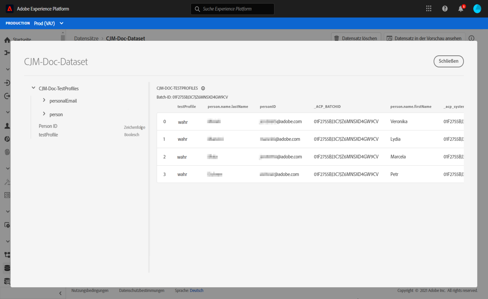

Ihre Test-Profil werden hinzugefügt und können jetzt beim Testen einer Journey verwendet werden. Siehe [diesen Abschnitt](../building-journeys/testing-the-journey.md).
>[!NOTE]
>
> Weitere Informationen zu CSV-Importen finden Sie in der [Datenaufnahmendokumentation](https://experienceleague.adobe.com/docs/experience-platform/ingestion/tutorials/map-a-csv-file.html#tutorials).

## Erstellen von Test-Profilen mit API-Aufrufen{#create-test-profiles-api}

Sie können auch Test-Profil über API-Aufrufe erstellen. Weitere Informationen finden Sie auf dieser [Seite](https://docs.adobe.com/content/help/de-DE/experience-platform/profile/home.html).

Sie müssen ein Profil-Schema verwenden, das das Mixin &quot;Profil-Testdetails&quot;enthält. Die Markierung „testProfile“ ist Teil dieses Mixins.

Achten Sie beim Erstellen eines Profils darauf, diesen Wert zu übergeben: testProfile = true.

Beachten Sie, dass Sie auch ein vorhandenes Profil aktualisieren können, um die Markierung „testProfile“ in „true“ zu ändern.

Hier sehen Sie ein Beispiel für einen API-Aufruf zum Erstellen eines Testprofils:

```
curl -X POST \
'https://dcs.adobedc.net/collection/xxxxxxxxxxxxxx' \
-H 'Cache-Control: no-cache' \
-H 'Content-Type: application/json' \
-H 'Postman-Token: xxxxx' \
-H 'cache-control: no-cache' \
-H 'x-api-key: xxxxx' \
-H 'x-gw-ims-org-id: xxxxx' \
-d '{
"header": {
"msgType": "xdmEntityCreate",
"msgId": "xxxxx",
"msgVersion": "xxxxx",
"xactionid":"xxxxx",
"datasetId": "xxxxx",
"imsOrgId": "xxxxx",
"source": {
"name": "Postman"
},
"schemaRef": {
"id": "https://example.adobe.com/mobile/schemas/xxxxx",
"contentType": "application/vnd.adobe.xed-full+json;version=1"
}
},
"body": {
"xdmMeta": {
"schemaRef": {
"contentType": "application/vnd.adobe.xed-full+json;version=1"
}
},
"xdmEntity": {
"_id": "xxxxx",
"_mobile":{
"ECID": "xxxxx"
},
"testProfile":true
}
}
}'
```

