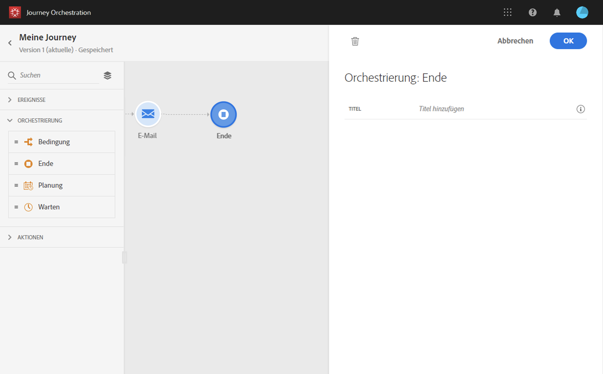

# Endaktivität{#section_vqp_4ft_dgb}

Mit der **[!UICONTROL Endaktivität]** können Sie das Ende jedes Pfades der Journey markieren. Sie ist nicht obligatorisch, wird aber aus Gründen der visuellen Klarheit empfohlen. Wenn die Journey mehrere Endaktivitäten hat, empfehlen wir, jedem Ende einen Titel hinzuzufügen, damit Berichte leichter lesbar sind. Weiterführende Informationen finden Sie auf [dieser Seite](../reporting/about-journey-reports.md).

