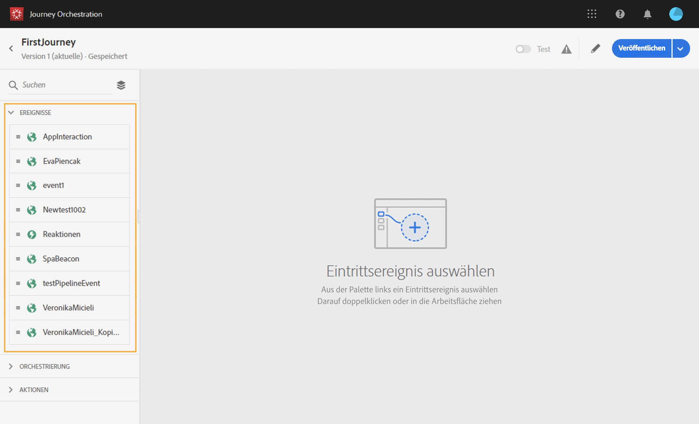
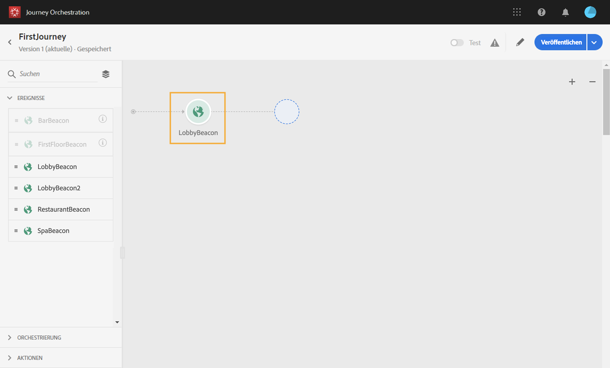
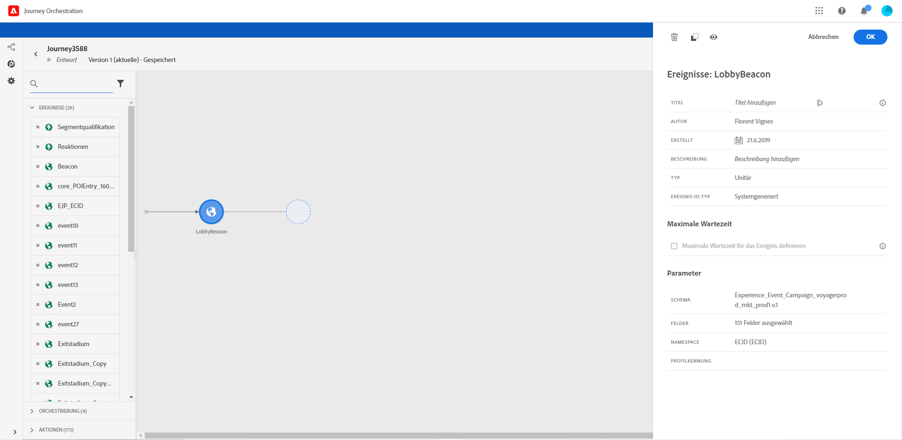
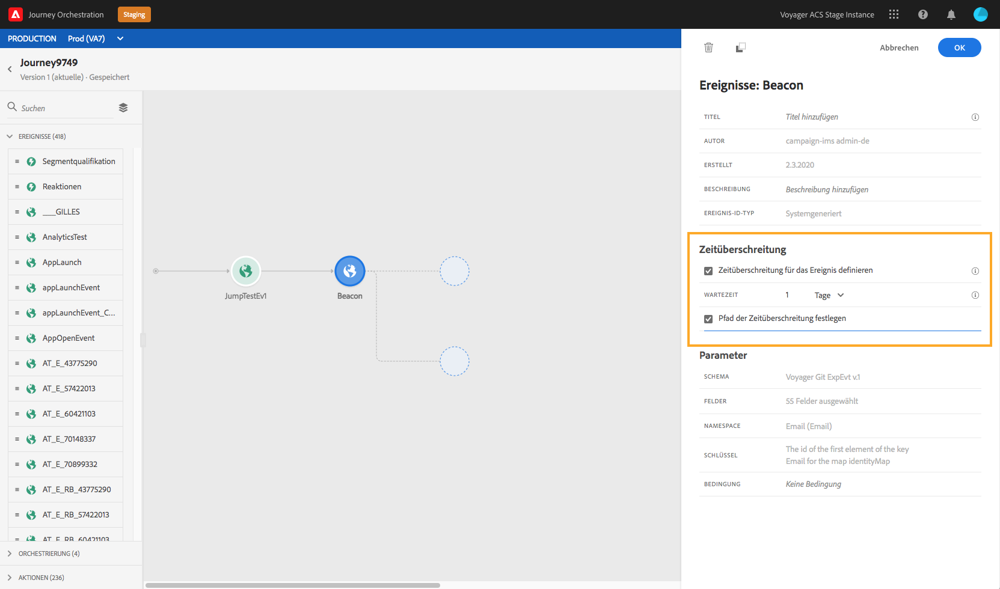
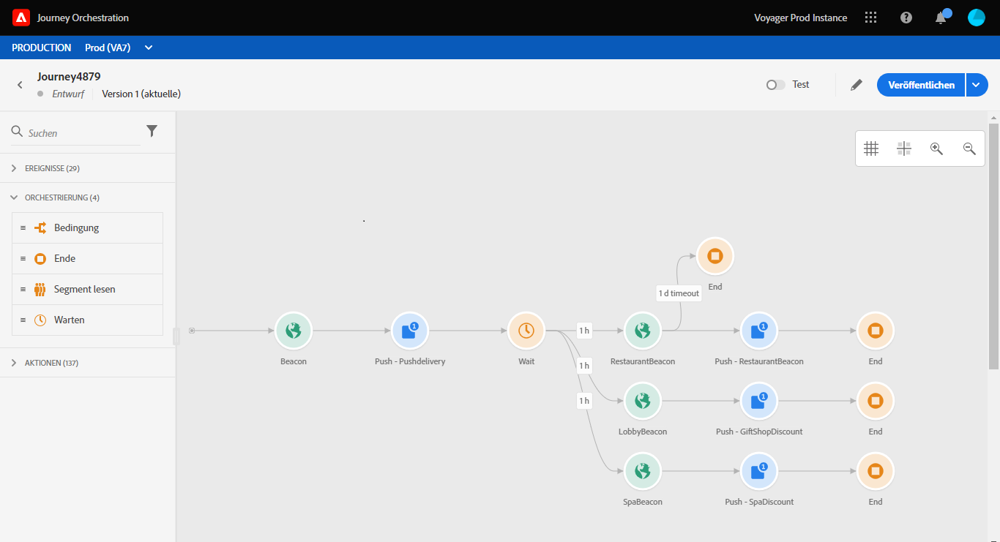

# Über Ereignisaktivitäten{#concept_rws_1rt_52b}

Die vom technischen Anwender konfigurierten Ereignisse (siehe [diese Seite](../event/about-events.md)) werden alle in der ersten Kategorie der Palette auf der linken Seite des Bildschirms angezeigt.

Beginnen Sie Ihre Journey immer mit Drag-and-Drop einer Ereignisaktivität. Sie können auf diese auch doppelklicken.

Wenn Sie auf die Ereignisaktivität auf der Arbeitsfläche klicken, wird der Konfigurationsbereich für die Aktivität angezeigt. Wenn Sie dasselbe Ereignis mehrmals verwenden, wird dem Ereignisnamen auf der Arbeitsfläche standardmäßig eine fortlaufende Nummer hinzugefügt. Darüber hinaus können Sie mit dem Feld **[!UICONTROL Titel]** dem Ereignisnamen ein Suffix hinzufügen, das unter Ihrer Aktivität auf der Arbeitsfläche angezeigt wird. Dies ist nützlich, um Ihre Ereignisse auf der Arbeitsfläche zu identifizieren, insbesondere wenn Sie dasselbe Ereignis mehrmals verwenden. Außerdem wird die Problembehebung bei Fehlern und das Lesen von Berichten erleichtert.

## Überwachen von Ereignissen während eines bestimmten Zeitraums

Eine in der Journey positionierte Ereignisaktivität überwacht Ereignisse auf unbestimmte Zeit. Damit ein Ereignis nur während einer bestimmten Zeit überwacht wird, müssen Sie für das Ereignis eine Zeitüberschreitung konfigurieren.

Die Journey überwacht dann das Ereignis während der in der Zeitüberschreitung angegebenen Zeit. Wenn ein Ereignis während dieses Zeitraums empfangen wird, wird die Person in den Ereignispfad geleitet. Ist dies nicht der Fall, wird der Kunde entweder in den Pfad einer Zeitüberschreitung geleitet oder seine Journey wird beendet.

Gehen Sie wie folgt vor, um für ein Ereignis eine Zeitüberschreitung zu konfigurieren:

1. Aktivieren Sie die Option **[!UICONTROL Zeitüberschreitung für das Ereignis definieren]** in den Eigenschaften des Ereignisses.

1. Legen Sie fest, wie lange die Journey auf das Ereignis warten soll.

1. Wenn Sie die Kontakte in den Pfad einer Zeitüberschreitung senden möchten, wenn innerhalb der angegebenen Zeitüberschreitung kein Ereignis empfangen wird, aktivieren Sie die Option **[!UICONTROL Pfad der Zeitüberschreitung festlegen]**. Wenn diese Option nicht aktiviert ist, wird die Journey für den betreffenden Kontakt beendet, sobald die Zeitüberschreitung erreicht wird.

   

In diesem Beispiel sendet die Journey einen ersten Willkommens-Push an einen Kunden. Es wird nur dann ein Essensrabatt-Push gesendet, wenn der Kunde das Restaurant innerhalb des nächsten Tages betritt. Deshalb wurde das Restaurantereignis mit einer 1-tägigen Zeitüberschreitung konfiguriert:

* Wenn das Restaurantereignis in weniger als 1 Tag nach der Begrüßungs-Push-Benachrichtigung eingeht, wird die Push-Aktivität für den Rabatt gesendet.
* Wenn innerhalb des nächsten Tags kein Restaurantereignis eingeht, wird die Person durch den Pfad der Zeitüberschreitung geleitet.

Wenn Sie eine Zeitüberschreitung für mehrere Ereignisse konfigurieren möchten, die sich nach einer **[!UICONTROL Warteaktivität]** befinden, müssen Sie die Zeitüberschreitung nur für eines dieser Ereignisse konfigurieren.

Die Zeitüberschreitung gilt für alle Ereignisse, die nach der **[!UICONTROL Warteaktivität]** positioniert wurden. Wenn nach der spezifizierten Zeitüberschreitung kein Ereignis empfangen wird, werden die Kontakte in einen einzigen Zeitüberschreitungspfad geleitet oder ihre Journey wird beendet.

