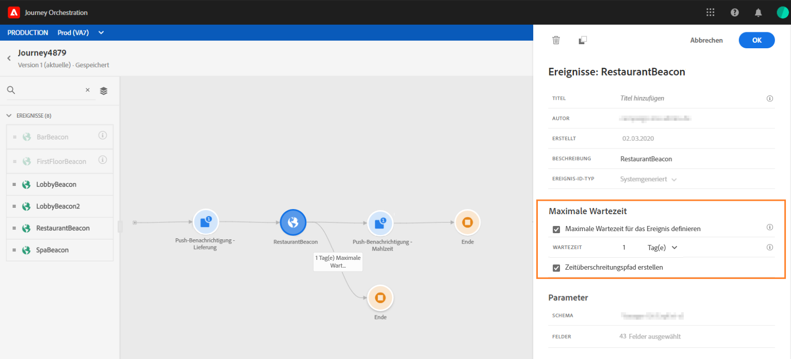

# Über Ereignisaktivitäten{#concept_rws_1rt_52b}

Die vom technischen Anwender konfigurierten Ereignisse (siehe ) werden alle in der ersten Kategorie der Palette auf der linken Seite des Bildschirms angezeigt.

Beginnen Sie Ihre Journey immer mit Drag-and-Drop einer Ereignisaktivität. Sie können auf diese auch doppelklicken.

Wenn Sie auf die Ereignisaktivität auf der Arbeitsfläche klicken, wird der Konfigurationsbereich für die Aktivität angezeigt. Wenn Sie dasselbe Ereignis mehrmals verwenden, wird dem Ereignisnamen auf der Arbeitsfläche standardmäßig eine fortlaufende Nummer hinzugefügt. Darüber hinaus können Sie mit dem Feld **[!UICONTROL Titel]** dem Ereignisnamen ein Suffix hinzufügen, das unter Ihrer Aktivität auf der Arbeitsfläche angezeigt wird. Dies ist nützlich, um Ihre Ereignisse auf der Arbeitsfläche zu identifizieren, insbesondere wenn Sie dasselbe Ereignis mehrmals verwenden. Außerdem wird die Problembehebung bei Fehlern und das Lesen von Berichten erleichtert.

## Verfolgen von Ereignissen während eines bestimmten Zeitraums

Eine in der Journey positionierte Ereignisaktivität überwacht Ereignisse auf unbestimmte Zeit. Um ein Ereignis nur während eines bestimmten Zeitraums abzurufen, müssen Sie einen Timeout für das Ereignis konfigurieren.

Die Reise hört dann während der im Timeout festgelegten Zeit auf das Ereignis. Wenn ein Ereignis während dieses Zeitraums empfangen wird, wird die Person in den Ereignispfad geleitet. Ist dies nicht der Fall, fließt der Kunde entweder in einen Timeout-Pfad oder beendet seine Reise.

Gehen Sie wie folgt vor, um einen Timeout für ein Ereignis zu konfigurieren:

1. Aktivieren Sie die Option &quot;Ereignis-Timeout **** aktivieren&quot;in den Eigenschaften des Ereignisses.

1. Geben Sie an, wie lange die Reise auf das Ereignis warten soll.

1. Wenn Sie die Personen in einen Timeout-Pfad senden möchten, wenn innerhalb der angegebenen Zeitüberschreitung kein Ereignis eingeht, aktivieren Sie die Option **[!UICONTROL Zeitüberschreitungspfad]** festlegen. Wenn diese Option nicht aktiviert ist, endet die Reise für die betreffende Person, sobald der Timeout erreicht wurde.

   

In diesem Beispiel sendet die Reise einen ersten Willkommens-Push an einen Kunden. Es sendet dann einen Rabatt-Push nur dann, wenn der Kunde innerhalb des nächsten Tages das Restaurant betritt. Deshalb haben wir das Restaurant-Ereignis mit einem 1-tägigen Timeout konfiguriert:

* Wenn das Restaurant-Ereignis weniger als 1 Tag nach dem Begrüßungstreffer erhalten wird, wird die Aktivität mit dem Meningrabatt gesendet.
* Wenn innerhalb des nächsten Tages kein Ereignis im Restaurant empfangen wird, fließt die Person durch den Timeout-Pfad.

Wenn Sie einen Timeout für mehrere Ereignis konfigurieren möchten, die sich nach einer **[!UICONTROL Wait]** -Aktivität befinden, müssen Sie den Timeout nur für eines dieser Ereignis konfigurieren.

Die Zeitüberschreitung gilt für alle Ereignis, die nach der **[!UICONTROL Wait]** -Aktivität positioniert wurden. Wenn nach dem angegebenen Timeout kein Ereignis empfangen wird, fließen die Personen in einen einzigen Timeout-Pfad oder beenden ihre Reise.

