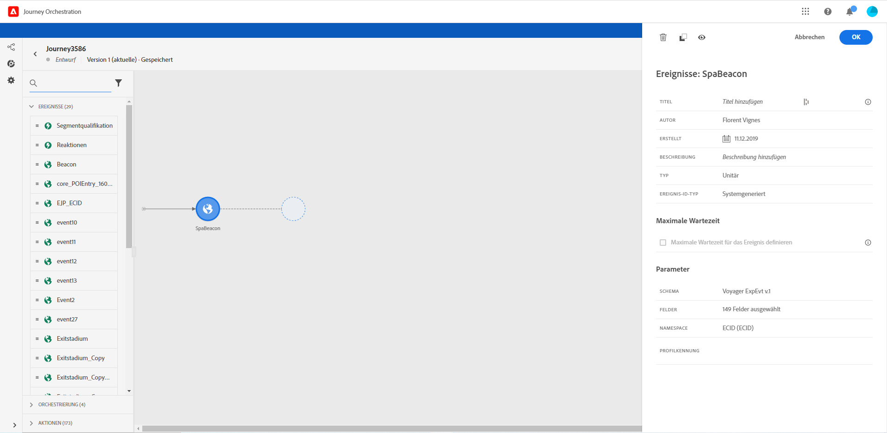

# Allgemeine Ereignisse {#section_ofg_jss_dgb}

Für diesen Ereignistyp können Sie nur einen Titel und eine Beschreibung hinzufügen. Der Rest der Konfiguration kann nicht bearbeitet werden. Dies wurde vom technischen Anwender durchgeführt. Weitere Informationen finden Sie auf [dieser Seite](../event/about-events.md).

