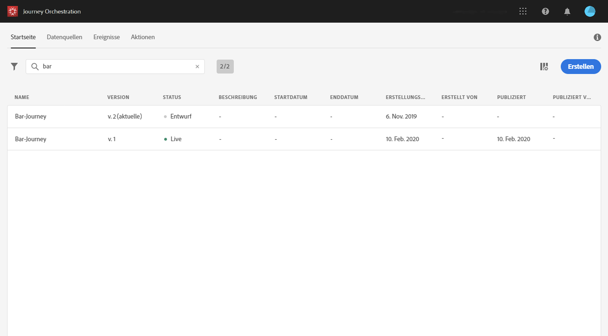
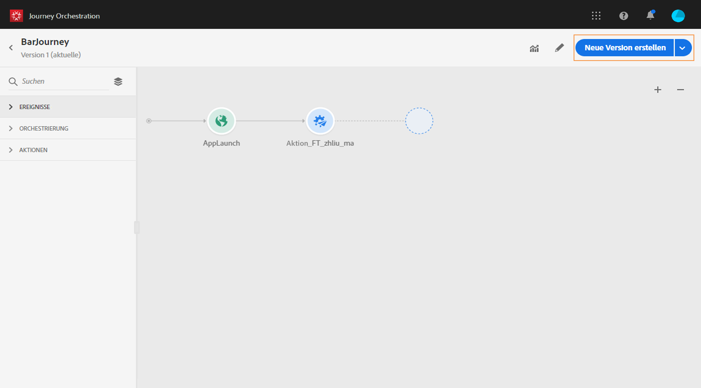
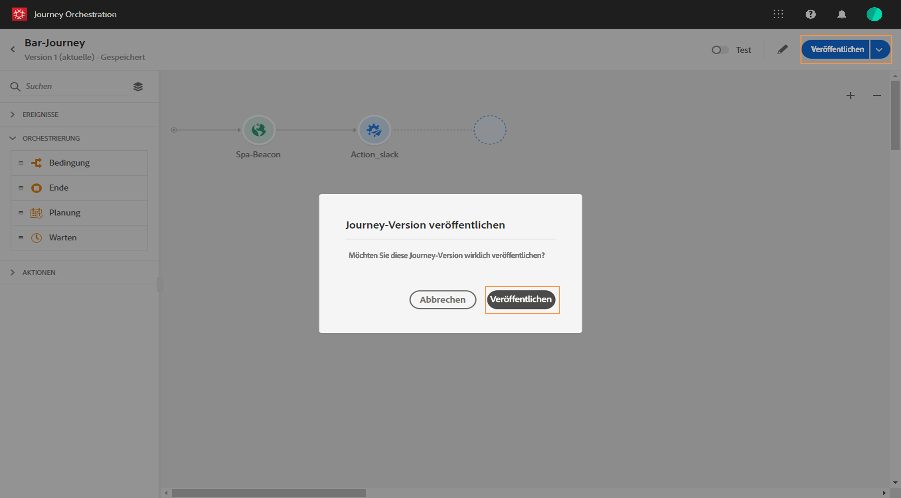

# Journey-Versionen{#concept_ldc_k55_zgb}

In der Liste der Journeys werden alle Journey-Versionen mit der Versionsnummer angezeigt. Siehe . Wenn Sie nach einer Journey suchen, werden beim ersten Öffnen der Anwendung die neuesten Versionen oben in der Liste angezeigt. Anschließend können Sie die gewünschte Sortierung definieren und die Anwendung behält sie als Benutzervoreinstellung bei. Die Version der Journey wird auch oben auf der Benutzeroberfläche zum Bearbeiten der Journey (oberhalb der Arbeitsfläche) angezeigt.

Wenn Sie eine Live-Journey ändern müssen, müssen Sie eine neue Version Ihrer Journey erstellen.

1. Öffnen Sie die neueste Version Ihrer Live-Journey, klicken Sie auf **[!UICONTROL Neue Version erstellen]** und bestätigen Sie.

   

   >[!NOTE]
   >
   >Sie können nur aus der neuesten Version einer Journey eine neue Journey erstellen.

1. Nehmen Sie Ihre Änderungen vor, klicken Sie auf **[!UICONTROL Veröffentlichen]** und bestätigen Sie.

   

Ab dem Zeitpunkt der Veröffentlichung der Journey nehmen Kontakte an der neuen Version der Journey teil. Personen, die bereits an einer früheren Version teilnehmen, bleiben in ihr, bis sie die Journey beenden. Wenn sie später wieder in dieselbe Journey eintreten, wechseln sie in die neueste Version.

Journey-Versionen können einzeln gestoppt werden. Alle Versionen von Journeys haben denselben Namen.

>[!NOTE]
>
>Wenn Sie mehrere Live-Versionen haben und die neueste Version stoppen, greifen die Anwender nicht auf eine frühere Live-Version zurück. Es findet kein Eintritt zur Journey statt.
