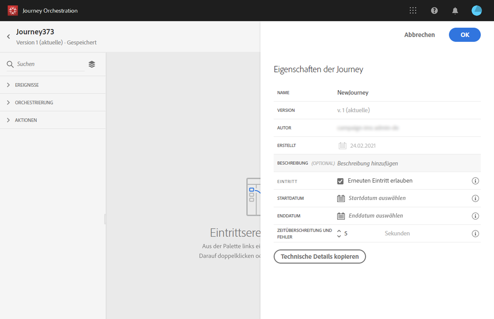

# Erstellen einer Journey {#concept_gq5_sqt_52b}

Dieser Schritt wird vom **Business-Anwender** ausgeführt. Hier erstellen Sie Ihre Journeys. Kombinieren Sie die verschiedenen Ereignis-, Orchestrierungs- und Aktionsaktivitäten, um Ihre mehrstufigen kanalübergreifenden Szenarien zu erstellen.

Die Benutzeroberfläche für die Journey ermöglicht es Ihnen, Aktivitäten einfach von der Palette in die Arbeitsfläche zu ziehen. Sie können auch auf eine Aktivität doppelklicken, um sie im nächsten verfügbaren Schritt der Arbeitsfläche hinzuzufügen. Jede Aktivität hat eine bestimmte Rolle und eine bestimmte Position im Prozess. Die Aktivitäten werden sequenziert. Nach Beendigung einer Aktivität wird der Fluss fortgesetzt und die nächste Aktivität verarbeitet usw.

Pro Journey ist nur ein Namespace zulässig. Wenn Sie das erste Ereignis ablegen, werden Ereignisse mit unterschiedlichen Namespaces grau dargestellt. Wenn das erste Ereignis keinen Namespace hat, werden alle Ereignisse mit einem Namespace grau dargestellt. Weitere Informationen finden Sie auf [dieser Seite](../event/selecting-the-namespace.md). Außerdem werden die Feldergruppen für Adobe Experience Platform grau dargestellt, wenn die Journey Ereignisse ohne Namespace enthält. Wenn Sie mehrere Ereignisse in derselben Journey nutzen, müssen diese denselben Namespace verwenden.

Beim Erstellen einer neuen Journey werden Elemente ausgeblendet, die nicht als erster Schritt auf der Arbeitsfläche abgelegt werden können. Dies betrifft alle Aktionen, die Bedingungsaktivität, die Wartezeit und die Reaktion.

## Schnellstart {#creating_journey}

Hier finden Sie die wichtigsten Schritte für das Erstellen und Veröffentlichen einer Journey.

1. Klicken Sie oben im Menü auf den Tab **[!UICONTROL Startseite]**.

   Die Liste der Journeys wird angezeigt. Weitere Informationen zur Benutzeroberfläche finden Sie auf [dieser Seite](../building-journeys/using-the-journey-designer.md).

   

1. Klicken Sie auf **[!UICONTROL Erstellen]**, um eine neue Journey zu erstellen.

   

1. Bearbeiten Sie im Konfigurationsbereich auf der rechten Seite die Eigenschaften der Journey. Weitere Informationen finden Sie auf [dieser Seite](../building-journeys/changing-properties.md).

   

1. Ziehen Sie zuerst eine Ereignisaktivität aus der Palette in die Arbeitsfläche. Sie können auch auf eine Aktivität doppelklicken, um sie der Arbeitsfläche hinzuzufügen.

   

1. Ziehen Sie Ihre anderen Aktivitäten per Drag-and-Drop und konfigurieren Sie sie. Weitere Informationen finden Sie auf den Seiten [Ereignisaktivitäten](../building-journeys/event-activities.md), [Informationen zu Orchestrierungsaktivitäten](../building-journeys/about-orchestration-activities.md) und [Informationen zu Aktionsaktivitäten](../building-journeys/about-action-activities.md).

   

1. Ihre Journey wird automatisch gespeichert. Testen und veröffentlichen Sie Ihre Journey. Siehe [Testen der Reise](../building-journeys/testing-the-journey.md) und [Veröffentlichen der Journey](../building-journeys/publishing-the-journey.md).

   

## Beenden einer Journey {#ending_a_journey}

Eine Journey kann für einen Kontakt aus zwei Gründen enden:

* Die Person kommt bei der letzten Aktivität eines Pfades an. Diese letzte Aktivität kann eine Endaktivität oder eine andere Aktivität sein. Sie müssen einen Pfad nicht mit einer Endaktivität beenden. Weitere Informationen finden Sie auf [dieser Seite](../building-journeys/end-activity.md).
* Die Person kommt bei einer Bedingungsaktivität (oder einer Warteaktivität mit einer Bedingung) an und erfüllt keine der Bedingungen.

Die Person kann dann wieder in die Journey eintreten, wenn der erneute Zutritt erlaubt ist. Weitere Informationen finden Sie auf [dieser Seite](../building-journeys/changing-properties.md).

Eine Journey kann aus den folgenden Gründen geschlossen werden:

* Die Journey wird manuell über die Schaltfläche **[!UICONTROL Für neue Eintritte schließen]** geschlossen.
* Das Enddatum des Journey wurde erreicht.

Wenn eine Journey geschlossen wird (aus einem der oben genannten Gründe), weist sie den Status **[!UICONTROL Geschlossen]** auf. Die Journey stoppt den Eintritt neuer Kontakte. Personen, die sich bereits in der Journey befinden, beenden die Journey wie gewohnt. Nach der standardmäßigen globalen maximalen Wartezeit von 30 Tagen wechselt die Journey zum Status **Beendet**. Weitere Informationen finden Sie in diesem [Abschnitt](../building-journeys/changing-properties.md#entrance).

Falls Sie den Fortschritt aller Personen in der Journey stoppen müssen, können Sie das tun. In diesem Fall entsteht für alle Personen in der Journey eine Zeitüberschreitung.

Weitere Informationen zum manuellen Schließen oder Stoppen einer Journey finden Sie in diesem [Abschnitt](../building-journeys/terminating-a-journey.md).
