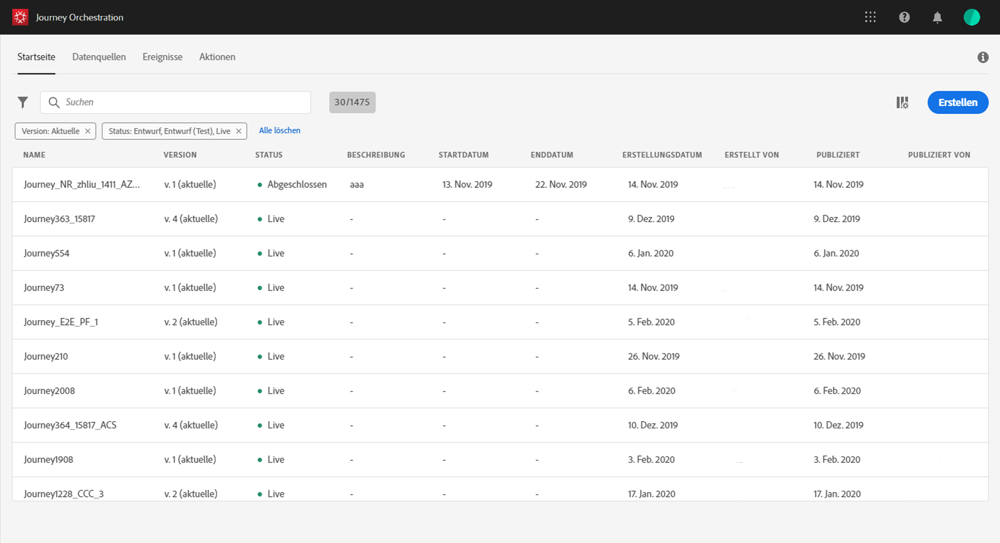

# Eine Reise erstellen {#concept_gq5_sqt_52b}

Dieser Schritt wird vom **Geschäftsbenutzer** ausgeführt. Hier kreieren Sie Ihre Reisen. Kombinieren Sie die verschiedenen Ereignis-, Orchestrierungs- und Aktionsaktivitäten, um Ihre mehrstufigen kanalübergreifenden Szenarien zu erstellen.

Die Benutzeroberfläche für die Reise ermöglicht Ihnen, Aktivitäten einfach von der Palette in die Arbeitsfläche zu ziehen. Sie können auch auf eine Aktivität doppelklicken, um sie im nächsten verfügbaren Schritt auf der Arbeitsfläche hinzuzufügen. Jede Aktivität hat eine bestimmte Rolle und einen bestimmten Platz im Prozess. Die Aktivitäten werden sequenziert. Nach Abschluss einer Aktivität wird der Fluss fortgesetzt und die nächste Aktivität verarbeitet usw.

Pro Fahrt ist nur ein Namespace zulässig. Wenn Sie das erste Ereignis abbrechen, werden Ereignisse mit unterschiedlichen Namespaces grau dargestellt. Wenn das erste Ereignis keinen Namespace hat, werden alle Ereignisse mit einem Namespace grau ausgeblendet. Näheres wird im Abschnitt  beschrieben. Außerdem werden Feldgruppen für Erlebnisplattformen ausgegraut, wenn die Reise Ereignisse ohne Namespace enthält. Und schließlich müssen mehrere Ereignisse auf derselben Reise denselben Namespace verwenden.

## Quickstart {#creating_journey}

Hier sind die wichtigsten Schritte, um eine Reise zu erstellen und zu veröffentlichen.

1. Klicken Sie im oberen Menü auf die Registerkarte **[!UICONTROL Start]**.

   Die Liste der Reisen wird angezeigt. Weitere Informationen  zur Benutzeroberfläche finden Sie unter .

   

1. Klicken Sie auf **[!UICONTROL Erstellen]**, um eine neue Reise zu erstellen.

   

1. Bearbeiten Sie die Eigenschaften der Reise im Konfigurationsbereich auf der rechten Seite. Näheres wird im Abschnitt  beschrieben.

   

1. Ziehen Sie zuerst eine Ereignisaktivität aus der Palette in die Arbeitsfläche. Sie können auch auf eine Aktivität doppelklicken, um sie der Arbeitsfläche hinzuzufügen.

   

1. Ziehen Sie Ihre anderen Aktivitäten per Drag &amp; Drop und konfigurieren Sie sie. See ,  and .

   

1. Ihre Reise wird automatisch gespeichert. Testen Sie Ihre Reise und veröffentlichen Sie sie. Siehe  und .

   

## Ende einer Reise{#ending_a_journey}

Es gibt zwei Möglichkeiten, eine Reise zu beenden:

* Die Person kommt bei der letzten Aktivität eines Pfades an. Diese letzte Aktivität kann eine Endaktivität oder eine andere Aktivität sein. Es besteht keine Verpflichtung, einen Pfad mit einer Endaktivität zu beenden. Näheres wird im Abschnitt  beschrieben.
* Die Person gelangt zu einer Bedingungsaktivität (oder einer Warteaktivität mit einer Bedingung) und erfüllt keine der Bedingungen.

Die Person kann dann wieder in die Reise einreisen, wenn der Wiedereintritt erlaubt ist. Näheres wird im Abschnitt  beschrieben.

