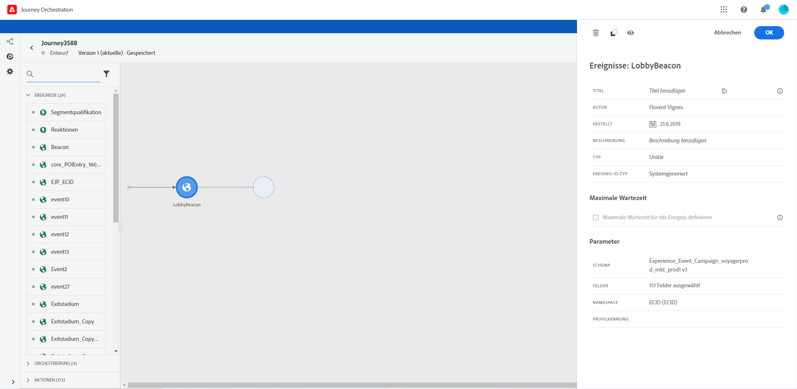

# Erstellen einer Journey {#concept_gq5_sqt_52b}

Dieser Schritt wird vom **Business-Anwender** ausgeführt. Hier erstellen Sie Ihre Journeys. Kombinieren Sie die verschiedenen Ereignis-, Orchestrierungs- und Aktionsaktivitäten, um Ihre mehrstufigen kanalübergreifenden Szenarien zu erstellen.

Die Benutzeroberfläche für die Journey ermöglicht es Ihnen, Aktivitäten einfach von der Palette in die Arbeitsfläche zu ziehen. Sie können auch auf eine Aktivität doppelklicken, um sie im nächsten verfügbaren Schritt der Arbeitsfläche hinzuzufügen. Jede Aktivität hat eine bestimmte Rolle und eine bestimmte Position im Prozess. Die Aktivitäten werden sequenziert. Nach Beendigung einer Aktivität wird der Fluss fortgesetzt und die nächste Aktivität verarbeitet usw.

Pro Journey ist nur ein Namespace zulässig. Wenn Sie das erste Ereignis ablegen, werden Ereignisse mit unterschiedlichen Namespaces grau dargestellt. Wenn das erste Ereignis keinen Namespace hat, werden alle Ereignisse mit einem Namespace grau dargestellt. Siehe . Außerdem werden Feldgruppen für Adobe Experience Platformen ausgegraut, wenn die Reise Ereignisse ohne Namensraum hat. Wenn Sie mehrere Ereignisse in derselben Journey verwenden, müssen diese denselben Namespace verwenden.

## Schnellstart {#creating_journey}

Hier finden Sie die wichtigsten Schritte für das Erstellen und Veröffentlichen einer Journey.

1. Klicken Sie oben im Menü auf den Tab **[!UICONTROL Startseite]**.

   Die Liste der Journeys wird angezeigt. Weitere Informationen zur Benutzeroberfläche finden Sie unter .

   

1. Klicken Sie auf **[!UICONTROL Erstellen]**, um eine neue Journey zu erstellen.

   

1. Bearbeiten Sie im Konfigurationsbereich auf der rechten Seite die Eigenschaften der Journey. Siehe .

   

1. Ziehen Sie zuerst eine Ereignisaktivität aus der Palette in die Arbeitsfläche. Sie können auch auf eine Aktivität doppelklicken, um sie der Arbeitsfläche hinzuzufügen.

   

1. Ziehen Sie Ihre anderen Aktivitäten per Drag-and-Drop und konfigurieren Sie sie. Siehe ,  und .

   

1. Ihre Journey wird automatisch gespeichert. Testen und veröffentlichen Sie Ihre Journey. Siehe  und .

   

## Beenden einer Journey {#ending_a_journey}

Es gibt zwei Möglichkeiten, eine Journey zu beenden:

* Die Person kommt bei der letzten Aktivität eines Pfades an. Diese letzte Aktivität kann eine Endaktivität oder eine andere Aktivität sein. Sie müssen einen Pfad nicht mit einer Endaktivität beenden. Siehe .
* Die Person kommt bei einer Bedingungsaktivität (oder einer Warteaktivität mit einer Bedingung) an und erfüllt keine der Bedingungen.

Die Person kann dann wieder in die Journey eintreten, wenn der erneute Zutritt erlaubt ist. Siehe .
