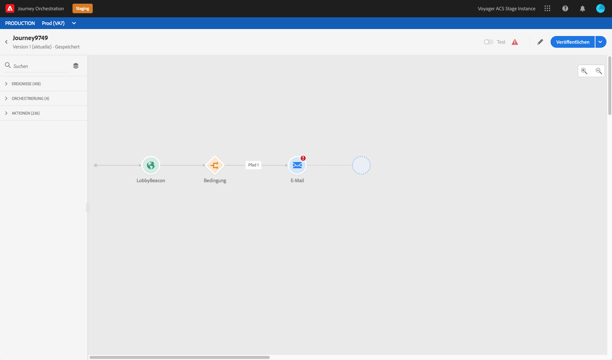
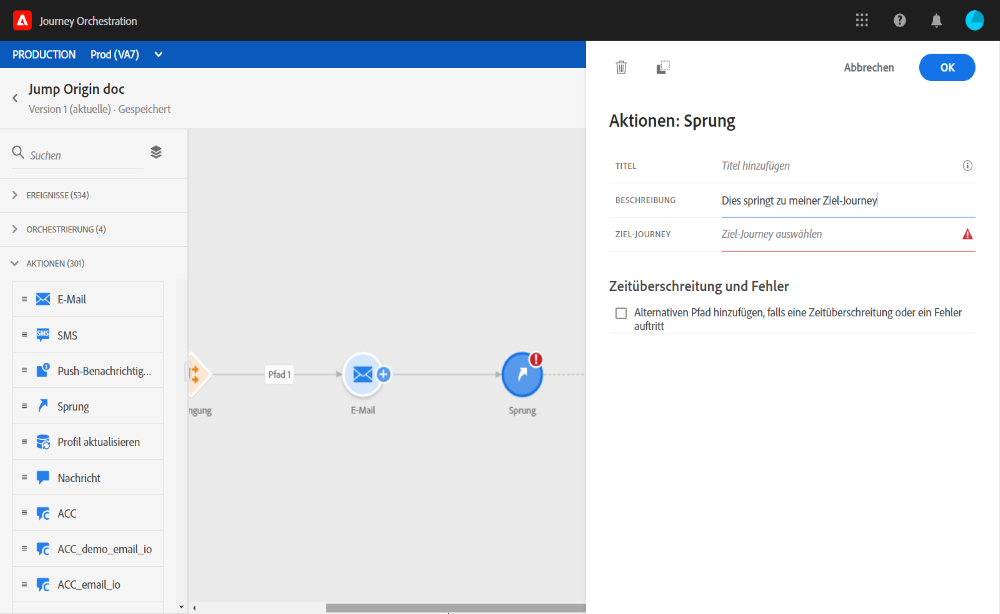
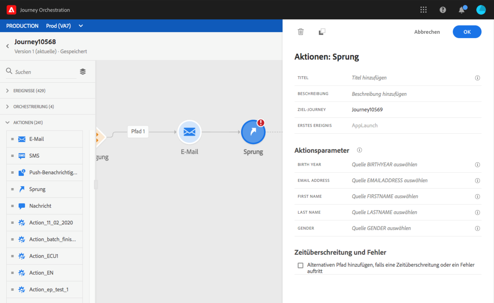
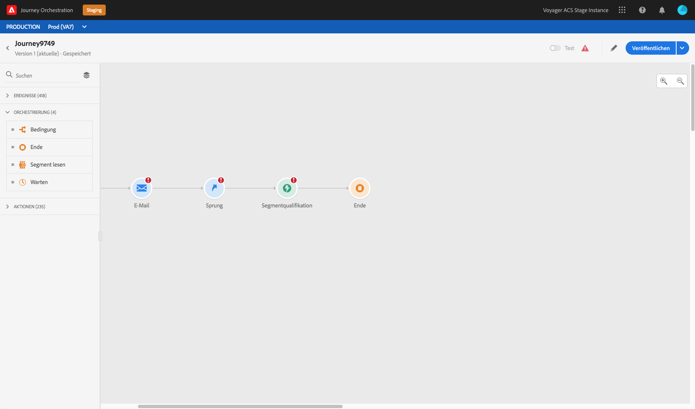
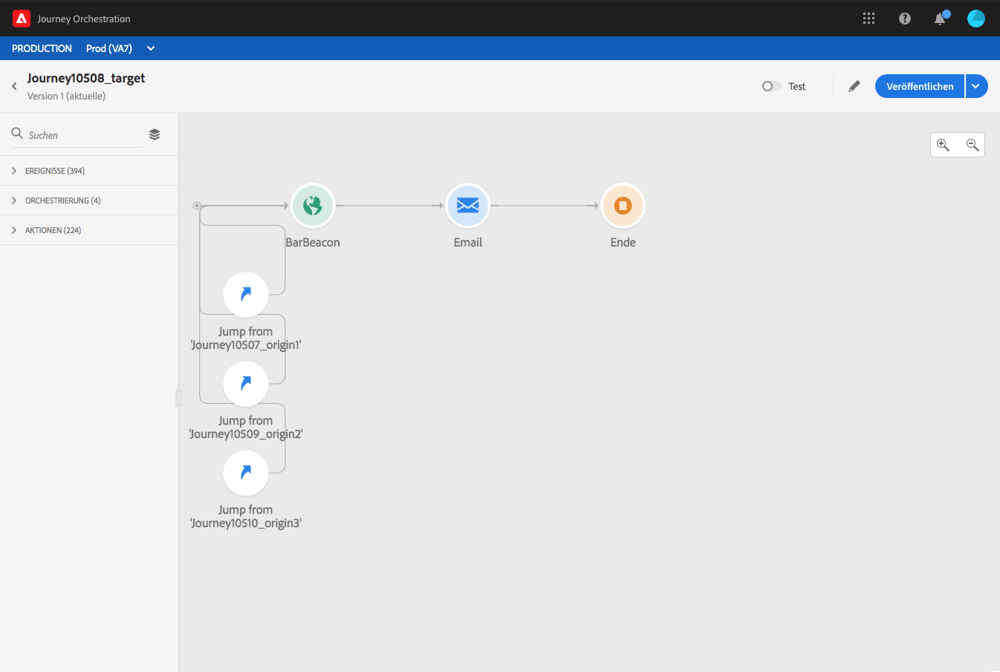
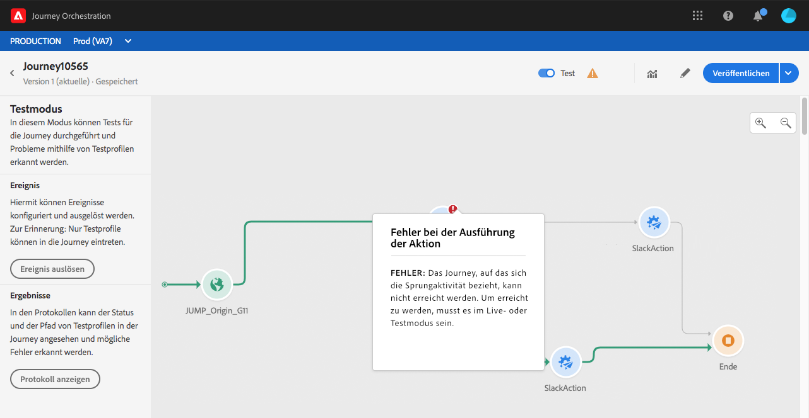

# Springen zwischen Journeys {#jump}

Mit der Aktionsaktivität **[!UICONTROL Sprung]** können Sie Kontakte von einer Journey in eine andere bewegen. Diese Funktion unterstützt:

* Vereinfachung der Gestaltung sehr komplexer Journeys durch Aufteilung in mehrere Journeys
* Erstellung von Journeys anhand allgemeiner und wiederverwendbarer Journey-Muster

Fügen Sie in der Herkunft einfach eine **[!UICONTROL Jump]**-Aktivität hinzu und wählen Sie eine Zielgruppe Reise. Wenn die Person in den Schritt **[!UICONTROL Jump]** eintritt, wird ein internes Ereignis an das erste Ereignis der Zielgruppe gesendet. Wenn die Aktion **[!UICONTROL Jump]** erfolgreich ist, wird die Person auf der Reise fortgeführt. Das Verhalten ist mit anderen Aktionen vergleichbar.

Auf dem Weg zur Zielgruppe wird das erste intern durch die **[!UICONTROL Jump]**-Aktivität ausgelöste Ereignis den individuellen Verlauf der Reise bestimmen.

## Lebenszyklus

Nehmen wir an, Sie haben eine **[!UICONTROL Jump]**-Aktivität auf einer Reise A zu einer Reise B hinzugefügt. Reise A ist die **Herkunft Reise** und Reise B, die **Zielgruppe Reise**.
Im Folgenden finden Sie die verschiedenen Schritte des Ausführungsprozesses:

**Journey A** wird von einem externen Ereignis ausgelöst:

1. Journey A empfängt ein externes Ereignis, das mit einem Kontakt in Verbindung steht.
1. Die Einzelperson erreicht den Schritt **[!UICONTROL Jump]**.
1. Die Person wird zu Reise B gedrängt und fährt nach dem Schritt **[!UICONTROL Jump]** mit den nächsten Schritten in Reise A fort.

Auf der Fahrt B wird das erste Ereignis intern über die Aktivität **[!UICONTROL Jump]** von der Reise A ausgelöst:

1. Journey B erhielt ein internes Ereignis von Journey A.
1. Der Einzelanwender wird in Journey B geleitet.

>[!NOTE]
>
>Journey B kann auch über ein externes Ereignis ausgelöst werden.

## Best Practices und Einschränkungen

### Authoring

* Die **[!UICONTROL Jump]**-Aktivität ist nur auf Reisen verfügbar, die einen Namensraum verwenden.
* Sie können nur in eine Journey springen, die denselben Namespace wie die Ursprungs-Journey verwendet.
* Sie können nicht in eine Journey springen, die mit einem **Segmentqualifikationsereignis** beginnt.
* Sie können auf derselben Reise keine **[!UICONTROL Jump]**-Aktivität und kein **Segmentqualifizierung**-Ereignis haben.
* Sie können so viele **[!UICONTROL Jump]**-Aktivitäten einschließen, wie Sie für eine Reise benötigen. Nach einem **[!UICONTROL Jump]** können Sie jede erforderliche Aktivität hinzufügen.
* Sie können beliebig viele Sprungstufen einfügen. So kann z. B. Journey A zu Journey B springen, welche zu Journey C springt, usw.
* Die Zielgruppe-Reise kann nach Bedarf auch so viele **[!UICONTROL Jump]**-Aktivitäten enthalten.
* Schleifenmuster werden nicht unterstützt. Es gibt keine Möglichkeit, zwei oder mehr Journeys miteinander zu verbinden, die eine Endlosschleife erzeugen würden. Der Konfigurationsbildschirm für **[!UICONTROL Sprungaktivitäten]** verhindert dies.

### Ausführung

* Wenn die Aktivität **[!UICONTROL Jump]** ausgeführt wird, wird die neueste Version des Zielgruppe-Reiseverlaufs ausgelöst.
* Wie üblich darf sich ein eindeutiger Kontakt nur einmal in einer Journey befinden. Wenn sich der Kontakt, der aus der Ursprungs-Journey bewegt wurde, bereits in der Ziel-Journey befindet, tritt der Kontakt also nicht mehr in die Ziel-Journey ein. Bei der Aktivität **[!UICONTROL Jump]** wird kein Fehler gemeldet, da dies ein normales Verhalten ist.

## Konfigurieren der Jump-Aktivität

1. Entwerfen Sie Ihre **Herkunft Journey**.

   

1. Fügen Sie in jedem Schritt der Reise eine **[!UICONTROL Jump]**-Aktivität aus der Kategorie **[!UICONTROL ACTIONS]** hinzu. Fügen Sie einen Titel und eine Beschreibung hinzu.

   

1. Klicken Sie in das Feld **Ziel-Journey**.
Die Liste zeigt alle Journey-Versionen an, die sich im Entwurfs-, Live- oder Testmodus befinden. Journeys, die einen anderen Namespace verwenden oder mit einem **Segmentqualifikationsereignis** beginnen, sind nicht verfügbar. Ziel-Journeys, die ein Schleifenmuster erzeugen würden, werden ebenfalls herausgefiltert.

   

   >[!NOTE]
   >
   >Sie können rechts auf das Symbol **Zielgruppen-Journey öffnen** klicken, um die Ziel-Journey in einem neuen Tab zu öffnen.

1. Wählen Sie die Ziel-Journey aus, zu der Sie springen möchten.
Das Feld **Erstes Ereignis** wird vorab mit dem Namen des ersten Ereignisses der Ziel-Journey gefüllt. Wenn Ihre Zielgruppe mehrere Ereignis umfasst, ist **[!UICONTROL Jump]** nur für das erste Ereignis zulässig.

   

1. Im Abschnitt **Aktionsparameter** werden alle Felder des Zielereignisses angezeigt. Ordnen Sie wie bei anderen Arten von Aktionen jedem Feld Felder aus dem Ursprungsereignis oder der Datenquelle zu. Diese Informationen werden zur Laufzeit an die Ziel-Journey weitergegeben.
1. Fügen Sie die nächsten Aktivitäten hinzu, um Ihre Ursprungs-Journey zu beenden.

   

   >[!NOTE]
   >
   >Die Identität des Einzelanwenders wird automatisch zugeordnet. Diese Informationen sind auf der Benutzeroberfläche nicht sichtbar.

Ihre **[!UICONTROL Jump]**-Aktivität ist konfiguriert. Sobald Ihre Reise live ist oder sich im Testmodus befindet, werden Personen, die den Schritt **[!UICONTROL Jump]** erreichen, von der Zielgruppe auf die Reise weitergeleitet.

Wenn eine **[!UICONTROL Jump]**-Aktivität in einer Reise konfiguriert ist, wird am Anfang der Zielgruppe automatisch ein **[!UICONTROL Jump]**-Eintragssymbol hinzugefügt. Auf diese Weise können Sie erkennen, dass die Reise extern, aber auch intern von einer **[!UICONTROL Jump]**-Aktivität ausgelöst werden kann.

## Fehlerbehebung

Wenn die Journey veröffentlicht wird oder sich im Testmodus befindet, treten Fehler auf, wenn:
* die Ziel-Journey nicht mehr existiert,
* der Zustand der Ziel-Journey „Entwurf“, „geschlossen“ oder „gestoppt“ ist,
* wenn sich das erste Ereignis der Ziel-Journey geändert hat und die Zuordnung unterbrochen ist.

