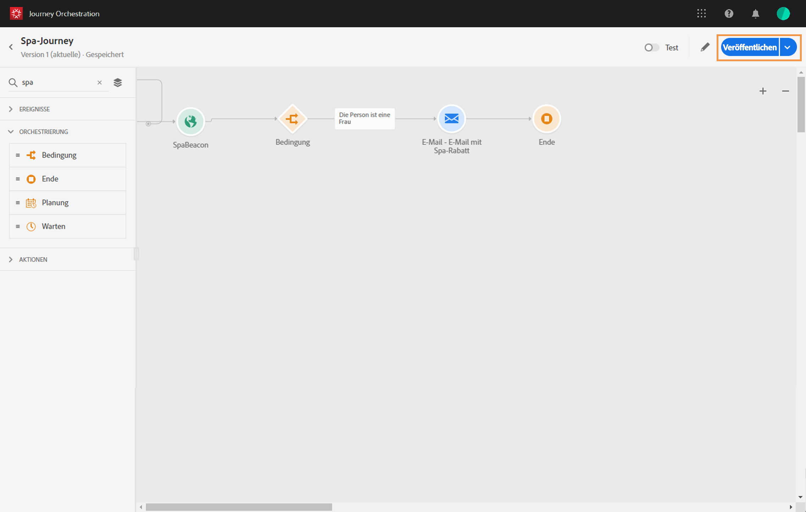

# Veröffentlichen der Journey{#concept_mtc_lrt_52b}

Sie können eine Journey veröffentlichen, nachdem Sie ihre Gültigkeit getestet haben.

Wenn Sie eine veröffentlichte Journey ändern möchten, müssen Sie eine neue Version Ihrer Journey erstellen. Siehe . Wenn eine Journey schreibgeschützt ist, können Sie nur die Titel und Beschreibungen der Aktivitäten, den Namen der Journey und die Beschreibung der Journey ändern.

Wenn Sie eine Journey anhalten, wird sie dauerhaft angehalten. Alle Personen, die sich in der Journey aufhalten, werden dauerhaft angehalten und die Journey lässt keine neuen Zutritte mehr zu. Wenn Sie die Journey erneut verwenden möchten, müssen Sie sie duplizieren und veröffentlichen.

1. Vergewissern Sie sich vor der Veröffentlichung, dass die Journey gültig ist und keine Fehler vorliegen. Sie können keine fehlerbehafteten Journeys veröffentlichen. Siehe . Es wird auch empfohlen, die Journey vor der Veröffentlichung zu testen. Siehe .
1. Klicken Sie zum Veröffentlichen der Journey oben rechts im Dropdown-Menü auf die Option **[!UICONTROL Veröffentlichen]**.

   

Nachdem die Journey veröffentlicht wurde, ist sie schreibgeschützt.

Hier eine Liste der verschiedenen Status der Journey eines Kontakts:

* _Läuft_: der Kontakt befindet sich derzeit in der Journey.
* _Abgeschlossen_: der Kontakt befindet sich am Ende der Journey.
* _Fehler_: der Kontakt wird aufgrund eines Fehlers in der Journey angehalten.
* _Zeitüberschreitung_: der Kontakt wird aufgrund eines Schritts, der zu viel Zeit in Anspruch genommen hat, in der Journey angehalten.