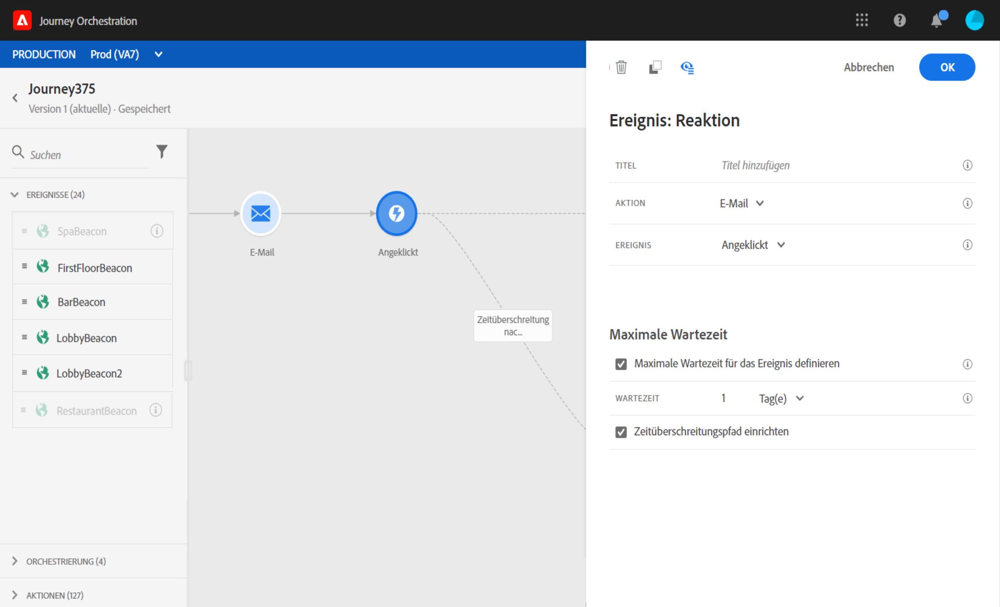

# Reaktionsereignisse {#section_dhx_gss_dgb}

Unter den verschiedenen Ereignisaktivitäten, die in der Palette verfügbar sind, finden Sie das integrierte **[!UICONTROL Reaktionsereignis]**. Mit dieser Aktivität können Sie auf Tracking-Daten reagieren, die sich auf eine mit E-Mail-, SMS- oder Push-Aktivitäten gesendete Nachricht innerhalb derselben Journey beziehen. Diese Informationen stammen aus Transaktionsnachrichten in Adobe Campaign Standard. Wir erfassen diese Informationen in Echtzeit, sobald sie für Adobe Experience Platform freigegeben werden. Bei Push-Benachrichtigungen können Sie auf angeklickte, gesendete oder fehlgeschlagene Nachrichten reagieren. Bei SMS-Nachrichten können Sie auf gesendete oder fehlgeschlagene Nachrichten reagieren. Bei E-Mails können Sie auf angeklickte, gesendete, geöffnete oder fehlgeschlagene Nachrichten reagieren.

Sie können diesen Mechanismus auch verwenden, um eine Aktion auszuführen, wenn keine Reaktion auf Ihre Nachrichten erfolgt. Erstellen Sie dazu einen zweiten Pfad parallel zur Reaktionsaktivität und fügen Sie eine Warteaktivität hinzu. Wenn während des in der Warteaktivität definierten Zeitraums keine Reaktion erfolgt, wird der zweite Pfad ausgewählt. Sie können beispielsweise eine Folgenachricht senden.

Beachten Sie, dass Sie eine Reaktionsaktivität auf der Arbeitsfläche nur verwenden können, wenn zuvor eine E-Mail-, Push- oder SMS-Aktivität stattgefunden hat.

Siehe [Informationen zu Aktionsaktivitäten](../building-journeys/about-action-activities.md).

Im Folgenden werden die verschiedenen Schritte zum Konfigurieren der Reaktionsereignisse beschrieben:

1. Fügen Sie der Reaktion einen **[!UICONTROL Titel]** hinzu. Dieser Schritt ist optional.
1. Wählen Sie aus der Dropdown-Liste die Aktionsaktivität aus, auf die Sie reagieren möchten. Sie können jede Aktionsaktivität auswählen, die in den vorherigen Schritten des Pfades platziert wurde.
1. Wählen Sie je nach ausgewählter Aktion (E-Mail, SMS oder Push-Benachrichtigung) aus, worauf Sie reagieren möchten.
1. Sie können eine Bedingung als optionalen Schritt definieren. Beispielsweise können Sie nach einer E-Mail-Aktion zwei Pfade erstellen, einen mit einem Reaktionsereignis zum Verfolgen von Klicks nur für VIP-Kunden und einen mit einem Reaktionsereignis zum Verfolgen von Klicks, die von Frauen ausgeführt wurden.

>[!NOTE]
>
>Reaktionsereignisse funktionieren mit Adobe Campaign Standard mit Bereitstellung sowohl auf AWS- als auch auf Azure-Servern.
>
>Reaktionsereignisse können keine E-Mail-, SMS- oder Push-Aktionen verfolgen, die in einer anderen Journey stattfinden.
>
>Reaktionsereignisse verfolgen Klicks auf Links des Typs „verfolgt“ (siehe diese [Seite](https://docs.adobe.com/content/help/de-DE/campaign-standard/using/designing-content/links.html#about-tracked-urls)). Abmeldungs- und Mirrorseiten-Links werden nicht berücksichtigt.

>[!IMPORTANT]
>
>E-Mail-Clients wie Gmail erlauben die Blockierung von Bildern. Das Öffnen von E-Mails wird anhand eines in der E-Mail enthaltenen 0-Pixel-Bildes nachverfolgt. Wenn Bilder blockiert werden, wird das Öffnen von E-Mails nicht berücksichtigt.
