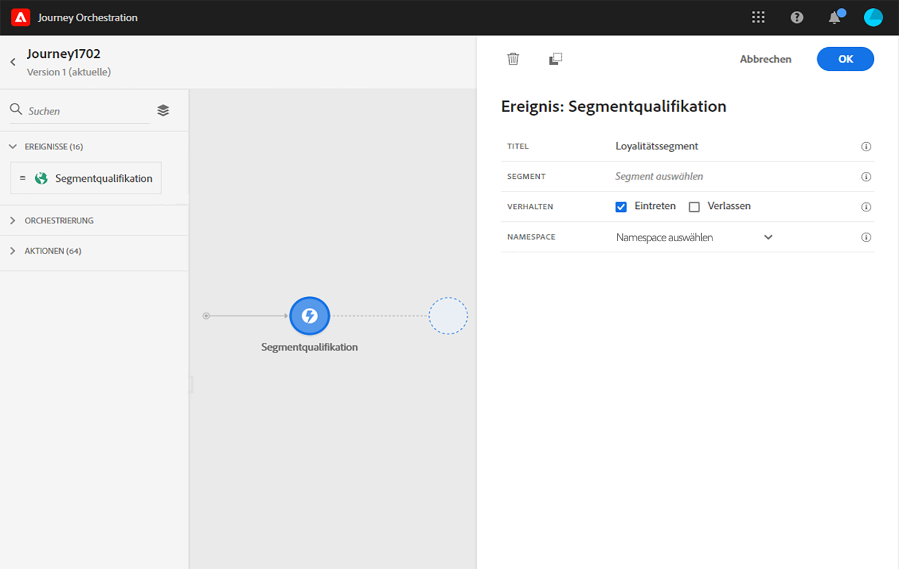
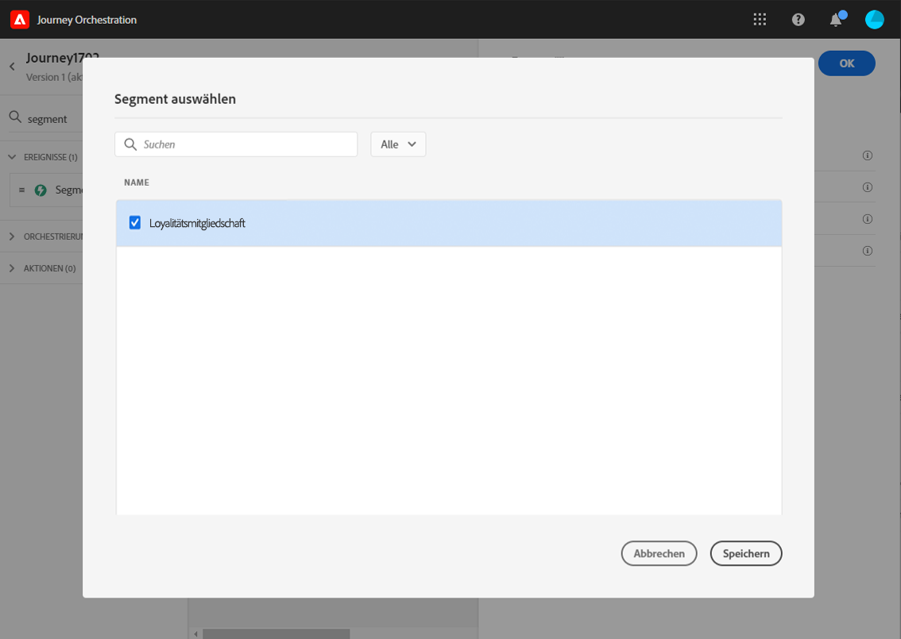
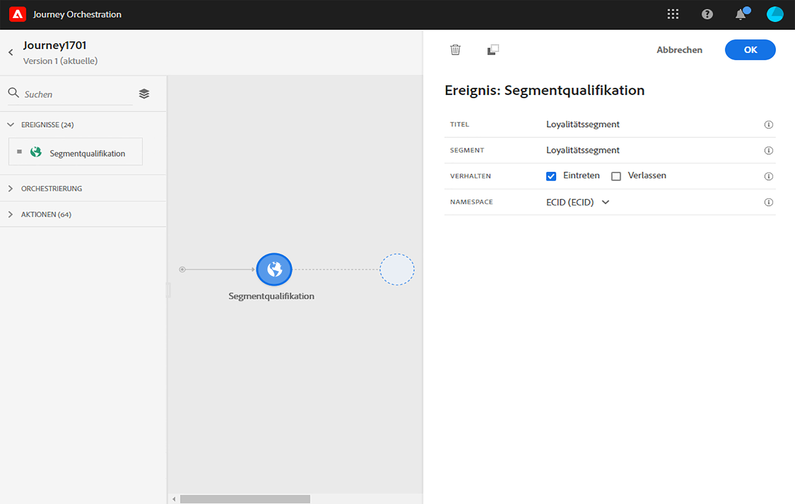
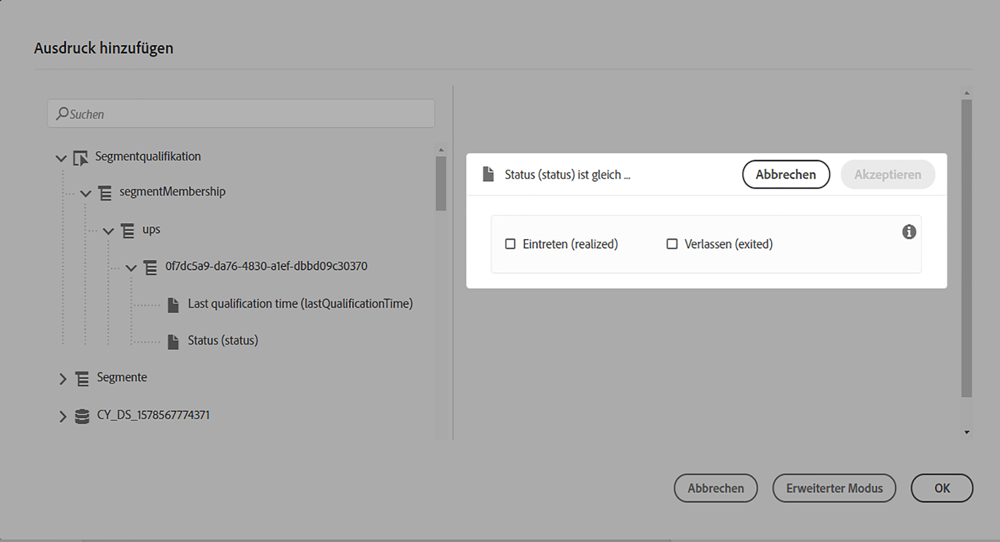
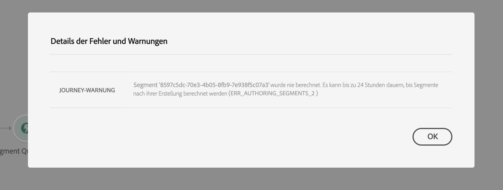
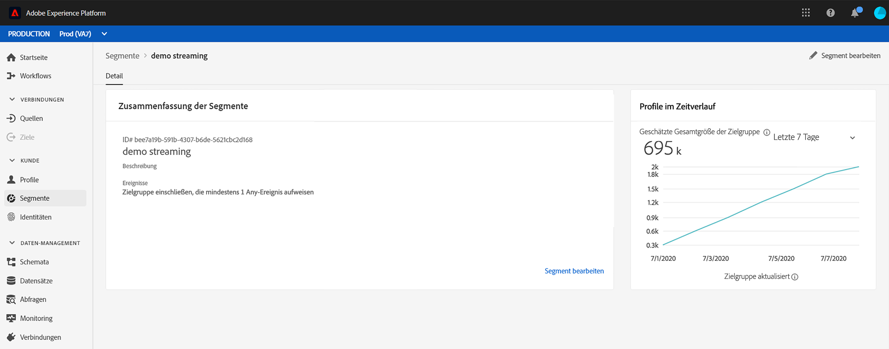

# Segmentqualifizierungsereignisse {#segment-qualification}

## About segment qualification events{#about-segment-qualification}

Diese Aktivität ermöglicht es Ihnen, die Ein- und Ausstiege von Profilen in Adobe Experience Platform zu hören, um Einzelpersonen in eine Reise einzusteigen oder sich vorwärts zu bewegen. Weiterführende Informationen zur Erstellung von Segmenten finden Sie in [diesem Abschnitt](../segment/about-segments.md).

Nehmen wir an, Sie verfügen über ein Segment für „Silber-Kunden“. Mit dieser Aktivität können Sie dafür sorgen, dass alle neuen Silber-Kunden eine Journey beginnen, und ihnen eine Reihe personalisierter Nachrichten senden.

Diese Art von Ereignis kann als erster Schritt oder auch später in der Journey positioniert werden.

Wenn das Segment mit der Option &quot;Audiencen mit hoher Frequenz&quot;von Adobe Experience Platform gestreamt wird, werden die Ein- und Ausstiege in Echtzeit überwacht. Wenn das Segment nicht gestreamt wird, werden Ein- und Austritte zum Zeitpunkt der Segmentberechnung berücksichtigt.

1. Erweitern Sie die Kategorie **[!UICONTROL Ereignisse]** und legen Sie eine Aktivität vom Typ **[!UICONTROL Segmentqualifizierung]** auf Ihrer Arbeitsfläche ab.

   

1. Fügen Sie der Aktivität einen **[!UICONTROL Titel]** hinzu. Dieser Schritt ist optional.

1. Klicken Sie in das Feld **[!UICONTROL Segment]** und wählen Sie die gewünschten Segmente aus.

   

1. Wählen Sie im Feld **[!UICONTROL Verhalten]** aus, ob Sie Segmenteintritte, -austritte oder beides überwachen möchten.

1. Wählen Sie einen Namespace aus. Dies ist nur erforderlich, wenn das Ereignis als erster Schritt der Journey positioniert wird.

   

Die Payload enthält die folgenden Kontextinformationen, die Sie in Bedingungen und Aktionen verwenden können:

* Verhalten (Eintritt, Austritt)
* Zeitstempel der Qualifizierung
* Segmentkennung

Wenn Sie den Ausdruckseditor in einer Bedingung oder Aktion verwenden, die einer Aktivität vom Typ **[!UICONTROL Segmentqualifikation]** folgt, können Sie auf den Knoten **[!UICONTROL Segmentqualifikation]** zugreifen. Sie können zwischen der **[!UICONTROL letzten Qualifikationszeit]** und dem **[!UICONTROL Status]** (Einstieg oder Ausstieg) wählen.

Siehe [Bedingungsaktivität](../building-journeys/condition-activity.md#about_condition).

## Bewährte Verfahren für Segmente {#best-practices-segments}

Die **[!UICONTROL Segmentqualifizierungs]** -Aktivität ermöglicht den sofortigen Eintritt in Reisen von Personen, die sich aus einem Adobe Experience Platform-Segment qualifizieren oder disqualifiziert haben.

Die Empfangsgeschwindigkeit dieser Informationen ist hoch. Die durchgeführten Messungen zeigen eine Geschwindigkeit von 10 000 Ereignissen pro Sekunde. Daher sollten Sie sich vergewissern, dass Sie verstehen, wie die Spitzen des Eintritts passieren können, wie sie vermieden werden können und wie Sie Ihre Reise darauf vorbereiten können.

### Stapelsegmente{#batch-speed-segment-qualification}

Beachten Sie bei Verwendung der Segmentqualifikation für ein Stapelsegment, dass ein Höhepunkt des Eingangs zum Zeitpunkt der täglichen Berechnung eintritt. Die Größe der Spitze hängt von der Anzahl der Personen ab, die das Segment täglich aufrufen (oder verlassen).

Wenn das Stapelsegment neu erstellt und sofort auf einer Reise verwendet wird, kann der erste Berechnungsstapel außerdem dazu führen, dass sehr viele Personen die Reise besuchen.

### Streaming-Segmente{#streamed-speed-segment-qualification}

Bei der Verwendung der Segmentqualifikation für Streaming-Segmente besteht aufgrund der kontinuierlichen Bewertung des Segments ein geringeres Risiko, große Höhen von Ein-/Ausstiegen zu erzielen. Wenn die Segmentdefinition jedoch dazu führt, dass ein großes Kundenvolumen gleichzeitig qualifiziert wird, kann es auch zu einem Spitzenwert kommen.

### Vermeidung von Überladungen{#overloads-speed-segment-qualification}

Im Folgenden finden Sie einige bewährte Verfahren, die helfen, Überlastungssysteme zu vermeiden, die auf Reisen genutzt werden (Datenquellen, benutzerdefinierte Aktionen, Adobe Campaign Standard-Aktionen).

Verwenden Sie in einer **[!UICONTROL Segmentqualifizierungs]** -Aktivität kein Stapelsegment unmittelbar nach der Erstellung. Dadurch wird der erste Berechnungsgipfel vermieden. Beachten Sie, dass es eine gelbe Warnung auf der Arbeitsfläche der Reise geben wird, wenn Sie im Begriff sind, ein Segment zu verwenden, das noch nie berechnet wurde.

Legen Sie eine Deckelungsregel für Datenquellen und Aktionen fest, die bei Fahrten verwendet werden, um eine Überlastung zu vermeiden (siehe [Abschnitt](../api/capping.md)). Beachten Sie, dass die Deckelregel nicht erneut versucht wird. Wenn Sie es erneut versuchen müssen, müssen Sie einen alternativen Pfad auf der Reise verwenden, indem Sie das Kästchen **[!UICONTROL Hinzufügen einem alternativen Pfad im Falle eines Timeouts oder eines Fehlers]** bei Bedingungen oder Aktionen markieren.

Bevor Sie das Segment auf einer Produktionsreise verwenden, sollten Sie immer zuerst das Volumen der Personen auswerten, die sich täglich für dieses Segment qualifizieren. Dazu können Sie den Abschnitt **[!UICONTROL Segmente]** im Adobe Experience Platform überprüfen und das Diagramm auf der rechten Seite betrachten.

