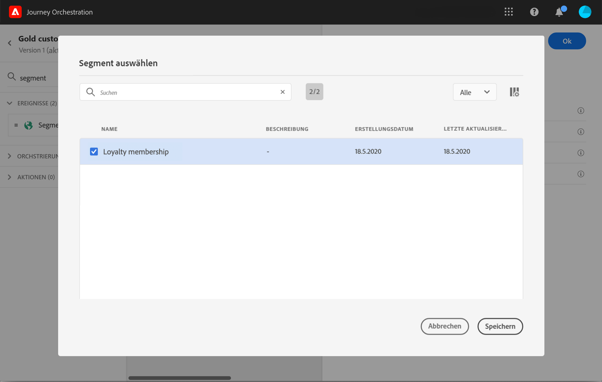

# Segmentqualifizierungsereignisse {#segment-qualification}

## Über Segmentqualifizierungsereignisse{#about-segment-qualification}

Mit dieser Aktivität kann Ihre Journey die Ein- und Austritte von Profilen in Adobe Experience Platform-Segmenten überwachen, um Kontakte dazu zu bringen, in eine Journey einzutreten oder in einer Journey fortzufahren. Weiterführende Informationen zur Erstellung von Segmenten finden Sie in [diesem Abschnitt](../segment/about-segments.md).

Nehmen wir an, Sie verfügen über ein Segment für „Silber-Kunden“. Mit dieser Aktivität können Sie dafür sorgen, dass alle neuen Silber-Kunden eine Journey beginnen, und ihnen eine Reihe personalisierter Nachrichten senden.

Diese Art von Ereignis kann als erster Schritt oder auch später in der Journey positioniert werden.

Wenn das Segment mit der Adobe Experience Platform-Option für Audiences mit hoher Häufigkeit gestreamt wird, werden Eintritte und Austritte in Echtzeit überwacht. Wenn das Segment nicht gestreamt wird, werden Ein- und Austritte zum Zeitpunkt der Segmentberechnung berücksichtigt.

1. Erweitern Sie die Kategorie **[!UICONTROL Ereignisse]** und legen Sie eine Aktivität vom Typ **[!UICONTROL Segmentqualifizierung]** auf Ihrer Arbeitsfläche ab.

   

1. Fügen Sie der Aktivität einen **[!UICONTROL Titel]** hinzu. Dieser Schritt ist optional.

1. Klicken Sie in das Feld **[!UICONTROL Segment]** und wählen Sie die gewünschten Segmente aus.

   >[!NOTE]
   >
   >Beachten Sie, dass Sie die in der Liste angezeigten Spalten anpassen und sortieren können.

   

   Nachdem das Segment hinzugefügt wurde, können Sie mit der Schaltfläche **[!UICONTROL Kopieren]** dessen Namen und ID kopieren:

   `{"name":"Loyalty membership“,”id":"8597c5dc-70e3-4b05-8fb9-7e938f5c07a3"}`

   

1. Wählen Sie im Feld **[!UICONTROL Verhalten]** aus, ob Sie Segmenteintritte, -austritte oder beides überwachen möchten.

1. Wählen Sie einen Namespace aus. Dies ist nur erforderlich, wenn das Ereignis als erster Schritt der Journey positioniert wird.

   

Die Payload enthält die folgenden Kontextinformationen, die Sie in Bedingungen und Aktionen verwenden können:

* Verhalten (Eintritt, Austritt)
* Zeitstempel der Qualifizierung
* Segmentkennung

Wenn Sie den Ausdruckseditor in einer Bedingung oder Aktion verwenden, die einer Aktivität vom Typ **[!UICONTROL Segmentqualifikation]** folgt, können Sie auf den Knoten **[!UICONTROL Segmentqualifikation]** zugreifen. Sie können zwischen der **[!UICONTROL letzten Qualifikationszeit]** und dem **[!UICONTROL Status]** (Einstieg oder Ausstieg) wählen.

Siehe [Bedingungsaktivität](../building-journeys/condition-activity.md#about_condition).

## Best Practices {#best-practices-segments}

Mit der Aktivität **[!UICONTROL Segmentqualifikation]** wird der sofortige Eintritt in Journeys von Personen möglich, die über ein Adobe Experience Platform-Segment qualifiziert oder disqualifiziert werden.

Die Empfangsgeschwindigkeit dieser Daten ist hoch. Durchgeführte Messungen zeigen eine Geschwindigkeit von 10.000 empfangenen Ereignissen pro Sekunde. Daher sollten Sie wissen, wie Eintrittsspitzen auftreten können, wie sie sich vermeiden lassen und wie Sie Ihre Journey darauf vorbereiten können.

### Batch-Segmente{#batch-speed-segment-qualification}

Beachten Sie bei Verwendung der Segmentqualifikation für ein Batch-Segment, dass zum Zeitpunkt der täglichen Berechnung eine Eintrittsspitze auftritt. Der Umfang der Spitze hängt von der Zahl der Personen ab, die in das Segment täglich eintreten (bzw. austreten).

Wenn das Batch-Segment neu erstellt und in einer Journey unmittelbar verwendet wird, kann der erste Berechnungs-Batch außerdem dazu führen, dass sehr viele Personen in die Journey eintreten.

### Streaming-Segmente{#streamed-speed-segment-qualification}

Bei Verwendung der Segmentqualifikation für Streaming-Segmente besteht aufgrund der kontinuierlichen Bewertung des Segments ein geringeres Risiko, dass es bei Ein-/Austritten zu großen Spitzen kommt. Wenn die Segmentdefinition dazu führt, dass eine große Zahl von Kunden gleichzeitig qualifiziert wird, kann es jedoch ebenfalls zu einer Spitze kommen.

### So vermeiden Sie Überlastungen{#overloads-speed-segment-qualification}

Im Folgenden finden Sie Best Practices, die Ihnen dabei helfen, eine Überlastung der für Journeys genutzten Systeme zu verhindern (Datenquellen, benutzerdefinierte Aktionen, Adobe Campaign Standard-Aktionen).

Verwenden Sie in einer Aktivität vom Typ **[!UICONTROL Segmentqualifikation]** Batch-Segmente nicht unmittelbar nach ihrer Erstellung. So lässt sich die erste Berechnungsspitze vermeiden. Beachten Sie, dass in der Journey-Arbeitsfläche eine gelbe Warnung angezeigt wird, wenn Sie im Begriff sind, ein Segment zu verwenden, das noch nie berechnet wurde.

Legen Sie eine Begrenzungsregel für Datenquellen und Aktionen fest, die in Journeys verwendet werden, um eine Überlastung zu vermeiden (siehe diesen [Abschnitt](../api/capping.md)). Beachten Sie, dass die Begrenzungsregel nicht erneut versucht wird. Für einen erneuten Versuch müssen Sie einen alternativen Pfad in der Journey verwenden, indem Sie in Bedingungen oder Aktionen das Kontrollkästchen **[!UICONTROL Alternativen Pfad hinzufügen, falls eine Zeitüberschreitung oder ein Fehler auftritt]** aktivieren.

Bevor Sie das Segment in einer Produktions-Journey verwenden, sollten Sie immer zuerst das Volumen der Personen auswerten, die sich für dieses Segment täglich qualifizieren. Dazu können Sie den Abschnitt **[!UICONTROL Segmente]** in Adobe Experience Platform lesen und sich das Diagramm auf der rechten Seite ansehen.

