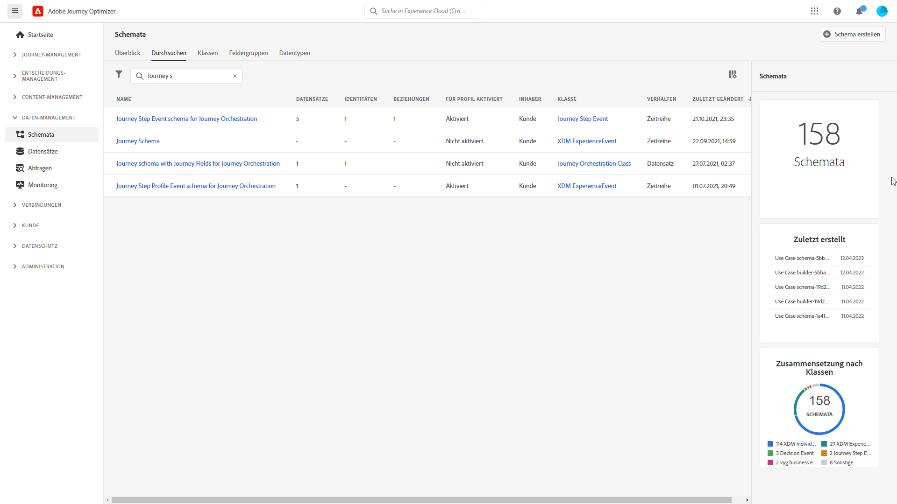
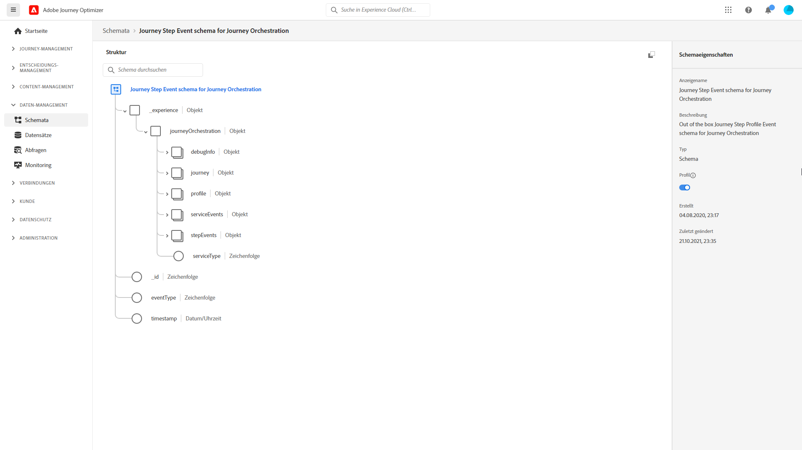
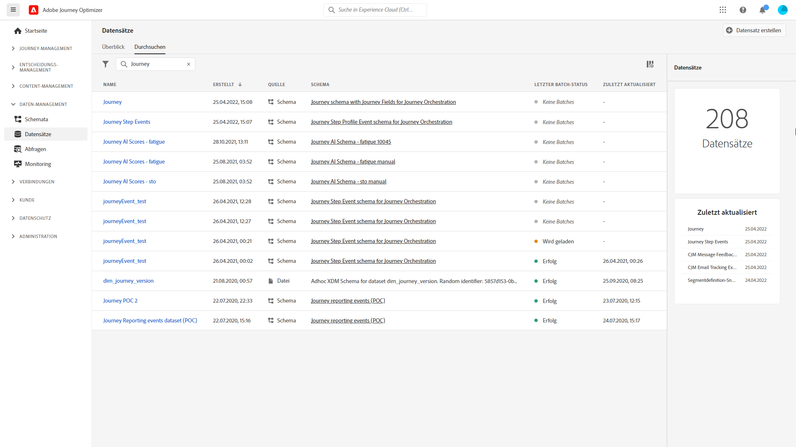

# Übersicht über die Freigabe von Journey-Schritten{#sharing-overview}

[!DNL Journey Orchestration] sendet automatisch Daten zur Journey-Performance an Adobe Experience Platform, damit sie zu Analysezwecken mit anderen Daten kombiniert werden können.

>[!NOTE]
>
>Diese Funktion ist nicht bei allen neu bereitgestellten Instanzen standardmäßig aktiviert. Die Aktivierung erfolgt auf Anfrage.

Sie haben beispielsweise eine Journey eingerichtet, die mehrere E-Mails sendet. Mit dieser Funktion können Sie [!DNL Journey Orchestration]-Daten mit nachgelagerten Ereignisdaten kombinieren (z. B. der Anzahl der Konversionen, der Interaktionen auf der Website oder der Transaktionen im Store). Die Journey-Daten können entweder über andere digitale Eigenschaften oder über Offline-Eigenschaften mit Daten aus Adobe Experience Platform kombiniert werden, um eine genauere Ansicht der Leistung zu ermöglichen.

[!DNL Journey Orchestration] erstellt für jeden Schritt, den ein Kontakt bei einer Journey unternimmt, automatisch die erforderlichen Schemata und streamt die Daten in Datensätze zu Adobe Experience Platform. Ein Schrittereignis entspricht einem Kontakt, der bei einer Journey von einem Knoten zu einem anderen wechselt. Beispielsweise werden bei einer Journey, die über ein Ereignis, eine Bedingung und eine Aktion verfügt, drei Schrittereignisse an Adobe Experience Platform gesendet.

Die Liste der weitergeleiteten XDM-Felder ist umfassend. Einige enthalten systemgenerierte Codes, andere haben lesbare Anzeigenamen. Beispiele sind die Bezeichnung der Journey-Aktivität und der Schrittstatus: wie oft eine Aktion die Zeit überschritten hat oder fehlerhaft endete.

>[!CAUTION]
>
>Für den Echtzeit-Profildienst können keine Datensätze aktiviert werden. Stellen Sie sicher, dass der Umschalter **[!UICONTROL Profil]** deaktiviert ist..

Journeys sendet Daten direkt im Streaming-Modus. Sie können diese Daten mit dem Query Service abfragen. Sie können eine Verbindung zu Customer Journey Analytics oder anderen BI-Tools herstellen, um Daten anzuzeigen, die mit diesen Schritten in Verbindung stehen.

Die folgenden Schemata werden erstellt:

* Journey Step Profile Event-Schema für [!DNL Journey Orchestration] – Erlebnisereignisse für Schritte, die in einer Journey unternommen werden, zusammen mit einer Identitätszuordnung, die der Zuordnung zu einem einzelnen Journey-Teilnehmer dient.
* Journey Step Event-Schema für [!DNL Journey Orchestration] – Journey-Schrittereignis, das mit Journey-Metadaten verknüpft ist.
* Journey-Schema mit Journey-Feldern für [!DNL Journey Orchestration] – Journey-Metadaten zur Beschreibung von Journeys.

Die folgenden Datensätze werden übergeben:

* Journey Step Profile Event-Schema für [!DNL Journey Orchestration]
* Journey-Schrittereignisse
* Journey

Die Listen der XDM-Felder, die an Adobe Experience Platform übergeben werden, werden hier beschrieben:

* [Gemeinsame Felder für journeyStep-Ereignisse](../building-journeys/sharing-common-fields.md)
* [Aktionsausführungsfelder für journeyStep-Ereignisse](../building-journeys/sharing-execution-fields.md)
* [Datenabruffelder für journeyStep-Ereignisse](../building-journeys/sharing-fetch-fields.md)
* [Identitätsfelder für journeyStep-Ereignisse](../building-journeys/sharing-identity-fields.md)
* [Journey-Felder](../building-journeys/sharing-journey-fields.md)

Weiterführende Informationen zu Berichten über Schrittereignisse an Adobe Experience Platform finden Sie in diesem [Anleitungsvideo](https://docs.adobe.com/content/help/de-DE/journey-orchestration-learn/tutorials/understanding-journey-orchestration.html).
