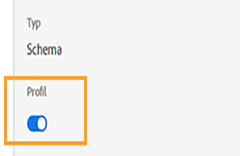

# Übersicht über die schrittweise Freigabe für Reisen{#sharing-overview}

[!DNL Journey Orchestration] sendet automatisch Daten zur Reiseleistung an die Adobe Experience Platform, damit sie zu Analysen mit anderen Daten kombiniert werden können.

Sie haben beispielsweise eine Reise eingerichtet, die mehrere E-Mails sendet. Mit dieser Funktion können Sie [!DNL Journey Orchestration] Daten mit nachgelagerten Ereignis-Daten kombinieren, z. B. wie viele Konversionen stattgefunden haben, wie viel Interaktion auf der Website stattgefunden hat oder wie viele Transaktionen im Store stattgefunden haben. Die Fahrteninformationen können mit Daten auf der Plattform kombiniert werden, entweder von anderen digitalen Eigenschaften oder von Offlineinhalten, um eine umfassendere Ansicht der Leistung zu ermöglichen.

[!DNL Journey Orchestration] erstellt automatisch die erforderlichen Schema und fließt in Datensätze zur Plattform für jeden Schritt, den ein Einzelner auf einer Reise unternimmt. Ein step-Ereignis entspricht einer Person, die während einer Reise von einer Node zu einer anderen wechselt. Beispielsweise werden bei einer Reise mit einem Ereignis, einer Bedingung und einer Aktion drei Ereignis an die Plattform gesendet.

Die Liste der weitergeleiteten XDM-Felder ist umfassend. Einige enthalten systemgenerierte Codes, andere haben lesbare Anzeigenamen. Beispiele sind die Bezeichnung der Aktivität der Reise oder der Status der Stufe: wie oft eine Aktion abgelaufen ist oder fehlerhaft endete.

>[!CAUTION]
>
>Standardmäßig sind Datensätze für den Echtzeit-Profil-Dienst nicht aktiviert. Wenn Sie einen Datensatz im Profil-Dienst verwenden möchten, müssen Sie ihn aktivieren (**Profil** -Umschalter). Achten Sie darauf, dass eine große Anzahl von Ereignissen die Datenspeicherung Ihrer Quote in Anspruch nehmen wird. Bitte gehen Sie vor der Aktivierung eines Datensatzes für Profil sorgfältig vor
>
>

>[!NOTE]
>
>Reisen haben auch die Möglichkeit, das Journey Step Profil Ereignis an Platform zu senden oder nicht. Journeys unterhält ein Techoggle, um dies zu entscheiden.
>
>

Journeys sendet Daten im Streaming-Modus. Sie können diese Daten mit dem Abfrage-Dienst Abfrage werden. Sie können eine Verbindung zu Customer Journey Analytics oder anderen BI-Tools herstellen, um Daten zur Ansicht dieser Schritte zu erhalten.

Die folgenden Schema werden erstellt:

* Journey Step Profil Ereignis Schema for [!DNL Journey Orchestration] - Experience Ereignisses für Schritte, die in einer Reise unternommen werden, zusammen mit einer Identitätskarte, die für die Zuordnung zu einem einzelnen Reiseteilnehmer verwendet wird.
* Journey Step Ereignis Schema for [!DNL Journey Orchestration] - Journey-Step-Ereignis, das mit einer Journey-Metadaten verknüpft ist.
* Journey Schema mit Journey Fields for [!DNL Journey Orchestration] - Journey Metadata zur Beschreibung von Reisen.

Die folgenden Datensätze werden übergeben:

* Profil-Ereignis-Schema für Reisen [!DNL Journey Orchestration]
* Ereignisse für Reiseschritte
* Journeys

Die Listen der XDM-Felder, die an die Plattform übergeben werden, sind hier beschrieben:

* [JourneySchritte Ereignis - gemeinsame Felder](../building-journeys/sharing-common-fields.md)
* [Aktionsausführungsfelder für Ereignis von &quot;travelStep&quot;](../building-journeys/sharing-execution-fields.md)
* [JourneyStep-Ereignisse - Datenabruf von Feldern](../building-journeys/sharing-fetch-fields.md)
* [travelStep Ereignis-Identitätsfelder](../building-journeys/sharing-identity-fields.md)
* [Reisefelder](../building-journeys/sharing-journey-fields.md)

